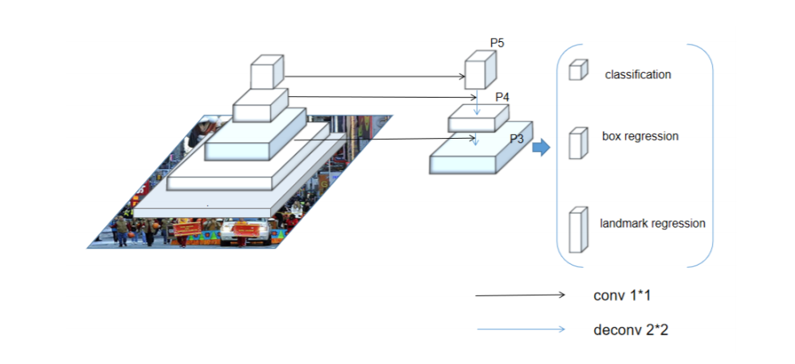

# CenterFace for Face Detection

## 1. 概述

CenterFace 是一个 anchor-free 的轻量级人脸检测网络，主要用于边缘设备，我们支持 A910 的训练和评估。

无约束环境下的人脸检测和对齐通常部署在内存有限、计算能力低的边缘设备上。CenterFace 提出一种实时快速、高精度的同时预测人脸框和关键点的一阶段方法。

CenterFace 网络的基本结构如下图。



## 2. 数据和预训练模型准备

我们建议用户使用 WiderFace 数据集来使用我们的模型，其他数据集则需要使用与 WiderFace 相同的格式。在我们的模型中，训练集标注文件格式是 coco 格式，图像是 widerface 数据集，验证集真实标签是.mat 文件。

- 目录结构如下，目录和文件的名称由用户定义：
  ```path
      ├── dataset
          ├── centerface
              ├── annotations
              │   ├─ train_wider_face.json
              ├── images
              │   ├─ train
              │   │    └─images
              │   │       ├─class1_image_folder
              │   │       ├─ ...
              │   │       └─classn_image_folder
              │   └─ val
              │       └─images
              │           ├─class1_image_folder
              │           ├─ ...
              │           └─classn_image_folder
              ├── ground_truth
                  ├─wider_easy_val.mat
                  ├─wider_face_val.mat
                  ├─wider_hard_val.mat
                  └─wider_medium_val.mat
  ```

我们建议用户使用 WiderFace 数据集来使用我们的模型，其他数据集则需要使用与 WiderFace 相同的格式。在我们的模型中，训练集标注文件格式是 coco 格式，图像是 widerface 数据集，验证集真实标签是.mat 文件。训练集标注可以参考这里的[介绍](https://github.com/chenjun2hao/CenterFace.pytorch#train)。图像可以从[Widerface](http://shuoyang1213.me/WIDERFACE/index.html)下载。验证集标注可以从 [ground_truth](https://github.com/chenjun2hao/CenterFace.pytorch/tree/master/evaluate/ground_truth)下载。

## 3. 训练

### 3.1 算法基本信息

- 任务类型：人脸检测
- 支持的框架引擎：Ascend-Powered-Engine | Mindspore-1.1.1-python3.7-aarch64

### 3.2 订阅算法

订阅算法流程请参考[使用 AI 市场的预置算法训练模型-订阅算法](https://support.huaweicloud.com/bestpractice-modelarts/modelarts_10_0025.html#modelarts_10_0025__section87421022184315)。

### 3.3 创建训练作业

数据集准备完成后，将数据集迁移至 OBS，上传 OBS 请参考[如何上传数据至 OBS？](https://support.huaweicloud.com/modelarts_faq/modelarts_05_0013.html) 。

使用订阅算法创建训练作业请参考 [使用 AI 市场的预置算法训练模型-创建训练作业](https://support.huaweicloud.com/bestpractice-modelarts/modelarts_10_0025.html#modelarts_10_0025__section139551128135716)。

### 3.4 训练参数说明

| 名称                | 默认值      | 类型   | 是否必填 | 描述                            |
| ------------------- | ----------- | ------ | -------- | ------------------------------- |
| max_epoch           | 140         | int    | True     | 最大训练轮数                    |
| pretrained_backbone | ""          | string | False    | 预训练模型路径                  |
| resume              | ""          | string | False    | 断点训练                        |
| lr_scheduler        | "multistep" | string | True     | 调整学习率方式                  |
| lr                  | 5e-4        | float  | True     | 初始学习率                      |
| lr_epochs           | ”90,120“    | string | False    | 学习率在哪些 epoch 强制改变     |
| per_batch_size      | 8           | int    | True     | 一次训练所选取的样本数          |
| warmup_epochs       | 0           | float  | True     | 预热学习率                      |
| weight_decay        | 0.0000      | float  | True     | 权重衰减                        |
| t-max               | 140         | int    | True     | 训练 T_max 轮之后重新设置学习率 |
| loss_scale          | 1024        | int    | True     | 静态损耗标度                    |

### 3.5 训练输出文件

训练完成后的输出文件如下。

1. 训练输出目录
2. `├─xxxx-xx-xx_time_xx_xx_xx`
3. `│ ├─xxxx-xx-xx_time_xx_xx_xx_rank_0.log`
4. `│ ├─0_1_XXX.ckpt`
5. `│ ├─0_2_XXX.ckpt`
6. `│ ├─0_x_xxx.ckpt`
7. `├─0_graph.meta`
