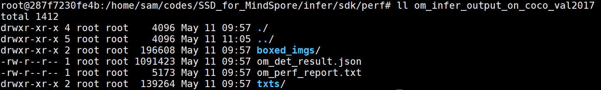
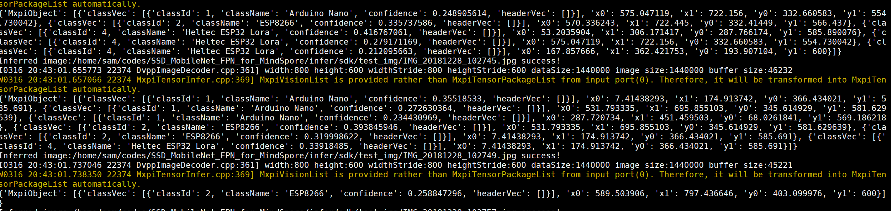
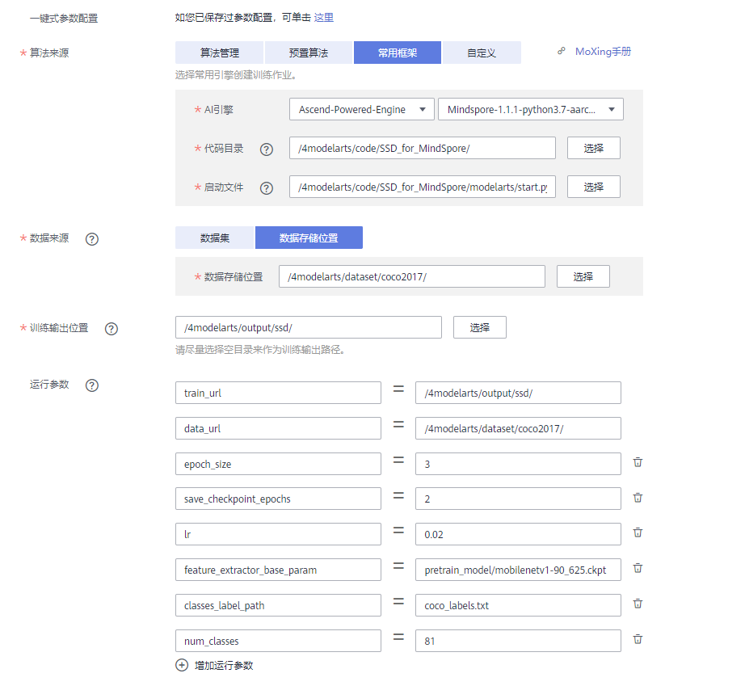
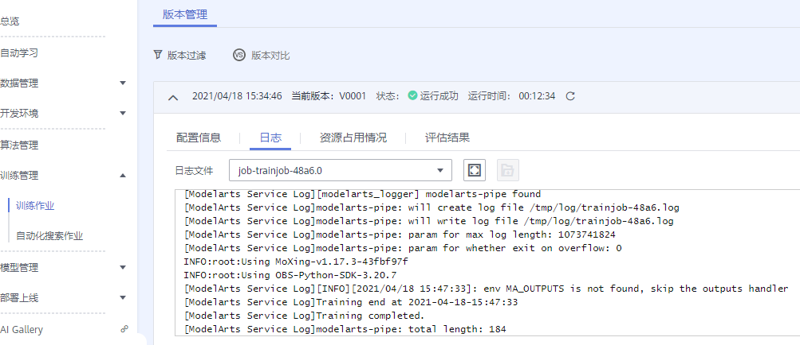
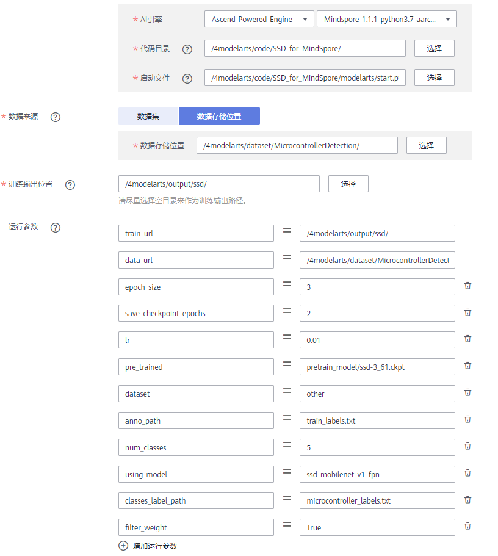
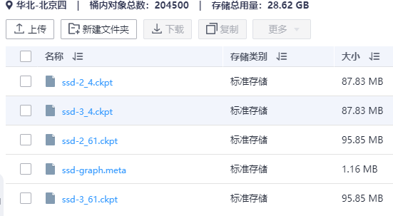

	SSD for MindSpore

-   [交付件基本信息](#交付件基本信息.md)
-   [概述](#概述.md)
    -   [简述](#简述.md)
    -   [默认配置](#默认配置.md)
    -   [支持特性](#支持特性.md)
-   [准备工作](#准备工作.md)
    -   [训练环境准备\[MindSpore\]](#训练环境准备-MindSpore.md)
    -   [推理环境准备](#推理环境准备.md)
    -   [源码介绍](#源码介绍.md)
-   [训练](#训练.md)
    -   [数据集准备](#数据集准备.md)
    -   [模型训练](#模型训练.md)
    -   [高级参考](#高级参考.md)
    -   [迁移学习指导](#迁移学习指导.md)
-   [推理](#推理.md)
    -   [模型转换](#模型转换.md)
    -   [模型推理](#模型推理.md)
    -   [MindX SDK推理](#MindX-SDK推理.md)
    -   [应用参考](#应用参考.md)
-   [在ModelArts上应用](#在ModelArts上应用.md)
-   [性能示例](#性能示例.md)
    -   [训练性能](#训练性能.md)
    -   [推理性能](#推理性能.md)
-   [版本说明](#版本说明.md)
## 1 交付件基本信息

发布者（Publisher）：Huawei

应用领域（Application Domain）：Object Detection

版本（Version）：1.4

修改时间（Modified）：2021.02.04

大小（Size）：

框架（Framework）：MindSpore 1.1.1

模型格式（Model Format）：ckpt（训练）/om（推理）

精度（Precision）：Mixed/FP16

处理器（Processor）：昇腾910（训练）/昇腾310（推理）

应用级别（Categories）：Released

描述（Description）：基于MindSpore框架的SSD Mobilenet V1 FPN 目标检测网络模型训练并保存模型，通过ATC工具转换，可在昇腾AI设备上运行

## 2 概述

-   **[简述](#简述.md)**  

-   **[默认配置](#默认配置.md)**  

-   **[支持特性](#支持特性.md)**  

### 2.1 简述

SSD Mobilenet V1 FPN SSD 将边界框的输出空间离散为一组默认框，每个特征地图位置的纵横比和比例不同。在预测时，网络为每个默认框中每个对象类别
生成分数，并对该框进行调整，以更好地匹配对象形状。此外，该网络结合了来自不同分辨率的多个特征图的预测，从而自然地处理不同尺寸的物体。

参考论文：[Wei Liu, Dragomir Anguelov, Dumitru Erhan, Christian Szegedy, Scott Reed, Cheng-Yang Fu, Alexander C. Berg.European Conference on Computer Vision (ECCV), 2016 (In press).](https://arxiv.org/abs/1512.02325)

### 2.2 默认配置

-   网络结构
    -   Backbone
        -   ssd-mobilenet-v1-fpn：使用 mobilenet-v1 和 FPN 作为特征提取网络，使用带共享权重的目标检测器。
        -   ssd300：使用 mobilenetv2 作为主干网络，使用论文中的目标检测器.

-   数据集<br/>
    使用coco2017数据集。 数据集说明：
-   数据集大小：19G
        - 训练集：18G，118000 张图片
            - 验证集：1G，5000 张图片
            - 标注文件：241M， 实例、标签、人像关键点信息等。
    
-   数据格式：图片及 json 文件
        - 说明：数据集通过 dataset.py 文件处理。

### 2.3 支持特性

支持的特性包括：1、分布式并行训练。2、混合精度训练。

#### 2.3.1 分布式并行训练

MindSpore支持数据并行及自动并行。自动并行是MindSpore融合了数据并行、模型并行及混合并行的一种分布式并行模式，可以自动建立代价模型，为用户选择一种并行模式。相关代码示例。

```
context.set_auto_parallel_context(parallel_mode = ParallelMode.DATA_PARALLEL, device_num = device_num)
```

#### 2.3.2 混合精度训练

昇腾910 AI处理器提供自动混合精度功能，可以针对全网中float32数据类型的算子，按照内置的优化策略，自动将部分float32的算子降低精度到float16，从而在精度损失很小的情况下提升系统性能并减少内存使用。混合精度通常配合 LossScale 的功能来使用，我们在配套脚本中已集成 LossScale 功能，可以直接在配置文件中设置。

## 3 准备工作

-   **[训练环境准备\[MindSpore\]](#训练环境准备-MindSpore.md)**  

-   **[推理环境准备](#推理环境准备.md)**  

-   **[源码介绍](#源码介绍.md)**  


### 3.1 训练环境准备 [MindSpore]

-   硬件环境准备请参见[各硬件产品文档](各硬件产品文档https://support.huawei.com/enterprise/zh/category/ai-computing-platform-pid-1557196528909)。需要在硬件设备上安装固件与驱动。
- 宿主机上需要安装Docker并登录[Ascend Hub中心](Ascend Hub中心https://ascend.huawei.com/ascendhub/#/home)获取镜像。

  当前模型支持的镜像列表如[表1](#zh-cn_topic_0000001074020224_table1519011227314)所示。

  **表 1**  镜像列表

  <a name="zh-cn_topic_0000001074020224_table1519011227314"></a>


  <table xmlns="http://www.w3.org/1999/html"><thead align="left"><tr id="zh-cn_topic_0000001074020224_row0190152218319"><th class="cellrowborder" valign="top" width="55.00000000000001%" id="mcps1.2.4.1.1"><p id="zh-cn_topic_0000001074020224_p1419132211315"><a name="zh-cn_topic_0000001074020224_p1419132211315"></a><a name="zh-cn_topic_0000001074020224_p1419132211315"></a>镜像名称</p>
  </th>
  <th class="cellrowborder" valign="top" width="20%" id="mcps1.2.4.1.2"><p id="zh-cn_topic_0000001074020224_p1564813141255"><a name="zh-cn_topic_0000001074020224_p1564813141255"></a><a name="zh-cn_topic_0000001074020224_p1564813141255"></a>镜像版本</p>
  </th>
  <th class="cellrowborder" valign="top" width="25%" id="mcps1.2.4.1.3"><p id="zh-cn_topic_0000001074020224_p1764811141954"><a name="zh-cn_topic_0000001074020224_p1764811141954"></a><a name="zh-cn_topic_0000001074020224_p1764811141954"></a>配套CANN版本</p>
  </th>
  </tr>
  </thead>
  <tbody><tr id="zh-cn_topic_0000001074020224_row71915221134"><td class="cellrowborder" valign="top" width="55.00000000000001%" headers="mcps1.2.4.1.1 "><a name="zh-cn_topic_0000001074020224_ul129622059162218"></a><a name="zh-cn_topic_0000001074020224_ul129622059162218"></a><ul id="zh-cn_topic_0000001074020224_ul129622059162218"><li>ARM架构：<a href="https://ascend.huawei.com/ascendhub/#/detail?name=ascend-mindspore-arm" target="_blank" rel="noopener noreferrer">ascend-mindspore-arm</a></li><li>x86架构：<a href="https://ascend.huawei.com/ascendhub/#/detail?name=ascend-mindspore-x86" target="_blank" rel="noopener noreferrer">ascend-mindspore-x86</a></li></ul>
  </td>
  <td class="cellrowborder" valign="top" width="20%" headers="mcps1.2.4.1.2 "><p id="zh-cn_topic_0000001074020224_p14648161414516"><a name="zh-cn_topic_0000001074020224_p14648161414516"></a><a name="zh-cn_topic_0000001074020224_p14648161414516"></a>20.1.020.2.0</p>
  </td>
  <td class="cellrowborder" valign="top" width="25%" headers="mcps1.2.4.1.3 "><p id="zh-cn_topic_0000001074020224_p1264815147514"><a name="zh-cn_topic_0000001074020224_p1264815147514"></a><a name="zh-cn_topic_0000001074020224_p1264815147514"></a><a href="https://ascend.huawei.com/#/software/cann" target="_blank" rel="noopener noreferrer">20.1</a><a href="https://ascend.huawei.com/#/software/cann" target="_blank" rel="noopener noreferrer">20.2</a></p>
  </td>
  </tr>
  </tbody>
  </table>

-   了解MindSpore更多学习资源：
    -   [MindSpore教程](MindSpore教程https://www.mindspore.cn/tutorial/training/zh-CN/master/index.html )
    -   [MindSpore API参考](MindSpore API参考https://www.mindspore.cn/doc/api_python/zh-CN/master/index.html )

### 3.2 推理环境准备

- **表 1**  镜像列表

  <a name="zh-cn_topic_0000001074020224_table1519011227314"></a>

  <table><thead align="left"><tr id="zh-cn_topic_0000001074020224_row0190152218319"><th class="cellrowborder" valign="top" width="55.00000000000001%" id="mcps1.2.4.1.1"><p id="zh-cn_topic_0000001074020224_p1419132211315"><a name="zh-cn_topic_0000001074020224_p1419132211315"></a><a name="zh-cn_topic_0000001074020224_p1419132211315"></a>镜像名称</p>
  </th>
  <th class="cellrowborder" valign="top" width="20%" id="mcps1.2.4.1.2"><p id="zh-cn_topic_0000001074020224_p1564813141255"><a name="zh-cn_topic_0000001074020224_p1564813141255"></a><a name="zh-cn_topic_0000001074020224_p1564813141255"></a>镜像版本</p>
  </th>
  <th class="cellrowborder" valign="top" width="25%" id="mcps1.2.4.1.3"><p id="zh-cn_topic_0000001074020224_p1764811141954"><a name="zh-cn_topic_0000001074020224_p1764811141954"></a><a name="zh-cn_topic_0000001074020224_p1764811141954"></a>配套CANN版本</p>
  </th>
  </tr>
  </thead>
  <tbody><tr id="zh-cn_topic_0000001074020224_row71915221134"><td class="cellrowborder" valign="top" width="55.00000000000001%" headers="mcps1.2.4.1.1 "><a name="zh-cn_topic_0000001074020224_ul129622059162218"></a><a name="zh-cn_topic_0000001074020224_ul129622059162218"></a><ul id="zh-cn_topic_0000001074020224_ul129622059162218"><li>ARM架构：<a href="https://ascendhub.huawei.com/#/detail?name=ascend-infer-arm" target="_blank" rel="noopener noreferrer">ascend-infer-arm</a></li><li>x86架构：<a href="https://ascendhub.huawei.com/#/detail?name=ascend-infer-x86" target="_blank" rel="noopener noreferrer">ascend-infer-x86</a></li></ul>
  </td>
  <td class="cellrowborder" valign="top" width="20%" headers="mcps1.2.4.1.2 "><p id="zh-cn_topic_0000001074020224_p14648161414516"><a name="zh-cn_topic_0000001074020224_p14648161414516"></a><a name="zh-cn_topic_0000001074020224_p14648161414516">20.2.0</p>
  </td>
  <td class="cellrowborder" valign="top" width="25%" headers="mcps1.2.4.1.3 "><p id="zh-cn_topic_0000001074020224_p1264815147514">CANN V100R020C20</p>
  </td>
  </tr>
  </tbody>
  </table>


-   本样例配套的CANN版本为20.2，MindX SDK版本为2.0.1。
-   硬件环境和运行环境准备请参见《CANN 软件安装指南](CANN 软件安装指南https://ascend.huawei.com/#/software/cann)》。
-   安装MindX SDK开发套件请参见《mxManufacture 用户指南](mxManufacture 用户指南https://ascend.huawei.com/#/software/mindx-sdk/sdk-detail)》。
-   运行推理环境需要安装Python3.7.5并获取以下lib库。

    **表 1**  获取信息

    <a name="table14461461588"></a>
    <table><thead align="left"><tr id="row184461462585"><th class="cellrowborder" valign="top" width="41.730000000000004%" id="mcps1.2.3.1.1"><p id="p5447124614584"><a name="p5447124614584"></a><a name="p5447124614584"></a>类别</p>
    </th>
    <th class="cellrowborder" valign="top" width="58.269999999999996%" id="mcps1.2.3.1.2"><p id="p1944714466583"><a name="p1944714466583"></a><a name="p1944714466583"></a>版本要求</p>
    </th>
    </tr>
    </thead>
    <tbody><tr id="row64471046115815"><td class="cellrowborder" valign="top" width="41.730000000000004%" headers="mcps1.2.3.1.1 "><p id="p1944774635817"><a name="p1944774635817"></a><a name="p1944774635817"></a>pycocotools</p>
    </td>
    <td class="cellrowborder" valign="top" width="58.269999999999996%" headers="mcps1.2.3.1.2 "><p id="p84471446125811"><a name="p84471446125811"></a><a name="p84471446125811"></a>2.0.2及以上</p>
    </td>
    </tr>
    <tr id="row184471846145815"><td class="cellrowborder" valign="top" width="41.730000000000004%" headers="mcps1.2.3.1.1 "><p id="p8447174617582"><a name="p8447174617582"></a><a name="p8447174617582"></a>mmcv</p>
    </td>
    <td class="cellrowborder" valign="top" width="58.269999999999996%" headers="mcps1.2.3.1.2 "><p id="p10447114695815"><a name="p10447114695815"></a><a name="p10447114695815"></a>0.2.14及以上</p>
    </td>
    </tr>
    <tr id="row9447246205818"><td class="cellrowborder" valign="top" width="41.730000000000004%" headers="mcps1.2.3.1.1 "><p id="p1144734625820"><a name="p1144734625820"></a><a name="p1144734625820"></a>Pillow</p>
    </td>
    <td class="cellrowborder" valign="top" width="58.269999999999996%" headers="mcps1.2.3.1.2 "><p id="p11447134612588"><a name="p11447134612588"></a><a name="p11447134612588"></a>8.0.0及以上</p>
    </td>
    </tr>
    <tr id="row1447134613583"><td class="cellrowborder" valign="top" width="41.730000000000004%" headers="mcps1.2.3.1.1 "><p id="p18447164695815"><a name="p18447164695815"></a><a name="p18447164695815"></a>numpy</p>
    </td>
    <td class="cellrowborder" valign="top" width="58.269999999999996%" headers="mcps1.2.3.1.2 "><p id="p144478466581"><a name="p144478466581"></a><a name="p144478466581"></a>1.19.2及以上</p>
    </td>
    </tr>
    <tr id="row174471946175817"><td class="cellrowborder" valign="top" width="41.730000000000004%" headers="mcps1.2.3.1.1 "><p id="p044784695819"><a name="p044784695819"></a><a name="p044784695819"></a>easydict</p>
    </td>
    <td class="cellrowborder" valign="top" width="58.269999999999996%" headers="mcps1.2.3.1.2 "><p id="p1344724665812"><a name="p1344724665812"></a><a name="p1344724665812"></a>1.9及以上</p>
    </td>
    </tr>
    </tbody>
    </table>


### 3.3 源码介绍

脚本和示例代码结构如下：

```
.
├── ascend310_infer
│   ├── aipp.cfg
│   ├── build.sh
│   ├── CMakeLists.txt
│   ├── inc
│   │   └── utils.h
│   └── src
│       ├── main.cc
│       └── utils.cc
├── Dockerfile                  # 训练镜像 Dockerfile 文件
├── eval.py                     # 模型评估入口脚本
├── export.py                   # 模型导出入口脚本
├── infer
│   ├── convert                 # 模型转换功能
│   │   ├── aipp.cfg
│   │   ├── aipp_coco_rgb.cfg   # 模型转换使用的 AIPP 配置文件
│   │   ├── aipp_coco_yuv.cfg
│   │   ├── aipp_yuv.cfg
│   │   ├── convert_om.sh       # 模型转换入口脚本
│   │   └── models
│   ├── __init__.py
│   ├── sdk                                                        # mxManufacture 推理 exmaple 目录
│   │   ├── conf
│   │   │   ├── coco.names                                         # 数据集标签文件
│   │   │   ├── ssd_mobilenet_fpn_mc.names                         # 数据集 Microcontroller 标签文件
│   │   │   ├── ssd_mobilenet_fpn_ms_coco.pipeline                 # 数据集 coco2017 val 推理 pipeline 配置
│   │   │   ├── ssd_mobilenet_fpn_ms_mc.pipeline                   # 数据集 Microcontroller 推理 pipeline 配置
│   │   │   ├── ssd_mobilenet_v1_fpn_ms_on_coco_postprocess.cfg    # 数据集 coco2017 推理后处理配置
│   │   │   └── ssd_mobilenet_v1_fpn_ms_on_mc_postprocess.cfg      # 数据集 Microcontroller 推理后处理配置
│   │   ├── infer_by_sdk.py
│   │   ├── __init__.py
│   │   ├── perf
│   │   │   ├── generate_map_report.py                    # mxManufacture 推理精度测试脚本
│   │   │   ├── __init__.py
│   │   │   ├── om_infer_perf_test.py                     # mxManufacture 推理性能测试脚本
│   │   │   ├── run_map_test.sh                           # mxManufacture 精度测试脚本
│   │   │   └── run_om_infer_perf_test.sh
│   │   └── test_img
│   └── utils
│       ├── __init__.py
│       ├── resize_utils.py
│       └── restore_coordinates_from_json.py
├── __init__.py
├── LICENSE
├── mindspore_hub_conf.py
├── modelarts
│   ├── config.yaml
│   ├── label
│   │   ├── coco_labels.txt
│   │   └── microcontroller_labels.txt
│   ├── modelarts_utils.py
│   ├── readme.md
│   └── start.py
├── postprocess.py
├── README_CN_C.md
├── README_CN.md
├── README.md
├── requirements.txt
├── res
│   └── md
│       ├── infer
│       │   ├── sdk_infer_pipeline.png
│       │   └── sdk_infer_ret.png
│       └── modelarts
│           ├── create_train_task.png
│           ├── create_transfer_train_task.png
│           ├── models.png
│           └── train_log.png
├── scripts                             # 训练、评估入口脚本
│   ├── docker_start_infer.sh
│   ├── docker_start.sh
│   ├── run_distribute_train_gpu.sh
│   ├── run_distribute_train.sh
│   ├── run_eval_gpu.sh
│   ├── run_eval.sh
│   └── run_infer_310.sh
├── src                                 # 网络结构实现
│   ├── anchor_generator.py
│   ├── box_utils.py
│   ├── config.py
│   ├── config_ssd300.py
│   ├── config_ssd_mobilenet_v1_fpn.py
│   ├── config_ssd_resnet50_fpn.py
│   ├── config_ssd_vgg16.py
│   ├── dataset.py
│   ├── eval_callback.py
│   ├── eval_utils.py
│   ├── fpn.py
│   ├── init_params.py
│   ├── __init__.py
│   ├── lr_schedule.py
│   ├── mobilenet_v1.py
│   ├── resnet.py
│   ├── ssd.py
│   └── vgg16.py
├── train.py
└── utils
    ├── __init__.py
    └── trans_xml_annotations_to_txt.py
```

## 4 训练

-   **数据集准备**  
-   **模型训练**  
-   **高级参考**  
-   **迁移学习指导**
-   **模型导出**


### 4.1 数据集准备

1.  请用户自行准备好coco2017 数据集，应包含训练集和验证集两部分，本文训练使用coco2017 数据集。
2.  下载训练集、验证集和标注文件，并解压，其目录结构如下：

    ```
    .
    ├── annotations
    │   ├── captions_train2017.json
    │   ├── captions_val2017.json
    │   ├── instances_train2017.json         # 训练集标注文件
    │   ├── instances_val2017.json           # 验证集标注文件
    │   ├── person_keypoints_train2017.json
    │   └── person_keypoints_val2017.json
    ├── train2017      # 训练集
    └── val2017        # 验证集
    ```

3.  当前提供的训练脚本中，支持在线数据预处理操作。如果用户使用其他格式数据集，请用户使用该脚本之前自行修改训练脚本中的数据集加载和预处理方法。

### 4.2 模型训练

1. **单击“下载模型脚本”或“下载模型”，下载所需软件包。**

    说明：

    -   下载模型脚本：下载训练和推理的脚本文件。
    -   下载模型：下载模型文件。

2. **将源码上传至训练服务器任意目录并解压。**
    
    ```
    # 在环境上执行
    unzip SSD_for_MindSpore.zip
    cd SSD_for_MindSpore && dos2unix `find . *.sh`
   ```
    
3. **修改 backbone 网络配置。**

    ```
    vim src/config.py
    ```
    修改backbone网络配置：
    ```using_model='ssd_mobilenet_v1_fpn'```

4. **修改数据集根目录：**
    ```shell script
    vim src/config_ssd_mobilenet_v1_fpn.py
    ```
    如下实例：
    ```python
    "coco_root": "/data/dataset/coco2017",
    ```

5. **修改预训练模型**<br/>
    ssd_mobilenet_v1_fpn 使用 mobilenet_v1 作为特征提取网络，使用预训练模型可以提高模型精度和训练速度，建议配置预训练模型。
    如果不使用预训练模型，将以下参数配置成空字符串。

    ```python
    "feature_extractor_base_param": "/data/pretrained_models/ms/mobilenet_v1/ckpt_0/mobilenetv1-90_625.ckpt",
    ```

6. **构建镜像:**
    执行以下命令构建镜像：

    ```shell
    cd SSD_for_MindSpore
    docker build -t {docker_image} --build-arg FROM_IMAGE_NAME={base_image} .
    ```
    参数说明：
    - docker_image：将要构建生成镜像名称，请根据实际写入。
    - base_image：为基础镜像，可从AscendHub上下载，参考 3.1 章节。例如：
      ```shell
      # 注意：根据训练服务器架构选择对应平台镜像
      docker build -t ssd_ms:v1.0 --build-arg FROM_IMAGE_NAME=swr.cn-south-1.myhuaweicloud.com/public-ascendhub/ascend-mindspore-arm:21.0.1 .
      ```
    
7. **启动容器实例。**<br/>
   修改启动容器脚本：scripts/docker_start.sh，需要修改的关键参数包括：挂载的 NPU 设备、数据集、代码路径，构建的镜像名称。示例如下：

   ```sh
    #!/bin/bash
    
   docker_image=ssd_ms:v1.0
   data_dir=/data/dataset/coco2017
   ssd_code_dir=/data/sam/codes/ssd_mobilenet_v1_fpn
   pretrained_models_dir=/data/pretrained_models/ms/mobilenet_v1
   
   docker run -it --ipc=host \
   --device=/dev/davinci0 \
   --device=/dev/davinci1 \
   --device=/dev/davinci2 \
   --device=/dev/davinci3 \
   --device=/dev/davinci4 \
   --device=/dev/davinci5 \
   --device=/dev/davinci6 \
   --device=/dev/davinci7 \
   --device=/dev/davinci_manager \
   --device=/dev/devmm_svm \
   --device=/dev/hisi_hdc \
   -v /usr/local/Ascend/driver:/usr/local/Ascend/driver \
   -v /usr/local/Ascend/add-ons/:/usr/local/Ascend/add-ons/ \
   -v ${ssd_code_dir}:${ssd_code_dir} \
   -v ${data_dir}:${data_dir} \
   -v ${pretrained_models_dir}:${pretrained_models_dir} \
   -v /var/log/npu/conf/slog/slog.conf:/var/log/npu/conf/slog/slog.conf \
   -v /var/log/npu/slog/:/var/log/npu/slog/ \
   -v /var/log/npu/profiling:/var/log/npu/profiling \
   -v /var/log/npu/dump/:/var/log/npu/dump/ \
   -v /var/log/npu/:/usr/slog \
   ${docker_image} \
   /bin/bash
   ```
   关键参数说明：
   - docker_image 根据 4.2 中构建生成的 image 修改；
   - data_dir: 根据下载的数据集路径进行修改;
   - ssd_code_dir: 根据代码路径修改；
   - pretrained_models_dir: mobilenet_v1 的预训练模型，通常使用 mobilenet_v1 在 imagenet 上的预训练模型；
   - --device 指定训练使用的 NPU 设备；
   - -v 指定需要挂载的路径；
   <br/>

    执行以下命令启动训练容器：
   ```shell script
   cd scripts
   bash docker_start.sh 
   ```

8. **开始训练**
   在scripts下的训练脚本默认数据集是 coco2017 格式的数据集。执行以下命令启动训练

   ```shell
   cd /home/sam/codes/SSD_for_MindSpore/scripts/
   # 分布式训练
   sh run_distribute_train.sh [DEVICE_NUM] [EPOCH_SIZE] [LR] [DATASET] [RANK_TABLE_FILE]
   # 单卡训练
   bash run_standalone_train.sh [PRETRAINED_MODEL]
   ```
   **参数说明：** 

   - DEVICE_NUM：使用多少张训练卡；
   - EPOCH_SIZE:  训练 epoch 数目；
   - LR： 初始学习率；
   - DATASET：数据集名称，取值包括为：coco, voc, other；分别表示使用coco数据集、voc数据集、其他数据集（迁移学习使用）；
   - RANK_TABLE_FILEL:环境中多卡信息配置表路径。配置表生成步骤如下：
     - 请确保物理环境已配置 device 的网卡IP。配置方式请参考对应版本《CANN 软件安装指南](CANN 软件安装指南https://ascend.huawei.com/#/software/cann)》中的“安装运行环境（训练） \> 修改NPU卡IP地址”章节。
     - 通过工具[hccl\_tool](https://gitee.com/mindspore/mindspore/tree/master/model_zoo/utils/hccl_tools)自动生成配置表。

   训练命令实例如下：

   ```shell
   bash run_distribute_train.sh 8 50 0.02 coco /data/sam/codes/ssd_mobilenet_v1_fpn/scripts/hccl_8p_01234567_182.138.104.158.json
   ```

9. **开始评估**

   ```
   bash run_eval_ascend.sh [DATA_SET] [CHECKPOINT_PATH] [DEVICE_ID]
   ```

   评估参数说明如下：

   -   DATASET: 数据集名称，如 coco 等；
   -   CHECKPOINT\_PATH：待验证的ckpt文件路径；
   -   DEVICE_ID： 设备ID，如0、1、2、3；

   


### 4.3 高级参考
#### 4.3.1 脚本参数
- 训练脚本参数<br/>
  执行以下命令查看训练脚本参数:
  
    ```shell script
  python train.py --help
    ```
- 评估脚本参数<br/>
  执行以下命令查看模型评估脚本参数:
  
    ```shell script
  python eval.py --help
    ```
- 模型导出脚本参数<br/>
  执行以下命令查看模型导出脚本参数:
  
    ```shell script
  python export.py --help
    ```
- 后处理脚本参数<br/>
  执行以下命令查看后处理脚本参数:
  
    ```shell script
  python postprocess.py --help
    ```
#### 4.3.2 训练过程
通过“模型训练”中步骤，启动单卡或者多卡训练。
训练过程中，若需保存 checkpoint 文件，可在 src/config.py 中配置 save\_checkpoint=True，每 save\_checkpoint\_epochs 保存一次
 checkpoint，保存在路径 save\_checkpoint\_path 中，也可设置保存的最大checkpoint数keep\_checkpoint\_max。
训练结果将会被保存在 “LOG“ 目录（单卡）或者 “LOG[0-7\]“ 目录（多卡）下，包括 checkpoint 目录和
 log.txt等输出文件。8卡训练过程产生的 log.txt内容如下所示。

```
WARNING: 'ControlDepend' is deprecated from version 1.1 and will be removed in a future version, use 'Depend' instead.
(38400, 4)
(9600, 4)
(2400, 4)
(600, 4)
(150, 4)
Start create dataset!
mindrecord_file=/data/dataset/coco2017/MindRecord/ssd.mindrecord0
bs=32, ds_size=458
Create dataset done! dataset size is 458
In sink mode, one epoch return a loss.
Start train SSD, the first epoch will be slower because of the graph compilation.
WARNING: 'ControlDepend' is deprecated from version 1.1 and will be removed in a future version, use 'Depend' instead.
epoch: 1 step: 458, loss is 1.9814074
epoch time: 639087.568 ms, per step time: 1395.388 ms
epoch: 2 step: 458, loss is 1.6834763
epoch time: 350259.662 ms, per step time: 764.759 ms
epoch: 3 step: 458, loss is 1.3008881
epoch time: 345243.121 ms, per step time: 753.806 ms
```
#### 4.3.3 评估/推理过程
通过“模型训练”中的测试指令启动单卡或者多卡测试。单卡和多卡的配置与训练过程一致。
当前只能针对该工程训练出的 checkpoint 进行推理测试。
推理结果将会被保存在 “eval[x]“ 目录下，在日志中可以看到以下输出。

```
 Average Precision  (AP) @[ IoU=0.50:0.95 | area=   all | maxDets=100 ] = 0.338
 Average Precision  (AP) @[ IoU=0.50      | area=   all | maxDets=100 ] = 0.514
 Average Precision  (AP) @[ IoU=0.75      | area=   all | maxDets=100 ] = 0.363
 Average Precision  (AP) @[ IoU=0.50:0.95 | area= small | maxDets=100 ] = 0.164
 Average Precision  (AP) @[ IoU=0.50:0.95 | area=medium | maxDets=100 ] = 0.344
 Average Precision  (AP) @[ IoU=0.50:0.95 | area= large | maxDets=100 ] = 0.478
 Average Recall     (AR) @[ IoU=0.50:0.95 | area=   all | maxDets=  1 ] = 0.315
 Average Recall     (AR) @[ IoU=0.50:0.95 | area=   all | maxDets= 10 ] = 0.497
 Average Recall     (AR) @[ IoU=0.50:0.95 | area=   all | maxDets=100 ] = 0.527
 Average Recall     (AR) @[ IoU=0.50:0.95 | area= small | maxDets=100 ] = 0.291
 Average Recall     (AR) @[ IoU=0.50:0.95 | area=medium | maxDets=100 ] = 0.548
 Average Recall     (AR) @[ IoU=0.50:0.95 | area= large | maxDets=100 ] = 0.686
```

### 4.4 迁移学习指导
#### 4.4.1  数据集准备
1.  获取数据<br/>
    本文以从 kaggle上获取的 [Microcontroller](https://www.kaggle.com/tannergi/microcontroller-detection) 数据集为例进行迁移学习。
    数据集的目录组织如下所示：
    
    ```text
    /data/dataset/MicrocontrollerDetection
    |-- test
    `-- train
    ```
    其中：train 目录下为图片文件。
    
2. 标注数据。
    数据标注格式需要满足以下格式：
    
    ```json
    train2017/0000001.jpg 0,259,401,459,7 35,28,324,201,2 0,30,59,80,2
    ```
    格式说明：每一行为1张图片的标注信息，以空格分割。第一列为图片的相对路径（相对于：image_dir 参数值）；其后每一列表示1个目标的
    box 和 类别信息，以 [xmin,ymin,xmax,ymax,class_id] 格式组织。
    
    **注意：<u>class_id 为类别 ID，从1 开始编号。</u>**
    
    本文示例的迁移学习数据集标注文件转换执行以下命令即可生成迁移学习训练集、测试集的标注txt文件：
    
    ```python
    python trans_xml_annotations_to_txt.py
    ```
    
    **说明**：实际使用过程中，需要根据数据集情况对 trans_xml_annotations_to_txt.py 脚本进行修改。

#### 4.4.2 修改配置文件
使用 SSD Mobile V1 fpn 网络进行迁移学习需要修改 src/config.py 和 src/config_ssd_mobilenet_v1_fpn.py中相关配置参数。
其中src/config.py 文件修改如下：

```python
using_model = "ssd_mobilenet_v1_fpn"    
config_map = {
    "ssd300": config_ssd300,
    "ssd_mobilenet_v1_fpn": config_ssd_mobilenet_v1_fpn
}
```
src/config_ssd_mobilenet_v1_fpn.py 中和迁移学习相关的参数解释如下：

- feature_extractor_base_param: 基于coco2017 预训练的模型，可以直接下载训练好的预训练模型，或者参考 4.2 章节训练。
- checkpoint_filter_list： 需要过滤的权重参数
- mindrecord_dir： 用于迁移学习的数据集转换成 MindRecord 格式后的保存路径
- classes： 用于迁移学习的数据集的类别列表名列表（实际类别前面加上“background”类别）
- num_classes：用于迁移学习的数据集的类别数（实际类别数加1）
- image_dir：迁移学习数据集目录
- anno_path：迁移学习训练集标注文件路径<br/>
  针对本文示例所使用的数据集，src/config_ssd_mobilenet_v1_fpn.py  文件修改内容如下：
  
    ```python
    "feature_extractor_base_param": "/data/pretrained_models/ms/mobilenet_v1_fpn_on_coco2017/ssd-500_458.ckpt",
    "checkpoint_filter_list": ['network.multi_box.cls_layers.0.weight', 'network.multi_box.cls_layers.0.bias',
                               'network.multi_box.loc_layers.0.weight', 'network.multi_box.loc_layers.0.bias'],
    "mindrecord_dir": "/data/dataset/MicrocontrollerDetection/MindRecord",
    "coco_root": "",
    "train_data_type": "",
    "val_data_type": "",
    "instances_set": "",
    # 迁移学习数据集标签：background 之后为真实标签名，需要和 4.4.1 章节中的标注数据中类别及顺序保持一致。
    "classes": ('background', 'Arduino Nano', 'ESP8266', 'Raspberry Pi 3', 'Heltec ESP32 Lora'), 
    # 迁移学习数据集分类数：真实分数类 + 1
    "num_classes": 5,
    # The annotation.json position of voc validation dataset.
    "voc_json": "",
    # voc original dataset.
    "voc_root": "",
    # if coco or voc used, `image_dir` and `anno_path` are useless.
    # 迁移学习数据集目录
    "image_dir": "/data/dataset/MicrocontrollerDetection/",
    # 迁移学习数据集标注文件路径
    "anno_path": "/data/dataset/MicrocontrollerDetection/train_labels.txt"
    ```

#### 4.4.3 模型训练

1. 执行以下命令，修改迁移学习 filter_weight 参数为 True：

   ```shell
   vi train.py
   ```

   修改成如下值：

   ```python
   parser.add_argument("--filter_weight", type=ast.literal_eval, default=True,
                       help="Filter head weight parameters, default is False.")
   ```
   
2. **注意事项**：<br/>
   
    如果使用的迁移数据集比较小，还需要修改默认的batchsize值，使得：**迁移学习数据集图片总数/训练卡数/batchsize >=1**，本例中修改为2，如下所示：
    
    ```python
    parser.add_argument("--batch_size", type=int, default=2, help="Batch size, default is 32.")
    ```
    
    
    
3. 执行如下命令启动迁移学习:

    ```shell script
    bash run_distribute_train.sh \
    8 \
    100 \
    0.01 \
    other \
    /data/sam/codes/ssd_mobilenet_v1_fpn/scripts/hccl_8p.json \
    /data/pretrained_models/ms/mobilenet_v1_fpn_on_coco2017/ssd-500_458.ckpt \
    0 
    ```
    参数解释如下：
    - 参数1：设备数

    - 参数2：epoch个数

    - 参数3：学习率

    - 参数4：数据集名称（迁移学习设置为other）

    - 参数5：rank_table_file，参考

    - 参数6：预训练模型的 ckpt 文件绝对路径

    - 参数7：已经训练的 epoch 数，迁移学习设置为0
### 4.5  模型导出

 若训练或者迁移学习的模型要在昇腾 310 上推理，则在训练或者迁移学习结束后，需要在昇腾 910 环境上将 ckpt 文件导出为 AIR 文件，执行以下命令导出：

 ```shell
python export.py --ckpt_file [CKPT_FILE_NAME] --file_name [FILE_NAME] --file_format [FILE_FORMAT]
 ```

 参数说明：

 - ckpt_file： 训练（4.2章节）或者迁移学习（4.4 章节）生成的 ckpt 文件。
 - file_name: 导出的模型文件名
 - file_format: 导出的模型格式，当前支持：AIR、MINDIR 两种类型；

## 5 推理

-   **MindX SDK 推理** 

-   **mxBase 推理**


### 5.1 MindX SDK推理

1. 参考3.2章节，下载所需软件包 mxManufacture 上传到：/home/sam/pkgs 目录。

2. 上传下载的代码到推理环境，本文上传到：/home/sam/codes/ 目录，并执行以下命令解压：

   ```shell
   unzip SSD_for_MindSpore.zip
   ```

3. 准备推理图片
   针对coco公开数据集：/home/sam/dataset/coco2017，该目前在启动推理容器时挂载到容器中；
   本例中输入图片上传至：/home/sam/codes/SSD_for_MindSpore/infer/sdk/test_img 目录。
   
4. 上传推理迁移学习后导出的 AIR 模型文件，本文示例上传 ssd-60_458.air 到：/home/sam/codes/SSD_for_MindSpore/infer/convert/models/ms_ckpt_1_2 目录。

5. 执行如下命令启动推理容器
   ```shell
    cd /home/sam/codes/SSD_for_MindSpore/scripts
    bash docker_start_infer.sh swr.cn-south-1.myhuaweicloud.com/public-ascendhub/ascend-infer-x86:20.2.0 /home/sam
   ```
   参数说明：
   - 参数1： 镜像名称：版本
   - 参数2：宿主机挂载目录

6. 模型转换为 OM 模型。在容器中执行以下命令将 3 中上传的 AIR 模型转换为 OM 模型：
   若使用 coco 公开数据集，则执行以下命令进行模型转换：

   ```shell
   cd /home/sam/codes/SSD_for_MindSpore/infer/convert
   bash convert_om.sh ./models/ms_ckpt_1_2/ssd-60_458.air ./models/ms_ckpt_1_2/ssd-60_458 ./aipp_coco_yuv.cfg
   ```
   针对迁移学习数据集，命令参考如下：
   ```shell
   cd /home/sam/codes/SSD_for_MindSpore/infer/convert
   bash convert_om.sh ./models/ssd_1000-2_on_micro_ctrl.air ./models/ssd_1000-2_on_micro_ctrl_bgr ./aipp.cfg
   ```
   AIR 模型转换为 OM 模型的命令参数说明如下：
   - 参数1：AIR 模型文件路径
   - 参数2：转换生成的的 OM 模型 文件名。
   - 参数3：转换OM模型使用的 AIPP 配置文件

    本例中执行生成以下模型文件：<br/>
   ```
    root@9a9f1537b68b:/home/sam/codes/SSD_for_MindSpore/infer/convert# ll models/
    total 111184
    drwxr-xr-x 2 root root     4096 Apr 30 07:40 ./
    drwxr-xr-x 4 root root     4096 Apr 30 07:40 ../
    -rw-r--r-- 1 root root 47413459 Mar 10 06:46 ssd_1000-2_on_micro_ctrl.air
    -rw------- 1 root root 66428371 Apr 30 07:40 ssd_1000-2_on_micro_ctrl_bgr.om
   ```

7. 容器内安装 mxManufacture，本文安装到 /home/sam/mxManufacture
   执行以下命令安装 mxManufacture：

   ```shell
   cd /home/sam/pkgs
   # 如果是arm，则安装对应arm平台的run包
   chmod +x Ascend-mindxsdk-mxmanufacture_2.0.1_linux-x86_64.run
   bash Ascend-mindxsdk-mxmanufacture_2.0.1_linux-x86_64.run --install-path=/home/sam --install
   ```

8. 设置环境变量
   执行以下命令设置 SDK 推理需要的环境变量： 

   ```shell
   source ~/.bashrc
   ```

9. 修改以下配置文件：
   - 迁移数据集分类标签文件<br/>
     若使用 coco 公开数据集，则直接使用：/home/sam/codes/SSD_for_MindSpore/infer/sdk/conf/coco.names;
     
     针对本文示例的迁移学习数据集为：/home/sam/codes/SSD_for_MindSpore/infer/sdk/conf/ssd_mobilenet_fpn_mc.names
     
     ```
     # backgroud 为固定的分类标签；之后的标签顺序需要与 4.4.1 章节中的标签顺序保持一致。
     background
     Arduino Nano
     ESP8266
     Raspberry Pi 3
     Heltec ESP32 Lora
     ```
     
   - 后处理配置文件<br/>
     若使用 coco 公开数据集，则直接使用：/home/sam/codes/SSD_for_MindSpore/infer/sdk/conf/ssd_mobilenet_v1_fpn_ms_on_coco_postprocess.cfg；
     针对本文示例的迁移学习数据集：本文示例为：/home/sam/codes/SSD_for_MindSpore/infer/sdk/conf/ssd_mobilenet_v1_fpn_ms_on_mc_postprocess.cfg
     
     ```
     CLASS_NUM=5
     SCORE_THRESH=0.1
     IOU_THRESH=0.6
     ```
     参数说明：
     - CLASS_NUM：迁移学习数据集分类数+1
     - SCORE_THRESH：分类置信度阈值
     - IOU_THRESH： IOU 阈值
     
   - mxManufacture 推理 pipeline配置<br/>
     若使用coco公开数据集训练的模型，则使用：/home/sam/codes/SSD_for_MindSpore/infer/sdk/conf/ssd_mobilenet_fpn_ms_coco.pipeline。
     其关键配置参数如下：
     
     ```json
        "mxpi_tensorinfer0": {
            "props": {
                "dataSource": "mxpi_imageresize0",
                "modelPath": "/home/sam/codes/SSD_for_MindSpore/infer/convert/models/ms_ckpt_1_2/ssd-60_458_yuv.om"
            },
            "factory": "mxpi_tensorinfer",
            "next": "mxpi_objectpostprocessor0"
        },
        "mxpi_objectpostprocessor0": {
            "props": {
                "dataSource": "mxpi_tensorinfer0",
                "postProcessConfigPath": "/home/sam/codes/SSD_for_MindSpore/infer/sdk/conf/ssd_mobilenet_v1_fpn_ms_on_coco_postprocess.cfg",
                "labelPath": "/home/sam/codes/SSD_for_MindSpore/infer/sdk/conf/coco.names",
                "postProcessLibPath": "/home/sam/mxManufacture/lib/modelpostprocessors/libSsdMobilenetFpn_MindsporePost.so"
            },
            "factory": "mxpi_objectpostprocessor",
            "next": "mxpi_dataserialize0"
        },
     ```
     针对迁移学习，本文示例修改:/home/sam/codes/SSD_for_MindSpore/infer/sdk/conf/ssd_mobilenet_fpn_ms_mc.pipeline 如下：
     
        ```json
        "mxpi_tensorinfer0": {
                    "props": {
                        "dataSource": "mxpi_imageresize0",
                        "modelPath": "/home/sam/codes/SSD_for_MindSpore/infer/convert/models/ssd-500_458_bgr.om"
                    },
                    "factory": "mxpi_tensorinfer",
                    "next": "mxpi_objectpostprocessor0"
                },
                "mxpi_objectpostprocessor0": {
                    "props": {
                        "dataSource": "mxpi_tensorinfer0",
                        "postProcessConfigPath": "/home/sam/codes/SSD_for_MindSpore/infer/sdk/conf/ssd_mobilenet_v1_fpn_ms_on_coco_postprocess.cfg",
                        "labelPath": "/home/sam/codes/SSD_for_MindSpore/infer/sdk/conf/coco.names",
                        "postProcessLibPath": "/home/sam/mxManufacture/lib/modelpostprocessors/libSsdMobilenetFpn_MindsporePost.so"
                    },
                    "factory": "mxpi_objectpostprocessor",
                    "next": "mxpi_dataserialize0"
                },
        ```
   
    参数说明：
     - resizeHeight: 图像缩放高度
     - resizeWidth: 图像缩放宽度
     - modelPath: 步骤4中转换生成的 OM 模型绝对路径
     - postProcessConfigPath: 后处理配置文件绝对路径
     - labelPath：迁移学习数据集标注文件绝对路径
  - postProcessLibPath：后处理 so 文件绝对路径，根据 mxManufacture 安装路径修改

10. 执行推理

    针对coco2017数据集，启动以下命令进行推理测试：

   ```shell
cd /home/sam/codes/SSD_for_MindSpore/infer/sdk/perf
bash run_om_infer_perf_test.sh
   ```

   推理完成后，会生成以下文件：
    

   执行以下命令生成推理精度报告：
   ```shell
cd /home/sam/codes/SSD_for_MindSpore/infer/sdk/perf
python3 generate_map_report.py \
--annotations_json=/home/sam/dataset/coco2017/annotations/instances_val2017.json \
--det_result_json=./om_infer_output_on_coco_val2017/om_det_result.json \
--output_path_name=./om_infer_output_on_coco_val2017/npu_map.txt
   ```
    命令执行完成会，会在om_infer_output_on_coco_val2017目录中生成精度报告：npu_map.txt。

   针对迁移数据集，执行以下命令启动推理测试：
   ```shell
cd /home/sam/codes/SSD_for_MindSpore/infer/sdk
python3 infer_by_sdk.py
   ```

脚本可选参数可以通过：python3 infer_by_sdk.py --help查看如下：
- pipeline_path 推理pipeline配置文件路径
- stream_name 推理pipeline中配置的业务流名称
- img_path 推理图片或者图片所在目录路径
- res_path 推理结果文件路径（json格式）<br/>
   推理过程输出如下所示：<br/>
  
  查看推理结果目录，生成文件如下：    
  
  ```
  root@f4777ba50c5b:/home/sam/codes/SSD_for_MindSpore/infer/sdk# ll infer_res/
  total 24
  drwxr-xr-x 2 root root 4096 May  7 00:53 ./
  drwxr-xr-x 6 root root 4096 May  7 00:44 ../
  -rw-r--r-- 1 root root 3854 May  7 00:53 Arduino_Nano.json
  -rw-r--r-- 1 root root  412 May  7 00:53 ESP8266.json
  -rw-r--r-- 1 root root 1520 May  7 00:53 Heltec_ESP32_Lora.json
  -rw-r--r-- 1 root root 3035 May  7 00:53 Raspberry_Pi_3.json
  ```

### 5.2 mxBase 推理
1. 准备 mxBase 代码<br/>
   在推理环境上执行以下命令下载 mxBase 代码：
   
   ```shell script
   cd /data/sam/codes
   git clone https://github.com/Ascend/mindxsdk-mxbase.git
   ```
   执行以下命令拷贝推理代码到mxbase子目录：
   
   ```shell
   cp /data/sam/codes/ssd_mobilenet_v1_fpn/infer/mxbase/C++/* /data/sam/codes/mindxsdk-mxbase/samples/C++/
   cp /data/sam/codes/ssd_mobilenet_v1_fpn/infer/mxbase/models/coco.names /data/sam/codes/mindxsdk-mxbase/samples/models
   ```
```
   
2. OM 模型，执行以下命令将 3 中上传的 AIR 模型转换为 OM 模型：

   ```shell
   bash convert_om.sh /usr/local/Ascend/ascend-toolkit/ ./models/ssd_1000-2_on_micro_ctrl.air ./models/ssd_1000-2_on_micro_ctrl ./aipp_yuv.cfg
```

   AIR 模型转换为 OM 模型的命令参数说明如下：

   - 参数1：ascend-toolkit 安装路径

   - 参数2：AIR 模型文件路径

   - 参数3：转换生成的的 OM 模型 文件名。

   - 参数4：转换OM模型使用的 AIPP 配置文件

     

   **备注：** **SDK 推理和 mxBase 推理使用的是不同的 OM 模型文件。**

   

3. 修改环境变量及代码、模型路径

   ```shell
   cd /data/sam/codes/mindxsdk-mxbase/samples/C++/ # 根据1中clone的代码路径进行修改
   vi run.sh
   ```

   修改参数如下：

   ```shell
   export ARCH_PATTERN=x86_64-linux # 如果是arm推理环境则修改为： arm_64-linux
   
   # 以下变量根据代码 clone 路径及 OM 模型文件路径修改
   MXBASE_CODE_DIR=/data/sam/codes/mindxsdk-mxbase
   OM_FILE=/data/pretrained_models/ms/mobilenet_v1/ckpt_0/mobilenetv1-90_625_2_yuv.om
   ```

4. 修改 CMakeList.txt
   执行以下命令，修改 mindxsdk-mxbase 根目录下的 CMakeLists.txt 文件，在最后一行添加如下内容：

      ```
   add_subdirectory(samples/C++)
      ```

5. 启动编译并推理
    执行以下命令启动编译和推理：

    ```shell script
    bash run.sh
    ```

## 6 在Modelarts上应用

### 6.1 创建OBS桶

**步骤1**：登录OBS管理控制台，创建OBS桶。具体请参见[创建桶](https://support.huaweicloud.com/usermanual-obs/obs_03_0306.html)章节。例如创建名称为“4modelarts"的OBS桶。

说明：创建桶的区域需要与ModelArts所在的区域一致。例如：当前ModelArts在华北-北京四区域，在对象存储服务创建桶时，请选择华北-北京四。

**步骤2**：创建用于存放数据的文件夹，具体请参见[新建文件夹](https://support.huaweicloud.com/usermanual-obs/obs_03_0316.html)章节。例如，在已创建的OBS桶中新建文件夹code、dataset、logs、output目录。

目录结构说明：

* code：存放训练脚本目录
* dataset：存放训练数据集目录
* logs：存放训练日志目录
* output：训练生成的模型目录

将SSD训练脚本文件夹上传至“code”目录，数据集coco2017上传至“dataset”目录。

注意：预训练模型也需要上传到数据集所在目录中。

---- 结束

### 6.2 创建训练作业

**步骤1**：使用华为云账号登录[ModelArts管理控制台](https://console.huaweicloud.com/modelarts/?region=cn-north-4)，在左侧导航栏中选择“训练管理 > 训练作业”，默认进入“训练作业”列表。

**步骤2**：在训练作业列表中，单击左上角“创建”，进入“创建训练作业”页面。

**步骤3：**在创建训练作业页面，填写训练作业相关参数，然后单击“下一步”。

本步骤只提供训练任务部分参数配置说明，其他参数配置详情请参见《[ModelArts AI工程师用户指南](https://support.huaweicloud.com/modelarts/index.html)》中“使用自定义镜像训练模型”章节。

1. 填写基本信息。设置训练作业名称。

2. 填写作业参数。

   * 

   * **表1** 部分作业参数说明

     * | 参数名称       | 子参数       | 说明                                                         |
       | -------------- | ------------ | ------------------------------------------------------------ |
       | 一键式参数配置 | -            | 如果您在ModelArts已保存作业参数，可以根据界面提示，选择已有的作业参数，快速完成训练作业的参数配置 |
       | 算法来源       | 常用框架     | - **AI引擎**：Ascend-Powered-Engine，Mindspore-1.1.1-python3.7-aarch64<br>- **代码目录**：上传训练脚本到OBS的目录，如：/code/SSD_for_MindSpore/<br>- **启动文件**：启动训练的python脚本，选择代码目录modelarts目录下的start.py脚本。 |
       | 数据来源       | 数据存储位置 | 选择OBS上数据集存放的目录。                                  |
       | 训练输出位置   | -            | 选择训练结果的存储位置。                                     |
       | 运行参数       | -            | 代码中的命令行参数设置值，请根据您的算法代码逻辑进行填写，确保参数名称和代码的参数名称保持一致。<br>示例：<br>* 传入给start.py的参数：<br>  * train_url: 训练输出位置（默认生成）<br>  * data_url：训练数据来源（默认生成）<br>  * 其他参数见：表2 训练参数说明 |
       | 作业日志路径   | -            | 设置训练日志存放的目录。                                     |

   * **表2** 训练参数说明

     * 
       名称|默认值|类型|是否必填|描述
       ---|---|---|---|---
       lr|0.05|float|True|初始学习率
       dataset|coco|string|True|数据集格式，可选值coco、voc、other
       epoch_size|5|int|True|训练轮数
       batch_size|32|int|True|一次训练所抓取的数据样本数量
       save_checkpoint_epochs|10|int|False|保存checkpoint的轮数。
       feature_extractor_base_param|-|string|False|预训练模型路径，模型放在data_url下，填相对于data_url的路径。using_model为ssd_mobilenet_v1_fpn需要改参数。迁移学习时该参数不起作用。
        classes_label_path           |-|string|True|数据集标签文件路径，文件内容为，每行一个类别名，第一行类别名为background。填相对于data_url的路径。
       num_classes|81|string|True|数据集类别数+1。
       voc_json|-|string|False|dataset为voc时，用于指定数据集标注文件，填相对于data_url的路径。
       anno_path|-|string|False|dataset为other时，用于指定数据集标注文件，填相对于data_url的路径。
       pre_trained|-|string|False|迁移学习时，预训练模型路径，模型放在data_url下，填相对于data_url的路径。
       loss_scale|1024|int|False|Loss scale.
       filter_weight|False|Boolean|False|Filter head weight paramaters，迁移学习时需要设置为True。
       freeze_layer|none|string|False|冻结网络的权重，支持冻结backbone的权重。none、backbone可选。默认不冻结。
       

3. 选择用于训练作业的资源。选择资源类型为“Ascend”

4. 勾选“保存作业”。

5. 完成参数填写后，单击“下一步”

**步骤4**： 在”规格确认“页面，确认填写信息无误后，单击”提交“， 完成训练作业的创建。训练作业一般需要运行一段时间，根据您选择的数据量和资源不同，训练时间将耗时几十分钟到几个小时不等。

---- 结束

### 6.4 查看训练任务日志

**步骤1** 在Modelarts管理控制台，选择“训练管理 > 训练作业”，进入训练作业列表页面。

**步骤2** 在训练作业列表中，单击作业名称，查看该作业的详情。

**步骤2** 选择“日志”页签，可查看该作业日志信息。



---- 结束

### 6.5 迁移学习

**步骤1** 数据集准备

请参见”训练 > 迁移学习指导“，准备训练所需的数据集，并上传到对应的OBS桶中。

**步骤2** 在数据集目录下，新建pretrain_model文件夹，并上传预训练模型到该文件夹下。

**步骤3** 上传训练代码到OBS桶中。

**步骤4** 创建训练作业，进行迁移学习。请参考“创建训练作业”章节。



**步骤5** 在指定的训练输出位置查看生成的模型。



---- 结束


## 7 模型性能与精度
### 7.1 在线评估性能

| Parameters          | Ascend                                                                        | GPU                                                                           | Ascend                                                                        |
| ------------------- | ----------------------------------------------------------------------------- | ----------------------------------------------------------------------------- | ----------------------------------------------------------------------------- |
| Model Version       | SSD V1                                                                        | SSD V1                                                                        | SSD-Mobilenet-V1-Fpn                                                          |
| Resource            | Ascend 910 ；CPU 2.60GHz，192cores；Memory，755G                              | NV SMX2 V100-16G                                                              | Ascend 910 ；CPU 2.60GHz，192cores；Memory，755G                              |
| uploaded Date       | 09/15/2020 (month/day/year)                                                   | 09/24/2020 (month/day/year)                                                   | 01/13/2021 (month/day/year)                                                   |
| MindSpore Version   | 1.0.0                                                                         | 1.0.0                                                                         | 1.1.0                                                                         |
| Dataset             | COCO2017                                                                      | COCO2017                                                                      | COCO2017                                                                      |
| Training Parameters | epoch = 500,  batch_size = 32                                                 | epoch = 800,  batch_size = 32                                                 | epoch = 60,  batch_size = 32                                                  |
| Optimizer           | Momentum                                                                      | Momentum                                                                      | Momentum                                                                      |
| Loss Function       | Sigmoid Cross Entropy,SmoothL1Loss                                            | Sigmoid Cross Entropy,SmoothL1Loss                                            | Sigmoid Cross Entropy,SmoothL1Loss                                            |
| Speed               | 8pcs: 90ms/step                                                               | 8pcs: 121ms/step                                                              | 8pcs: 547ms/step                                                              |
| Total time          | 8pcs: 4.81hours                                                               | 8pcs: 12.31hours                                                              | 8pcs: 4.22hours                                                               |
| Parameters (M)      | 34                                                                            | 34                                                                            | 48M                                                                           |
| Scripts             | <https://gitee.com/mindspore/mindspore/tree/master/model_zoo/official/cv/ssd> | <https://gitee.com/mindspore/mindspore/tree/master/model_zoo/official/cv/ssd> | <https://gitee.com/mindspore/mindspore/tree/master/model_zoo/official/cv/ssd> |

### 7.2 在线推理精度

| Parameters          | Ascend                      | GPU                         | Ascend                      |
| ------------------- | --------------------------- | --------------------------- | --------------------------- |
| Model Version       | SSD V1                      | SSD V1                      | SSD-Mobilenet-V1-Fpn        |
| Resource            | Ascend 910                  | GPU                         | Ascend 910                  |
| Uploaded Date       | 09/15/2020 (month/day/year) | 09/24/2020 (month/day/year) | 09/24/2020 (month/day/year) |
| MindSpore Version   | 1.0.0                       | 1.0.0                       | 1.1.0                       |
| Dataset             | COCO2017                    | COCO2017                    | COCO2017                    |
| batch_size          | 1                           | 1                           | 1                           |
| outputs             | mAP                         | mAP                         | mAP                         |
| Accuracy            | IoU=0.50: 23.8%             | IoU=0.50: 22.4%             | Iout=0.50: 33.5%（实测）          |
| Model for inference | 34M(.ckpt file)             | 34M(.ckpt file)             | 97M(.ckpt file)             |

### 7.3 离线推理精度

| Parameters          | Ascend                      | GPU                         | Ascend                      |
| ------------------- | --------------------------- | --------------------------- | --------------------------- |
| Model Version       | SSD V1                      | SSD V1                      | SSD-Mobilenet-V1-Fpn        |
| Resource            | Ascend 310                  | GPU                         | Ascend 310                  |
| Uploaded Date       | 09/15/2020 (month/day/year) | 09/24/2020 (month/day/year) | 03/16/2021 (month/day/year) |
| MindSpore Version   | 1.0.0                       | 1.0.0                       | 1.1.0                       |
| Dataset             | COCO2017                    | COCO2017                    | COCO2017                    |
| batch_size          | 1                           | 1                           | 1                           |
| outputs             | mAP                         | mAP                         | mAP                         |
| Accuracy            | IoU=0.50: 23.8%             | IoU=0.50: 22.4%             | Iout=0.50:0.95: 31.6%       |
| Model for inference | 34M(.ckpt file)             | 34M(.ckpt file)             | 48M(.ckpt file)             |

