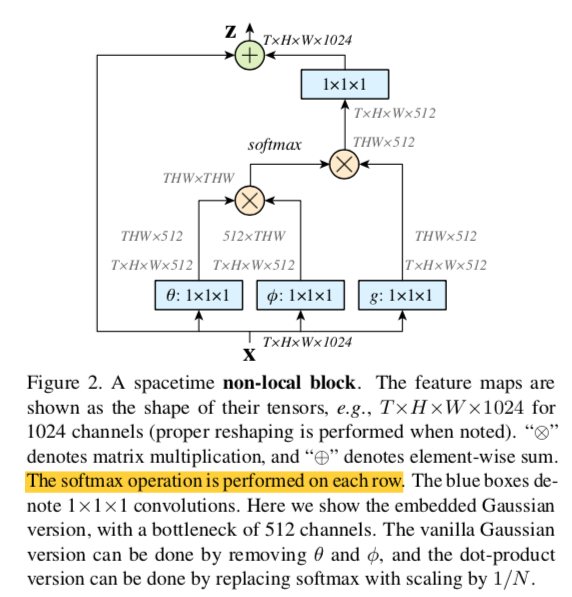
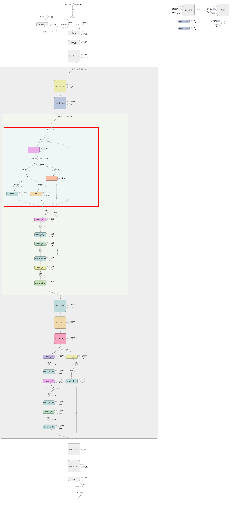
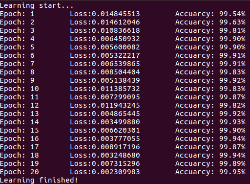
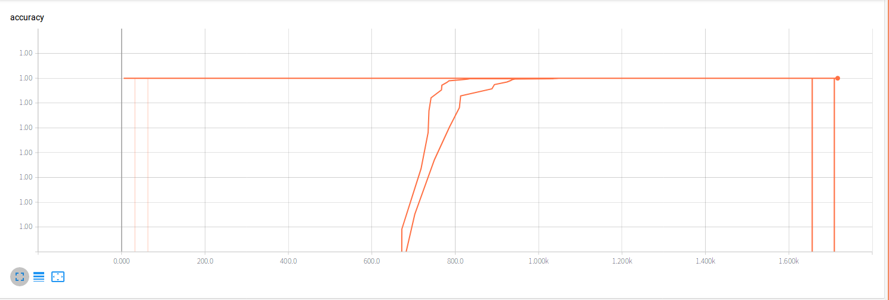
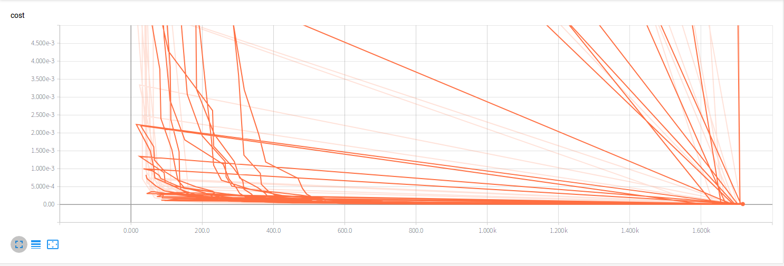

### 《Non-local Neural Network》复现

- [Non-local Neural Network](https://arxiv.org/pdf/1711.07971v1.pdf)

- [作者公开的源代码-caffe](https://github.com/facebookresearch/video-nonlocal-net)

- 传统的卷积操作一次只是处理的一个局部邻域（`local neighborhood`），没有考虑到其他位置的像素对其输出的影响。这篇文章呈现的non-local操作能够捕获远距离的像素之间的依赖关系（`long-range dependencies`）

- `non-local`公式如下：
  $$
  y_i = \frac{1}{C(x)}\sum_jf(x_i,x_j)g(x_j)
  $$
  以图像为例，$i, j$为像素位置，$f(·)$表示$i$和$j$之间的关联系数，也可以说是权重，$g(·)$表示像素j的信息，$C(x)$为归一化系数，整个公式表示遍历所有的点$j$，以$f$为权重，将信息$g$进行加权求和

- 输入和输出尺寸相同

- `non-local`对f和g的形式不敏感

- `Non-local  block`结构如下：

  

- 这个结构设置通道的数量为输入`x`通道数的一半，这样可以减少计算量，然后通过Wz的来让输出Z跟输出X通道数保持一致，这点参考了`ResNet`的`bottleneck`设计
- 这个结构实现起来不复杂，文章这个`block`添加到`ResNet50`中，分别添加1（`to res4`）、5（`3 to res4 and 2 to res3`）、10个（`to every residual block in res3 and res4`）`non-local block`

- 论文做的是视频分类，该代码做的实现的是在`MNIST`数据集上的分类，添加10个`non-local block`到`ResNet50`中

- 由于采用`ResNet50`，网络的输入尺寸为224x224，所以为了匹配尺寸，强行将28x28`pad`为224x224，纯粹是为了尺寸的匹配

- 计算图:

  

- 在`MNIST`上训练结果：

  

- 从打印出来的结果来看训练是正常的，但是不知道为什么损失函数和准确率曲线会是这样

- Reference:

  - CVPR2018-[https://arxiv.org/pdf/1711.07971v1.pdf](https://arxiv.org/pdf/1711.07971v1.pdf)
  - [https://github.com/titu1994/keras-non-local-nets](https://github.com/titu1994/keras-non-local-nets)
  - [https://github.com/nnUyi/Non-Local_Nets-Tensorflow](https://github.com/nnUyi/Non-Local_Nets-Tensorflow)
  - [https://github.com/Tencent/tencent-ml-images](https://github.com/Tencent/tencent-ml-images)

  