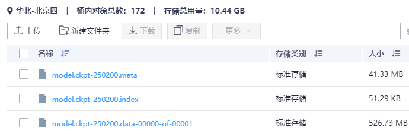
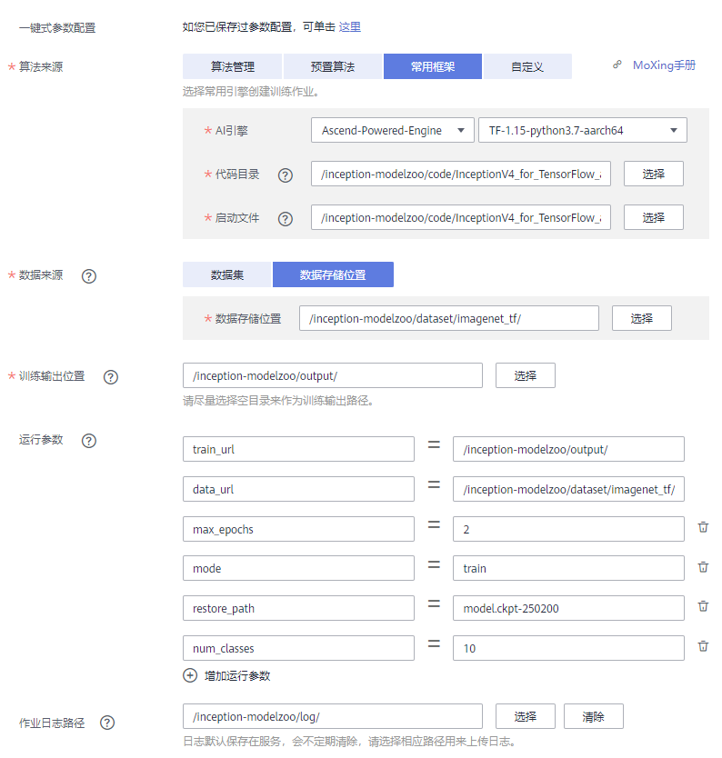

# InceptionV4 for TensorFlow
-   [交付件基本信息](#交付件基本信息.md)
-   [概述](#概述.md)
    -   [简述](#简述.md)
    -   [默认配置](#默认配置.md)
    -   [支持特性](#支持特性.md)
-   [准备工作](#准备工作.md)
    -   [训练环境准备](#训练环境准备.md)
    -   [推理环境准备](#推理环境准备.md)
    -   [源码介绍](#源码介绍.md)
-   [训练](#训练.md)
    -   [数据集准备](#数据集准备.md)
    -   [模型训练](#模型训练.md)
    -   [高级参考](#高级参考.md)
    -   [迁移学习指导](#迁移学习指导.md)
-   [推理](#推理.md)
    -   [模型转换](#模型转换.md)
    -   [MxBase推理](#MxBase推理.md)
    -   [MindX SDK推理](#MindX-SDK推理.md)
-   [在ModelArts上应用](#在ModelArts上应用.md)
    -   [创建OBS桶](#创建OBS桶.md)
    -   [创建训练作业](#创建训练作业.md)
    -   [查看训练任务日志](#查看训练任务日志.md)
    -   [迁移学习指导](#迁移学习指导-0.md)
<h2 id="交付件基本信息.md">交付件基本信息</h2>

发布者（Publisher）：Huawei

应用领域（Application Domain）：Image Classification

版本（Version）：1.3

修改时间（Modified）：2021.03.30

大小（Size）：539MB（ckpt）/88MB（om）

框架（Framework）：TensorFlow\_1.15.0

模型格式（Model Format）：ckpt/om

精度（Precision）：Mixed/FP32

处理器（Processor）：昇腾910/昇腾310

应用级别（Categories）：Released

描述（Description）：基于TensorFlow框架的InceptionV4网络图像分类网络训练并保存模型，通过ATC工具转换，可在昇腾AI设备上运行

<h2 id="概述.md">概述</h2>

-   **[简述](#简述.md)**  

-   **[默认配置](#默认配置.md)**  

-   **[支持特性](#支持特性.md)**  


<h2 id="简述.md">简述</h2>

InceptionV4是2016年提出的Inception系列网络的第四个版本，随着ResNet网络的出现以及在主流数据集上的良好表现，谷歌希望将残差结构引入到Inception网络中得到更好的表现，同时注意到InceptionV3的部分结构有不必要的复杂性，于是尝试在不引入残差结构的情况下改进原来的的Inception结构，最终达到和与ResNet结合方式相同的精度。

参考论文：[Christian Szegedy, Sergey Ioffe, Vincent Vanhoucke, Alex Alemi, ​​Inception-v4, Inception-ResNet and the Impact of Residual Connection on Learning.2016](https://arxiv.org/abs/1602.07261)

参考实现：[https://github.com/tensorflow/models/tree/master/research/slim](https://github.com/tensorflow/models/tree/master/research/slim)

<h2 id="默认配置.md">默认配置</h2>

-   网络结构
    -   初始学习率为0.045，使用Cosine learning rate
    -   优化器：RMSProp
    -   单卡batchsize：128
    -   8卡batchsize：64\*8
    -   总Epoch数设置为100
    -   Weight decay为0.00001，Momentu为0.9，decay为0.9，epsilon为1.0
    -   Label smoothing参数为0.1

-   训练数据集预处理（以ImageNet/Train为例，仅作为用户参考示例）：
    -   图像的输入尺寸为299\*299
    -   随机中心裁剪图像
    -   对比度，饱和度，色彩变换
    -   均值为0，归一化为\[-1，1\]

-   测试数据集预处理（以ImageNet/Val为例，仅作为用户参考示例）：
    -   图像的输入尺寸为299\*299
    -   均值为0，归一化为\[-1，1\]


<h2 id="支持特性.md">支持特性</h2>

## 支持特性

支持的特性包括：1、分布式训练。2、混合精度。3、数据并行。

8P训练脚本，支持数据并行的分布式训练。脚本样例中默认开启了混合精度，参考示例，见“开启混合精度”。

## 混合精度训练

昇腾910 AI处理器提供自动混合精度功能，可以针对全网中float32数据类型的算子，按照内置的优化策略，自动将部分float32的算子降低精度到float16，从而在精度损失很小的情况下提升系统性能并减少内存使用。

## 开启混合精度

相关代码示例。

```
run_config = NPURunConfig(
        hcom_parallel = True,
        enable_data_pre_proc = True,
        keep_checkpoint_max=5,
        save_checkpoints_steps=self.args.nsteps_per_epoch,
        session_config = self.sess.estimator_config,
        model_dir = self.args.log_dir,
        iterations_per_loop=self.args.iterations_per_loop,
        precision_mode='allow_mix_precision'
      ）
```

<h2 id="准备工作.md">准备工作</h2>

-   **[训练环境准备](#训练环境准备.md)**  

-   **[推理环境准备](#推理环境准备.md)**  

-   **[源码介绍](#源码介绍.md)**  


<h2 id="训练环境准备.md">训练环境准备</h2>

-   硬件环境准备请参见各硬件产品[“驱动和固件安装升级指南”](“驱动和固件安装升级指南”https://support.huawei.com/enterprise/zh/category/ai-computing-platform-pid-1557196528909)。需要在硬件设备上安装与CANN版本配套的固件与驱动。
-   宿主机上需要安装Docker并登录[Ascend Hub中心](Ascend Hub中心https://ascendhub.huawei.com/#/home)获取镜像。

    当前模型支持的镜像列表如下表所示。

    **表 1**  镜像列表

    <table><thead align="left"><tr id="zh-cn_topic_0000001073529887_row0190152218319"><th class="cellrowborder" valign="top" width="55.00000000000001%" id="mcps1.2.4.1.1"><p id="zh-cn_topic_0000001073529887_p1419132211315"><a name="zh-cn_topic_0000001073529887_p1419132211315"></a><a name="zh-cn_topic_0000001073529887_p1419132211315"></a>镜像名称</p>
    </th>
    <th class="cellrowborder" valign="top" width="20%" id="mcps1.2.4.1.2"><p id="zh-cn_topic_0000001073529887_p20601633736"><a name="zh-cn_topic_0000001073529887_p20601633736"></a><a name="zh-cn_topic_0000001073529887_p20601633736"></a>镜像版本</p>
    </th>
    <th class="cellrowborder" valign="top" width="25%" id="mcps1.2.4.1.3"><p id="zh-cn_topic_0000001073529887_p8601933539"><a name="zh-cn_topic_0000001073529887_p8601933539"></a><a name="zh-cn_topic_0000001073529887_p8601933539"></a>配套CANN版本</p>
    </th>
    </tr>
    </thead>
    <tbody><tr id="zh-cn_topic_0000001073529887_row71915221134"><td class="cellrowborder" valign="top" width="55.00000000000001%" headers="mcps1.2.4.1.1 "><a name="zh-cn_topic_0000001073529887_ul129622059162218"></a><a name="zh-cn_topic_0000001073529887_ul129622059162218"></a><ul id="zh-cn_topic_0000001073529887_ul129622059162218"><li>ARM架构：<a href="https://ascendhub.huawei.com/#/detail?name=ascend-tensorflow-arm" target="_blank" rel="noopener noreferrer">ascend-tensorflow-arm</a></li><li>x86架构：<a href="https://ascendhub.huawei.com/#/detail?name=ascend-tensorflow-x86" target="_blank" rel="noopener noreferrer">ascend-tensorflow-x86</a></li></ul>
    </td>
    <td class="cellrowborder" valign="top" width="20%" headers="mcps1.2.4.1.2 "><p id="zh-cn_topic_0000001073529887_p14648161414516"><a name="zh-cn_topic_0000001073529887_p14648161414516"></a><a name="zh-cn_topic_0000001073529887_p14648161414516"></a>20.2.0</p>
    </td>
    <td class="cellrowborder" valign="top" width="25%" headers="mcps1.2.4.1.3 "><p id="zh-cn_topic_0000001073529887_p1264815147514"><a name="zh-cn_topic_0000001073529887_p1264815147514"></a><a name="zh-cn_topic_0000001073529887_p1264815147514"></a><a href="https://ascend.huawei.com/#/software/cann/commercial" target="_blank" rel="noopener noreferrer">3.2.0</a></p>
    <div class="note" id="zh-cn_topic_0000001073529887_note6202161810548"><a name="zh-cn_topic_0000001073529887_note6202161810548"></a><a name="zh-cn_topic_0000001073529887_note6202161810548"></a><span class="notetitle"> 说明： </span><div class="notebody"><p id="zh-cn_topic_0000001073529887_zh-cn_topic_0000001074020224_p1320231814547"><a name="zh-cn_topic_0000001073529887_zh-cn_topic_0000001074020224_p1320231814547"></a><a name="zh-cn_topic_0000001073529887_zh-cn_topic_0000001074020224_p1320231814547"></a>对应配套华为企业业务网站 （ <a href="https://support.huawei.com/enterprise/zh/index.html" target="_blank" rel="noopener noreferrer">http://support.huawei.com</a> ） “技术支持 &gt; 昇腾计算 &gt; 解决方案配套与软件 &gt; CANN”的“V100R020C20”版本号。</p>
    </div></div>
    </td>
    </tr>
    </tbody>
    </table>


<h2 id="推理环境准备.md">推理环境准备</h2>

-   硬件环境、开发环境和运行环境准备请参见《CANN 软件安装指南](CANN 软件安装指南https://support.huawei.com/enterprise/zh/ascend-computing/cann-pid-251168373?category=installation-upgrade)》。
-   宿主机上需要安装Docker并登录[Ascend Hub中心](Ascend Hub中心https://ascendhub.huawei.com/#/home)获取镜像。

    当前模型支持的镜像列表如下表所示。

    **表 1**  镜像列表

    <table><thead align="left"><tr id="zh-cn_topic_0000001132685117_row0190152218319"><th class="cellrowborder" valign="top" width="55.00000000000001%" id="mcps1.2.4.1.1"><p id="zh-cn_topic_0000001132685117_p1419132211315"><a name="zh-cn_topic_0000001132685117_p1419132211315"></a><a name="zh-cn_topic_0000001132685117_p1419132211315"></a>镜像名称</p>
    </th>
    <th class="cellrowborder" valign="top" width="20%" id="mcps1.2.4.1.2"><p id="zh-cn_topic_0000001132685117_p75071327115313"><a name="zh-cn_topic_0000001132685117_p75071327115313"></a><a name="zh-cn_topic_0000001132685117_p75071327115313"></a>镜像版本</p>
    </th>
    <th class="cellrowborder" valign="top" width="25%" id="mcps1.2.4.1.3"><p id="zh-cn_topic_0000001132685117_p1024411406234"><a name="zh-cn_topic_0000001132685117_p1024411406234"></a><a name="zh-cn_topic_0000001132685117_p1024411406234"></a>配套CANN版本</p>
    </th>
    </tr>
    </thead>
    <tbody><tr id="zh-cn_topic_0000001132685117_row71915221134"><td class="cellrowborder" valign="top" width="55.00000000000001%" headers="mcps1.2.4.1.1 "><a name="zh-cn_topic_0000001132685117_ul81691515131910"></a><a name="zh-cn_topic_0000001132685117_ul81691515131910"></a><ul id="zh-cn_topic_0000001132685117_ul81691515131910"><li>ARM架构：<a href="https://ascendhub.huawei.com/#/detail?name=ascend-infer-arm" target="_blank" rel="noopener noreferrer">ascend-infer-arm</a></li><li>x86架构：<a href="https://ascendhub.huawei.com/#/detail?name=ascend-infer-x86" target="_blank" rel="noopener noreferrer">ascend-infer-x86</a></li></ul>
    </td>
    <td class="cellrowborder" valign="top" width="20%" headers="mcps1.2.4.1.2 "><p id="zh-cn_topic_0000001132685117_p14648161414516"><a name="zh-cn_topic_0000001132685117_p14648161414516"></a><a name="zh-cn_topic_0000001132685117_p14648161414516"></a>20.2.0</p>
    </td>
    <td class="cellrowborder" valign="top" width="25%" headers="mcps1.2.4.1.3 "><p id="zh-cn_topic_0000001132685117_p1264815147514"><a name="zh-cn_topic_0000001132685117_p1264815147514"></a><a name="zh-cn_topic_0000001132685117_p1264815147514"></a><a href="https://ascend.huawei.com/#/software/cann/commercial" target="_blank" rel="noopener noreferrer">3.2.0</a></p>
    <div class="note" id="zh-cn_topic_0000001132685117_note6202161810548"><a name="zh-cn_topic_0000001132685117_note6202161810548"></a><a name="zh-cn_topic_0000001132685117_note6202161810548"></a><span class="notetitle"> 说明： </span><div class="notebody"><p id="zh-cn_topic_0000001132685117_zh-cn_topic_0000001074020224_p1320231814547"><a name="zh-cn_topic_0000001132685117_zh-cn_topic_0000001074020224_p1320231814547"></a><a name="zh-cn_topic_0000001132685117_zh-cn_topic_0000001074020224_p1320231814547"></a>对应配套华为企业业务网站 （ <a href="https://support.huawei.com/enterprise/zh/index.html" target="_blank" rel="noopener noreferrer">http://support.huawei.com</a> ） “技术支持 &gt; 昇腾计算 &gt; 解决方案配套与软件 &gt; CANN”的“V100R020C20”版本号。</p>
    </div></div>
    </td>
    </tr>
    </tbody>
    </table>


<h2 id="源码介绍.md">源码介绍</h2>

## 脚本和示例代码

```
├── train.py                                  //网络训练与测试代码
├── README.md                                 //说明文档
├── inception
│    ├──inception_v4.py                      //网络构建
│    ├──create_session.py                    //session的参数
│    ├──data_loader.py                       //数据加载
│    ├──layers.py                            //计算accuracy，loss
│    ├──logger.py                            //logging message
│    ├──model.py                             //tf.estimator的封装
│    ├──train_helper.py                      //helper_class
│    ├──hyper_param.py                       //hyper paramaters设置
│    ├──trainer.py                           //estimator训练和验证
│    ├──inception_preprocessing.py           //数据预处理    
│    ├──inception.py   
│    ├──inception_utils.py 
├── scripts
│    ├──run_1p.sh                             //单卡运行脚本
│    ├──train_1p.sh                           //单卡配置脚本
│    ├──run_8p.sh                             //8卡运行脚本
│    ├──train_8p.sh                           //8卡配置脚本|
│    ├──8p.json                               //rank table配置文件
│    ├──test.sh                               //数据测试


```

<h2 id="训练.md">训练</h2>

-   **[数据集准备](#数据集准备.md)**  

-   **[模型训练](#模型训练.md)**  

-   **[高级参考](#高级参考.md)**  

-   **[迁移学习指导](#迁移学习指导.md)**  


<h2 id="数据集准备.md">数据集准备</h2>

## 环境依赖

制作数据集的环境上已安装Python2和TensorFlow 1.15.0版本。

## 操作步骤

1.  数据准备。

    > **说明：** 
    >下载和预处理数据可能需要几个小时，具体取决于您的网络和计算机速度，请耐心等待。

    1.  请用户自行准备好数据集，包含训练集和验证集两部分，可选用的数据集包括ImageNet2012，CIFAR10、Flower等，包含train和val两部分。以imagenet2012数据集为例。
    2.  上传准备好的数据集压缩包到训练环境上。

        ```
        ├── /data/dataset/imagenet2012
        │   ├──ILSVRC2012_img_train.tar
        │   ├──ILSVRC2012_img_val.tar
        │   ├──ILSVRC2012_bbox_train_v2.tar.gz
        ```

    3.  执行以下脚本，创建“train“、“val“、“bbox“和“imagenet\_tf“目录，分别解压train、val、bbox数据集压缩包到对应的目录。

        ```
        vim prepare_dataset.sh
        bash prepare_dataset.sh
        ```

        prepare\_dataset.sh脚本内容。

        ```
        #!/bin/bash
        mkdir -p train val bbox imagenet_tf
        tar -xvf ILSVRC2012_img_train.tar -C train/
        tar -xvf ILSVRC2012_img_val.tar -C val/
        tar -xvf ILSVRC2012_bbox_train_v2.tar.gz -C bbox/
        ```

        > **说明：** 
        >如果解压后的“train”目录下还是.tar文件，请在“train”目录下执行以下命令解压。
        >**find . -name "\*.tar" | while read LINE ; do mkdir -p "$\{LINE%.tar\}"; tar -xvf "$\{LINE\}" -C "$\{LINE%.tar\}"; rm -f "$\{LINE\}"; done**

    4.  检查数据集目录是否如下所示。

        ```
        ├── /data/dataset/imagenet2012
        │   ├──ILSVRC2012_img_train.tar
        │   ├──ILSVRC2012_img_val.tar
        │   ├──ILSVRC2012_bbox_train_v2.tar.gz
        │   ├──bbox/
        │   ├──train/
        │   ├──val/
        ```


2.  转换数据集为TFRecord格式。
    1.  下载源代码。

        ```
        git clone [https://github.com/tensorflow/models.git](https://github.com/tensorflow/models.git)
        ```

    2.  进入“datasets“目录，预处理验证数据。

        ```
        cd models-master/research/slim/datasets/
        # 预处理验证数据
        python preprocess_imagenet_validation_data.py /data/dataset/imagenet2012/val/ imagenet_2012_validation_synset_labels.txt
        ```

    3.  将标注的XML文件转换为单个CSV文件。

        ```
        python process_bounding_boxes.py /data/dataset/imagenet2012/bbox/ imagenet_lsvrc_2015_synsets.txt | sort > imagenet_2012_bounding_boxes.csv
        ```

    4.  转换ImageNet数据集为TFRecord格式。

        ```
        python build_imagenet_data.py --output_directory=/data/dataset/imagenet2012/imagenet_tf --train_directory=/data/dataset/imagenet2012/train --validation_directory=/data/dataset/imagenet2012/val
        ```


3.  查看转换好的数据集目录如下。

    ```
    ├── /data/dataset/imagenet2012/imagenet_tf
    │   ├──train-00000-of-01024
    │   ├──train-00001-of-01024
    │   ├──train-00002-of-01024
    │ ...
    │   ├──validation-00000-of-00128
    │   ├──validation-00001-of-00128
    │   ├──validation-00002-of-00128
    │ ...
    ```


<h2 id="模型训练.md">模型训练</h2>

1.  单击“下载模型脚本”，下载软件包。

    > **说明：** 
    >-   下载模型脚本：下载训练和推理的脚本文件。
    >-   下载模型：下载模型文件。

2.  上传源码包到服务器任意目录并解压（如：“/home/HwHiAiUser“）。

    ```
    # 在环境上执行
    unzip InceptionV4_TensorFlow_1.3_code.zip
    cd InceptionV4_TensorFlow_1.3_code/scripts && dos2unix `find .`
    ```

3.  进入训练脚本所在目录。

    **cd**  /home/HwHiAiUser_/InceptionV4\_TensorFlow\_1.3\_code_

4.  在scripts目录下执行**chmod +x \***，添加可执行权限。
5.  编译镜像。

    **docker** **build -t** _docker\_image_ **--build-arg FROM\_IMAGE\_NAME=**base\_image:tag **.**

    **表 1**  参数说明

    <table><thead align="left"><tr id="zh-cn_topic_0000001084194046_row105987468582"><th class="cellrowborder" valign="top" width="39.56%" id="mcps1.2.3.1.1"><p id="zh-cn_topic_0000001084194046_p10598104613582"><a name="zh-cn_topic_0000001084194046_p10598104613582"></a><a name="zh-cn_topic_0000001084194046_p10598104613582"></a>参数</p>
    </th>
    <th class="cellrowborder" valign="top" width="60.440000000000005%" id="mcps1.2.3.1.2"><p id="zh-cn_topic_0000001084194046_p205981346205810"><a name="zh-cn_topic_0000001084194046_p205981346205810"></a><a name="zh-cn_topic_0000001084194046_p205981346205810"></a>说明</p>
    </th>
    </tr>
    </thead>
    <tbody><tr id="zh-cn_topic_0000001084194046_row859824655818"><td class="cellrowborder" valign="top" width="39.56%" headers="mcps1.2.3.1.1 "><p id="zh-cn_topic_0000001084194046_p125981646105816"><a name="zh-cn_topic_0000001084194046_p125981646105816"></a><a name="zh-cn_topic_0000001084194046_p125981646105816"></a><em id="zh-cn_topic_0000001084194046_i63592054195810"><a name="zh-cn_topic_0000001084194046_i63592054195810"></a><a name="zh-cn_topic_0000001084194046_i63592054195810"></a>docker_image</em></p>
    </td>
    <td class="cellrowborder" valign="top" width="60.440000000000005%" headers="mcps1.2.3.1.2 "><p id="zh-cn_topic_0000001084194046_p1059884685815"><a name="zh-cn_topic_0000001084194046_p1059884685815"></a><a name="zh-cn_topic_0000001084194046_p1059884685815"></a>镜像名称，请根据实际写入。</p>
    </td>
    </tr>
    <tr id="zh-cn_topic_0000001084194046_row1159844620585"><td class="cellrowborder" valign="top" width="39.56%" headers="mcps1.2.3.1.1 "><p id="zh-cn_topic_0000001084194046_p45981246155810"><a name="zh-cn_topic_0000001084194046_p45981246155810"></a><a name="zh-cn_topic_0000001084194046_p45981246155810"></a><em id="zh-cn_topic_0000001084194046_i1815165712582"><a name="zh-cn_topic_0000001084194046_i1815165712582"></a><a name="zh-cn_topic_0000001084194046_i1815165712582"></a>base_image</em></p>
    </td>
    <td class="cellrowborder" valign="top" width="60.440000000000005%" headers="mcps1.2.3.1.2 "><p id="zh-cn_topic_0000001084194046_p1559810463585"><a name="zh-cn_topic_0000001084194046_p1559810463585"></a><a name="zh-cn_topic_0000001084194046_p1559810463585"></a>为基础镜像，可从Ascend Hub上下载。</p>
    </td>
    </tr>
    <tr id="zh-cn_topic_0000001084194046_row02758153582"><td class="cellrowborder" valign="top" width="39.56%" headers="mcps1.2.3.1.1 "><p id="zh-cn_topic_0000001084194046_p122751815165819"><a name="zh-cn_topic_0000001084194046_p122751815165819"></a><a name="zh-cn_topic_0000001084194046_p122751815165819"></a><em id="zh-cn_topic_0000001084194046_i1394922118583"><a name="zh-cn_topic_0000001084194046_i1394922118583"></a><a name="zh-cn_topic_0000001084194046_i1394922118583"></a>tag</em></p>
    </td>
    <td class="cellrowborder" valign="top" width="60.440000000000005%" headers="mcps1.2.3.1.2 "><p id="zh-cn_topic_0000001084194046_p11275131565810"><a name="zh-cn_topic_0000001084194046_p11275131565810"></a><a name="zh-cn_topic_0000001084194046_p11275131565810"></a>镜像tag，请根据实际配置，如：20.2.0。</p>
    </td>
    </tr>
    </tbody>
    </table>
    
> **说明：** 
    >不要遗漏命令结尾的“.“。
    
6.  （可选）如果需要跑8卡训练，修改文件“scripts/8p.json“，设置device\_ip，与本机NPU的IP保持一致。
    1.  查询本机NPU的IP命令。

        **for i in \{0..7\};do hccn\_tool -i $i -ip -g;done**

        ```
        ipaddr:192.168.100.101
        netmask:255.255.255.0
        ipaddr:192.168.101.101
        netmask:255.255.255.0
        ipaddr:192.168.102.101
        netmask:255.255.255.0
        ipaddr:192.168.103.101
        netmask:255.255.255.0
        ipaddr:192.168.100.100
        netmask:255.255.255.0
        ipaddr:192.168.101.100
        netmask:255.255.255.0
        ipaddr:192.168.102.100
        netmask:255.255.255.0
        ipaddr:192.168.103.100
        netmask:255.255.255.0
        ```

    2.  8P的json配置文件内容修改示例如下。

        ```
        {
         "group_count": "1",
         "group_list": [
          {
           "group_name": "worker",
           "device_count": "8",
           "instance_count": "1",
           "instance_list": [
            {
             "devices":[
              {"device_id":"0","device_ip":"192.168.100.101"},
              {"device_id":"1","device_ip":"192.168.101.101"},
              {"device_id":"2","device_ip":"192.168.102.101"},
              {"device_id":"3","device_ip":"192.168.103.101"},
              {"device_id":"4","device_ip":"192.168.100.100"},
              {"device_id":"5","device_ip":"192.168.101.100"},
              {"device_id":"6","device_ip":"192.168.102.100"},
              {"device_id":"7","device_ip":"192.168.103.100"}
             ],
             "pod_name":"ascend8p",
             "server_id":"127.0.0.1"
            }
           ]
          }
         ],
         "status": "completed"
        }
        ```


7.  启动容器实例。

    **bash** **scripts/docker\_start.sh** _docker\_image_ _data\_dir_ _model\_dir_

    **表 2**  参数说明

    <table><thead align="left"><tr id="zh-cn_topic_0304403934_row9243114772414"><th class="cellrowborder" valign="top" width="45.16%" id="mcps1.2.3.1.1"><p id="zh-cn_topic_0304403934_p524364716241"><a name="zh-cn_topic_0304403934_p524364716241"></a><a name="zh-cn_topic_0304403934_p524364716241"></a>参数</p>
    </th>
    <th class="cellrowborder" valign="top" width="54.84%" id="mcps1.2.3.1.2"><p id="zh-cn_topic_0304403934_p172431247182412"><a name="zh-cn_topic_0304403934_p172431247182412"></a><a name="zh-cn_topic_0304403934_p172431247182412"></a>说明</p>
    </th>
    </tr>
    </thead>
    <tbody><tr id="zh-cn_topic_0304403934_row52431473244"><td class="cellrowborder" valign="top" width="45.16%" headers="mcps1.2.3.1.1 "><p id="zh-cn_topic_0304403934_p1524318479243"><a name="zh-cn_topic_0304403934_p1524318479243"></a><a name="zh-cn_topic_0304403934_p1524318479243"></a><span id="zh-cn_topic_0304403934_ph15943124515168"><a name="zh-cn_topic_0304403934_ph15943124515168"></a><a name="zh-cn_topic_0304403934_ph15943124515168"></a>docker_image</span></p>
    </td>
    <td class="cellrowborder" valign="top" width="54.84%" headers="mcps1.2.3.1.2 "><p id="zh-cn_topic_0304403934_p10243144712410"><a name="zh-cn_topic_0304403934_p10243144712410"></a><a name="zh-cn_topic_0304403934_p10243144712410"></a>编译镜像生成的镜像名称</p>
    </td>
    </tr>
    <tr id="zh-cn_topic_0304403934_row1624394732415"><td class="cellrowborder" valign="top" width="45.16%" headers="mcps1.2.3.1.1 "><p id="zh-cn_topic_0304403934_p92434478242"><a name="zh-cn_topic_0304403934_p92434478242"></a><a name="zh-cn_topic_0304403934_p92434478242"></a>data_dir</p>
    </td>
    <td class="cellrowborder" valign="top" width="54.84%" headers="mcps1.2.3.1.2 "><p id="zh-cn_topic_0304403934_p324313472240"><a name="zh-cn_topic_0304403934_p324313472240"></a><a name="zh-cn_topic_0304403934_p324313472240"></a>数据集路径</p>
    </td>
    </tr>
    <tr id="zh-cn_topic_0304403934_row132436473240"><td class="cellrowborder" valign="top" width="45.16%" headers="mcps1.2.3.1.1 "><p id="zh-cn_topic_0304403934_p1824319472242"><a name="zh-cn_topic_0304403934_p1824319472242"></a><a name="zh-cn_topic_0304403934_p1824319472242"></a>model_dir</p>
    </td>
    <td class="cellrowborder" valign="top" width="54.84%" headers="mcps1.2.3.1.2 "><p id="zh-cn_topic_0304403934_p7243144712249"><a name="zh-cn_topic_0304403934_p7243144712249"></a><a name="zh-cn_topic_0304403934_p7243144712249"></a>训练脚本路径</p>
    </td>
    </tr>
    </tbody>
    </table>
    
容器启动脚本**docker\_start.sh**参数说明如下：
    
```
    #!/usr/bin/env bash
    
    docker_image=$1 \  # 接受第一个参数作为docker_image
    data_dir=$2 \      # 接受第二个参数作为训练数据集路径
    model_dir=$3 \     # 接受第三个参数作为训练脚本路径
    
    docker run -it --ipc=host \
                  --device=/dev/davinci0 \
                  --device=/dev/davinci1 \
                  --device=/dev/davinci2 \
                  --device=/dev/davinci3 \
                  --device=/dev/davinci4 \
                  --device=/dev/davinci5 \
                  --device=/dev/davinci6 \
                  --device=/dev/davinci7 \   # docker使用卡数，当前使用0～7卡
                  --device=/dev/davinci_manager \
                  --device=/dev/devmm_svm 
                  --device=/dev/hisi_hdc \
    	      -v /usr/local/Ascend/driver:/usr/local/Ascend/driver \
                  -v /usr/local/Ascend/add-ons/:/usr/local/Ascend/add-ons/ \
                  -v ${model_dir}:${model_dir} \   # 训练脚本路径
                  -v ${data_dir}:${data_dir}  \    # 训练数据集路径
                  -v /var/log/npu/conf/slog/slog.conf:/var/log/npu/conf/slog/slog.conf \
                  -v /var/log/npu/slog/:/var/log/npu/slog -v /var/log/npu/profiling/:/var/log/npu/profiling \
                  -v /var/log/npu/dump/:/var/log/npu/dump -v /var/log/npu/:/usr/slog ${docker_image} \     # docker_image为镜像名称
                  /bin/bash
    ```
    
8.  开始训练。

    进入$\{model\_dir\}配置脚本路径scripts下面进行训练。

    -   单机单卡训练

        ```
        bash run_1p.sh
        ```

        参数说明：

        ```
        python3.7 ${dname}/train.py --rank_size=1 \
                --mode=train \
                --max_epochs=100 \
                --T_max=100 \
                --data_dir=/opt/npu/imagenet_data \
                --iterations_per_loop=10 \
                --batch_size=128 \
                --lr=0.045 \
                --display_every=100 \
                --log_dir=./model \
                --log_name=inception_v4.log > ${currentDir}/result/1p/train_${device_id}.log 2>&1 &
        ```

    -   单机8卡训练

        ```
        bash run_8p.sh
        ```

        参数说明：

        ```
        python3.7 ${dname}/train.py --rank_size=8 \
                --mode=train \
                --max_epochs=100 \
                --T_max=100 \
                --data_dir=/opt/npu/imagenet_data \
                --iterations_per_loop=10 \
                --batch_size=64 \
                --lr=0.045 \
                --display_every=100 \
                --log_dir=./model \
                --log_name=inception_v4.log > ${currentDir}/result/1p/train_${device_id}.log 2>&1 &
        ```


9.  开始验证。

    如果用户训练采用的是train\_and\_evaluate模式，那么训练过程中会自动跑验证流程，不需要再执行以下验证步骤。

    1.  将运行模式**mode**修改为evaluate，配置训练ckpt路径（脚本位于scripts/test.sh）。

        ```
        python3.7 ${dname}/train.py --rank_size=1 \
                --mode=evaluate \
                --data_dir=/opt/npu/imagenet_data \
                --batch_size=128 \
                --log_dir=./model \
                --eval_dir=./model \     #用户自行配置训练ckpt路径
                --log_name=eval_inceptionv4.log > ${currentDir}/result/1p/eval_${device_id}.log 2>&1 & 
        ```

    2.  单机单卡。

        ```
        bash test.sh
        ```


10. 模型冻结。

    跳转到“scripts”上一级目录，将训练生成的ckpt模型冻结，“ckpt\_path”为ckpt模型路径，请根据实际修改。

    ```
    python3.7 frozen_graph.py --ckpt_path=./scripts/result/8p/0/model/model.ckpt-250200
    ```


<h2 id="高级参考.md">高级参考</h2>

## 脚本参数

```
--data_dir                        train data dir, default : path/to/data
--batch_size                      mini-batch size ,default: 256 
--lr                              initial learning rate,default: 0.01
--max_epochs                      max epoch num to train the model:default: 100
--weight_decay                    weight decay factor for regularization loss ,default: 4e-4
--momentum                        momentum for optimizer ,default: 0.9
--label_smoothing                 use label smooth in CE, default 0.1
--log_dir                         path to save checkpoint and log,default: ./model
--log_name                        name of log file,default: googlebet.log
--mode                            mode to run the program (train, train_and_evaluate,evaluate), default: train
--eval_dir                        path to checkpoint for evaluation,default : None
--max_train_steps                 max number of training steps ,default : 100
--iteration_per_loop              the number of steps in devices for each iteration, default: 10
--use_nesterov                    whether to use Nesterov in optimizer. default: True
--rank_size                       number of npus to use, default : 1
--T_max                           max epochs for cos_annealing learning rate
--epochs_between_evals            set the model=train_and_evaluate, evaluation will be performed after sveral epochs, default:5

```

## 训练过程

通过“模型训练”中的训练指令启动单卡或者多卡训练。单卡和多卡通过运行不同脚本，支持单卡，8卡网络训练。

将训练脚本（train\_1p.sh,train\_8p.sh）中的**data\_dir**设置为训练数据集的路径。具体的流程参见“模型训练”的示例。

模型存储路径为“results/1p”或者“results/8p”，包括训练的log以及checkpoints文件。以单卡训练为例，loss信息在文件results/1p/0/model/inception\_v4.log中，示例如下。

```
step: 12100  epoch:  1.2  FPS:  469.5  loss: 4.676  total_loss: 5.051  lr:0.04499
step: 12200  epoch:  1.2  FPS:  469.6  loss: 4.922  total_loss: 5.297  lr:0.04499
step: 12300  epoch:  1.2  FPS:  469.6  loss: 4.953  total_loss: 5.328  lr:0.04499
step: 12400  epoch:  1.2  FPS:  469.7  loss: 4.758  total_loss: 5.133  lr:0.04499
step: 12500  epoch:  1.2  FPS:  469.6  loss: 4.957  total_loss: 5.332  lr:0.04499
step: 12600  epoch:  1.3  FPS:  469.5  loss: 4.594  total_loss: 4.969  lr:0.04499
step: 12700  epoch:  1.3  FPS:  469.6  loss: 4.707  total_loss: 5.082  lr:0.04499
step: 12800  epoch:  1.3  FPS:  469.6  loss: 4.574  total_loss: 4.950  lr:0.04499
step: 12900  epoch:  1.3  FPS:  469.5  loss: 4.809  total_loss: 5.184  lr:0.04499
step: 13000  epoch:  1.3  FPS:  469.7  loss: 4.664  total_loss: 5.040  lr:0.04499
step: 13100  epoch:  1.3  FPS:  469.6  loss: 4.555  total_loss: 4.930  lr:0.04499
step: 13200  epoch:  1.3  FPS:  469.6  loss: 4.703  total_loss: 5.079  lr:0.04499
step: 13300  epoch:  1.3  FPS:  469.6  loss: 4.543  total_loss: 4.919  lr:0.04499
step: 13400  epoch:  1.3  FPS:  469.7  loss: 4.738  total_loss: 5.114  lr:0.04499
step: 13500  epoch:  1.3  FPS:  469.6  loss: 4.707  total_loss: 5.083  lr:0.04499
step: 13600  epoch:  1.4  FPS:  469.6  loss: 4.793  total_loss: 5.169  lr:0.04499
step: 13700  epoch:  1.4  FPS:  469.6  loss: 4.520  total_loss: 4.895  lr:0.04499
step: 13800  epoch:  1.4  FPS:  469.6  loss: 4.672  total_loss: 5.048  lr:0.04499
step: 13900  epoch:  1.4  FPS:  469.6  loss: 4.562  total_loss: 4.939  lr:0.04499
step: 14000  epoch:  1.4  FPS:  469.6  loss: 4.742  total_loss: 5.118  lr:0.04499
step: 14100  epoch:  1.4  FPS:  469.5  loss: 4.555  total_loss: 4.931  lr:0.04499
```

## 验证/推理过程

在100 epoch训练执行完成后：

方法一：参照“模型训练”中的测试流程，需要修改脚本启动参数（脚本位于scripts/train\_1p.sh）将**mode**设置为**evaluate**，增加eval\_dir的路径，然后执行脚本。

方法二：在训练过程中将mode修改为train\_and\_evaluate，设置epochs\_between\_evals=5，会训练5个epoch推理一次精度。

```
./run_*p.sh
```

方法一：该脚本会自动执行验证流程，验证结果会输出到 /results/\*p/0/model/eval.log文件中。

方法二：会把训练和推理结果写到同一个日志文件中/results/\*p/model/inception\_v4.log。

```
step: 24000  epoch:  9.6  FPS: 3109.4  loss: 2.855  total_loss: 3.670  lr:0.04411
step: 24100  epoch:  9.6  FPS: 3108.1  loss: 2.643  total_loss: 3.455  lr:0.04411
step: 24200  epoch:  9.7  FPS: 3108.8  loss: 3.014  total_loss: 3.825  lr:0.04411
step: 24300  epoch:  9.7  FPS: 3108.8  loss: 3.041  total_loss: 3.851  lr:0.04411
step: 24400  epoch:  9.8  FPS: 3107.3  loss: 3.248  total_loss: 4.056  lr:0.04411
step: 24500  epoch:  9.8  FPS: 3108.8  loss: 3.363  total_loss: 4.170  lr:0.04411
step: 24600  epoch:  9.8  FPS: 3108.8  loss: 3.416  total_loss: 4.221  lr:0.04411
step: 24700  epoch:  9.9  FPS: 3109.2  loss: 2.854  total_loss: 3.658  lr:0.04411
step: 24800  epoch:  9.9  FPS: 3109.2  loss: 3.143  total_loss: 3.945  lr:0.04411
step: 24900  epoch: 10.0  FPS: 3108.9  loss: 3.014  total_loss: 3.815  lr:0.04411
step: 25000  epoch: 10.0  FPS: 3109.2  loss: 3.055  total_loss: 3.855  lr:0.04411
Starting to evaluate
Validation dataset size: 49921
 step  epoch  top1    top5     loss   checkpoint_time(UTC)
25020   10.0  48.210   73.99    3.12  2020-09-02 00:40:10
Starting a training cycle
Step   Epoch   Speed   Loss   FinLoss   LR
step: 25100  epoch: 10.0  FPS:  251.3  loss: 2.830  total_loss: 3.628  lr:0.04390
step: 25200  epoch: 10.1  FPS: 3103.9  loss: 3.164  total_loss: 3.961  lr:0.04390
step: 25300  epoch: 10.1  FPS: 3104.1  loss: 3.303  total_loss: 4.098  lr:0.04390
step: 25400  epoch: 10.2  FPS: 3103.8  loss: 3.197  total_loss: 3.991  lr:0.04390
step: 25500  epoch: 10.2  FPS: 3104.5  loss: 2.998  total_loss: 3.791  lr:0.04390
```

<h2 id="迁移学习指导.md">迁移学习指导</h2>

1.  数据集准备。
    1.  获取数据。

        如果要使用自己的数据集，请参见“数据集准备”，将数据集转化为TFRecord格式。

        类别数可以通过网络中的num\_classes来设置。

    2.  准确标注类别标签的数据集。
    3.  数据集每个类别所占比例大致相同。
    4.  参照TFRecord脚本生成train/eval使用的TFRecord文件。
    5.  数据集文件结构，请用户自行制作TFRecord文件，包含训练集和验证集两部分，目录参考：

        ```
        |--|imagenet_tfrecord
        |  train-00000-of-01024
        |  train-00001-of-01024
        |  train-00002-of-01024
        |  ...
        |  validation-00000-of-00128
        |  validation-00001-of-00128
        |  ...
        ```


2.  模型修改。

    配置训练超参，新增分类类别和ckpt模型路径。

    ```
    python3.7 ${dname}/train.py --rank_size=1 \
        --mode=evaluate \
        --max_epochs=1000 \
        --iterations_per_loop=10 \
        --data_dir=/data/fine_tuning/dataset \
        --batch_size=128 \
        --lr=0.045 \
        --display_every=100 \
        --log_dir=./model \
        --eval_dir=/data/fine_tuning/InceptionV4_for_TensorFlow/scripts/result/1p/0/model \
        --num_classes=10 \
        --restore_path=/data/fine_tuning/InceptionV4_for_TensorFlow/ckpt/model.ckpt-250200 \
        --log_name=inception_v4.log > ${currentDir}/result/1p/train_${device_id}.log 2>&1
    ```

3.  模型训练。

    请参考“模型训练”。


<h2 id="推理.md">推理</h2>

-   **[模型转换](#模型转换.md)**  

-   **[MxBase推理](#MxBase推理.md)**  

-   **[MindX SDK推理](#MindX-SDK推理.md)**  


<h2 id="模型转换.md">模型转换</h2>

1.  单击“下载模型脚本”和“下载模型”，下载所需软件包。

    > **说明：** 
    >-   下载模型脚本：下载训练和推理的脚本文件。
    >-   下载模型：下载模型文件。

2.  上传软件包到服务器任意目录并解压（如：“/home/HwHiAiUser“）。
3.  准备AIPP配置文件。
    1.  准备AIPP配置文件aipp.config文件，在ATC转换的过程中插入AIPP算子，即可与DVPP处理后的数据无缝对接，AIPP参数配置请参见《CANN 开发辅助工具指南 \(推理\)](CANN 开发辅助工具指南 (推理)https://support.huawei.com/enterprise/zh/ascend-computing/cann-pid-251168373?category=developer-documents)》中“ATC工具使用指南”。

        inception\_v4\_tf\_aipp.cfg

        ```
        aipp_op {
            aipp_mode: static
            input_format : RGB888_U8
            csc_switch : false
            rbuv_swap_switch : true
            mean_chn_0 : 0
            mean_chn_1 : 0
            mean_chn_2 : 0
            min_chn_0 : 127.5
            min_chn_1 : 127.5
            min_chn_2 : 127.5
            var_reci_chn_0 : 0.007843137254902
            var_reci_chn_1 : 0.007843137254902
            var_reci_chn_2 : 0.007843137254902
        }
        ```

    2.  用户可以使用ATC的帮助命令**atc --help**查看参数配置。

        ```
        ........
          --model             Model file
          --framework         Framework type. 0:Caffe; 1:MindSpore; 3:Tensorflow; 5:Onnx
          --input_shape       Shape of input data. Separate multiple nodes with semicolons (;). Use double quotation marks (") to enclose each argument.
                              E.g.: "input_name1:n1,c1,h1,w1;input_name2:n2,c2,h2,w2"
          --insert_op_conf    Config file to insert new op
          --output            Output file path&name(needn't suffix, will add .om automatically).
                              If --singleop is set, this arg specifies the directory to which the single op offline model will be generated
          --output_type       Set net output type. Support FP32, FP16, UINT8. E.g.: FP16, indicates that all out nodes are set to FP16.
                              "node1:0:FP16;node2:1:FP32", indicates setting the datatype of multiple out nodes.
          --soc_version       The soc version.
          --log               Generate log with level. Support debug, info, warning, error, null
        ........
        ```


4.  执行以下命令，启动容器实例。

    **bash docker\_start\_infer.sh** docker_image_:tag_ _model\_dir_

    **表 1**  参数说明

    <table><thead align="left"><tr id="zh-cn_topic_0000001136178835_zh-cn_topic_0000001136178835_zh-cn_topic_0000001081594484_row156848395361"><th class="cellrowborder" valign="top" width="31.56%" id="mcps1.2.3.1.1"><p id="zh-cn_topic_0000001136178835_zh-cn_topic_0000001136178835_zh-cn_topic_0000001081594484_p1168493973617"><a name="zh-cn_topic_0000001136178835_zh-cn_topic_0000001136178835_zh-cn_topic_0000001081594484_p1168493973617"></a><a name="zh-cn_topic_0000001136178835_zh-cn_topic_0000001136178835_zh-cn_topic_0000001081594484_p1168493973617"></a>参数</p>
    </th>
    <th class="cellrowborder" valign="top" width="68.44%" id="mcps1.2.3.1.2"><p id="zh-cn_topic_0000001136178835_zh-cn_topic_0000001136178835_zh-cn_topic_0000001081594484_p146841239133614"><a name="zh-cn_topic_0000001136178835_zh-cn_topic_0000001136178835_zh-cn_topic_0000001081594484_p146841239133614"></a><a name="zh-cn_topic_0000001136178835_zh-cn_topic_0000001136178835_zh-cn_topic_0000001081594484_p146841239133614"></a>说明</p>
    </th>
    </tr>
    </thead>
    <tbody><tr id="zh-cn_topic_0000001136178835_zh-cn_topic_0000001136178835_zh-cn_topic_0000001081594484_row1568433920365"><td class="cellrowborder" valign="top" width="31.56%" headers="mcps1.2.3.1.1 "><p id="zh-cn_topic_0000001136178835_zh-cn_topic_0000001136178835_zh-cn_topic_0000001081594484_p186850391362"><a name="zh-cn_topic_0000001136178835_zh-cn_topic_0000001136178835_zh-cn_topic_0000001081594484_p186850391362"></a><a name="zh-cn_topic_0000001136178835_zh-cn_topic_0000001136178835_zh-cn_topic_0000001081594484_p186850391362"></a><em id="zh-cn_topic_0000001136178835_zh-cn_topic_0000001136178835_zh-cn_topic_0000001081594484_zh-cn_topic_0304403934_i9243184713248"><a name="zh-cn_topic_0000001136178835_zh-cn_topic_0000001136178835_zh-cn_topic_0000001081594484_zh-cn_topic_0304403934_i9243184713248"></a><a name="zh-cn_topic_0000001136178835_zh-cn_topic_0000001136178835_zh-cn_topic_0000001081594484_zh-cn_topic_0304403934_i9243184713248"></a>docker_image</em></p>
    </td>
    <td class="cellrowborder" valign="top" width="68.44%" headers="mcps1.2.3.1.2 "><p id="zh-cn_topic_0000001136178835_zh-cn_topic_0000001136178835_zh-cn_topic_0000001081594484_p1768593919362"><a name="zh-cn_topic_0000001136178835_zh-cn_topic_0000001136178835_zh-cn_topic_0000001081594484_p1768593919362"></a><a name="zh-cn_topic_0000001136178835_zh-cn_topic_0000001136178835_zh-cn_topic_0000001081594484_p1768593919362"></a>推理镜像名称，推理镜像请从Ascend Hub上下载。</p>
    </td>
    </tr>
    <tr id="zh-cn_topic_0000001136178835_zh-cn_topic_0000001136178835_row752715193536"><td class="cellrowborder" valign="top" width="31.56%" headers="mcps1.2.3.1.1 "><p id="zh-cn_topic_0000001136178835_zh-cn_topic_0000001136178835_p3527171912533"><a name="zh-cn_topic_0000001136178835_zh-cn_topic_0000001136178835_p3527171912533"></a><a name="zh-cn_topic_0000001136178835_zh-cn_topic_0000001136178835_p3527171912533"></a><em id="zh-cn_topic_0000001136178835_zh-cn_topic_0000001136178835_i07442595317"><a name="zh-cn_topic_0000001136178835_zh-cn_topic_0000001136178835_i07442595317"></a><a name="zh-cn_topic_0000001136178835_zh-cn_topic_0000001136178835_i07442595317"></a>tag</em></p>
    </td>
    <td class="cellrowborder" valign="top" width="68.44%" headers="mcps1.2.3.1.2 "><p id="zh-cn_topic_0000001136178835_zh-cn_topic_0000001136178835_p195274194539"><a name="zh-cn_topic_0000001136178835_zh-cn_topic_0000001136178835_p195274194539"></a><a name="zh-cn_topic_0000001136178835_zh-cn_topic_0000001136178835_p195274194539"></a>镜像tag，请根据实际配置，如：20.2.0。</p>
    </td>
    </tr>
    <tr id="zh-cn_topic_0000001136178835_zh-cn_topic_0000001136178835_zh-cn_topic_0000001081594484_row6685193920365"><td class="cellrowborder" valign="top" width="31.56%" headers="mcps1.2.3.1.1 "><p id="zh-cn_topic_0000001136178835_zh-cn_topic_0000001136178835_zh-cn_topic_0000001081594484_p166850393369"><a name="zh-cn_topic_0000001136178835_zh-cn_topic_0000001136178835_zh-cn_topic_0000001081594484_p166850393369"></a><a name="zh-cn_topic_0000001136178835_zh-cn_topic_0000001136178835_zh-cn_topic_0000001081594484_p166850393369"></a>model_dir</p>
    </td>
    <td class="cellrowborder" valign="top" width="68.44%" headers="mcps1.2.3.1.2 "><p id="zh-cn_topic_0000001136178835_zh-cn_topic_0000001136178835_zh-cn_topic_0000001081594484_p136851639113618"><a name="zh-cn_topic_0000001136178835_zh-cn_topic_0000001136178835_zh-cn_topic_0000001081594484_p136851639113618"></a><a name="zh-cn_topic_0000001136178835_zh-cn_topic_0000001136178835_zh-cn_topic_0000001081594484_p136851639113618"></a>推理脚本路径</p>
    <div class="note" id="zh-cn_topic_0000001136178835_zh-cn_topic_0000001136178835_zh-cn_topic_0000001081594484_note3671163915214"><a name="zh-cn_topic_0000001136178835_zh-cn_topic_0000001136178835_zh-cn_topic_0000001081594484_note3671163915214"></a><a name="zh-cn_topic_0000001136178835_zh-cn_topic_0000001136178835_zh-cn_topic_0000001081594484_note3671163915214"></a><span class="notetitle"> 说明： </span><div class="notebody"><p id="zh-cn_topic_0000001136178835_zh-cn_topic_0000001136178835_zh-cn_topic_0000001081594484_p1967133910524"><a name="zh-cn_topic_0000001136178835_zh-cn_topic_0000001136178835_zh-cn_topic_0000001081594484_p1967133910524"></a><a name="zh-cn_topic_0000001136178835_zh-cn_topic_0000001136178835_zh-cn_topic_0000001081594484_p1967133910524"></a>若推理所需模型是通过“下载模型”获取，则该路径为推理脚本和模型所在路径。</p>
    </div></div>
    </td>
    </tr>
    </tbody>
    </table>
    
其中docker\_start\_infer.sh内容如下。
    
```
    #!/bin/bash
    docker_image=$1
    data_dir=$2
    
    if [ -z "${docker_image}" ]; then
        echo "please input docker_image"
        exit 1
    fi
    
    if [ ! -d "${data_dir}" ]; then
        echo "please input data_dir"
        exit 1
    fi
    
    docker run -it \
               --device=/dev/davinci0 \
               --device=/dev/davinci_manager \
               --device=/dev/devmm_svm \
               --device=/dev/hisi_hdc \
               -v /usr/local/Ascend/driver:/usr/local/Ascend/driver \
               -v ${data_dir}:${data_dir} \
               ${docker_image} \
               /bin/bash
    ```
    
5.  执行以下命令，进行模型转换。

    输出om模型供后续推理使用。

    ```
    atc \
    --model=inception_v4_tf.pb \
    --framework=3 \
    --output=inception_v4_tf_aipp \
    --output_type=FP32 \
    --soc_version=Ascend310 \
    --input_shape="input:1,299,299,3" \
    --log=info \
    --insert_op_conf=inception_v4_tf_aipp.cfg
    ```

    参数说明：

    -   --model：模型包中的pb模型路径。
    -   --framework：3代表TensorFlow。
    -   --output：转换生成的om模型的路径。
    -   --soc\_version：模型转换时指定处理器版本。
    -   --input\_shape：输入数据的shape。
    -   --log=info：设置ATC模型转换过程中显示日志的级别。
    -   --insert\_op\_conf：插入算子的配置文件路径与文件名，例如aipp预处理算子。


<h2 id="MxBase推理.md">MxBase推理</h2>

## 约束条件

-   支持输入图片格式：JPG/JPEG
-   分辨率范围：最大4096 x 4096，最小32 x 32

## 操作步骤

1.  单击“下载模型脚本”和“下载模型”，下载所需软件包。

    > **说明：** 
    >-   下载模型脚本：下载训练和推理的脚本文件。
    >-   下载模型：下载模型文件。

2.  下载MxBase代码。

    下载路径：[https://github.com/Ascend/mindxsdk-mxbase](https://github.com/Ascend/mindxsdk-mxbasehttps://github.com/Ascend/mindxsdk-mxbase)

3.  将代码上传至服务器任意目录并解压（如：“/home/HwHiAiUser“），然后执行以下命令转换shell脚本文件的编码格式。

    ```
    find . -name "*.sh" | xargs dos2unix
    ```

4.  执行以下命令，启动容器实例。

    **bash docker\_start\_infer.sh** docker_image:tag model_dir

    **表 1**  参数说明

    <table><thead align="left"><tr id="zh-cn_topic_0000001136178835_zh-cn_topic_0000001136178835_zh-cn_topic_0000001081594484_row156848395361"><th class="cellrowborder" valign="top" width="31.56%" id="mcps1.2.3.1.1"><p id="zh-cn_topic_0000001136178835_zh-cn_topic_0000001136178835_zh-cn_topic_0000001081594484_p1168493973617"><a name="zh-cn_topic_0000001136178835_zh-cn_topic_0000001136178835_zh-cn_topic_0000001081594484_p1168493973617"></a><a name="zh-cn_topic_0000001136178835_zh-cn_topic_0000001136178835_zh-cn_topic_0000001081594484_p1168493973617"></a>参数</p>
    </th>
    <th class="cellrowborder" valign="top" width="68.44%" id="mcps1.2.3.1.2"><p id="zh-cn_topic_0000001136178835_zh-cn_topic_0000001136178835_zh-cn_topic_0000001081594484_p146841239133614"><a name="zh-cn_topic_0000001136178835_zh-cn_topic_0000001136178835_zh-cn_topic_0000001081594484_p146841239133614"></a><a name="zh-cn_topic_0000001136178835_zh-cn_topic_0000001136178835_zh-cn_topic_0000001081594484_p146841239133614"></a>说明</p>
    </th>
    </tr>
    </thead>
    <tbody><tr id="zh-cn_topic_0000001136178835_zh-cn_topic_0000001136178835_zh-cn_topic_0000001081594484_row1568433920365"><td class="cellrowborder" valign="top" width="31.56%" headers="mcps1.2.3.1.1 "><p id="zh-cn_topic_0000001136178835_zh-cn_topic_0000001136178835_zh-cn_topic_0000001081594484_p186850391362"><a name="zh-cn_topic_0000001136178835_zh-cn_topic_0000001136178835_zh-cn_topic_0000001081594484_p186850391362"></a><a name="zh-cn_topic_0000001136178835_zh-cn_topic_0000001136178835_zh-cn_topic_0000001081594484_p186850391362"></a><em id="zh-cn_topic_0000001136178835_zh-cn_topic_0000001136178835_zh-cn_topic_0000001081594484_zh-cn_topic_0304403934_i9243184713248"><a name="zh-cn_topic_0000001136178835_zh-cn_topic_0000001136178835_zh-cn_topic_0000001081594484_zh-cn_topic_0304403934_i9243184713248"></a><a name="zh-cn_topic_0000001136178835_zh-cn_topic_0000001136178835_zh-cn_topic_0000001081594484_zh-cn_topic_0304403934_i9243184713248"></a>docker_image</em></p>
    </td>
    <td class="cellrowborder" valign="top" width="68.44%" headers="mcps1.2.3.1.2 "><p id="zh-cn_topic_0000001136178835_zh-cn_topic_0000001136178835_zh-cn_topic_0000001081594484_p1768593919362"><a name="zh-cn_topic_0000001136178835_zh-cn_topic_0000001136178835_zh-cn_topic_0000001081594484_p1768593919362"></a><a name="zh-cn_topic_0000001136178835_zh-cn_topic_0000001136178835_zh-cn_topic_0000001081594484_p1768593919362"></a>推理镜像名称，推理镜像请从Ascend Hub上下载。</p>
    </td>
    </tr>
    <tr id="zh-cn_topic_0000001136178835_zh-cn_topic_0000001136178835_row752715193536"><td class="cellrowborder" valign="top" width="31.56%" headers="mcps1.2.3.1.1 "><p id="zh-cn_topic_0000001136178835_zh-cn_topic_0000001136178835_p3527171912533"><a name="zh-cn_topic_0000001136178835_zh-cn_topic_0000001136178835_p3527171912533"></a><a name="zh-cn_topic_0000001136178835_zh-cn_topic_0000001136178835_p3527171912533"></a><em id="zh-cn_topic_0000001136178835_zh-cn_topic_0000001136178835_i07442595317"><a name="zh-cn_topic_0000001136178835_zh-cn_topic_0000001136178835_i07442595317"></a><a name="zh-cn_topic_0000001136178835_zh-cn_topic_0000001136178835_i07442595317"></a>tag</em></p>
    </td>
    <td class="cellrowborder" valign="top" width="68.44%" headers="mcps1.2.3.1.2 "><p id="zh-cn_topic_0000001136178835_zh-cn_topic_0000001136178835_p195274194539"><a name="zh-cn_topic_0000001136178835_zh-cn_topic_0000001136178835_p195274194539"></a><a name="zh-cn_topic_0000001136178835_zh-cn_topic_0000001136178835_p195274194539"></a>镜像tag，请根据实际配置，如：20.2.0。</p>
    </td>
    </tr>
    <tr id="zh-cn_topic_0000001136178835_zh-cn_topic_0000001136178835_zh-cn_topic_0000001081594484_row6685193920365"><td class="cellrowborder" valign="top" width="31.56%" headers="mcps1.2.3.1.1 "><p id="zh-cn_topic_0000001136178835_zh-cn_topic_0000001136178835_zh-cn_topic_0000001081594484_p166850393369"><a name="zh-cn_topic_0000001136178835_zh-cn_topic_0000001136178835_zh-cn_topic_0000001081594484_p166850393369"></a><a name="zh-cn_topic_0000001136178835_zh-cn_topic_0000001136178835_zh-cn_topic_0000001081594484_p166850393369"></a>model_dir</p>
    </td>
    <td class="cellrowborder" valign="top" width="68.44%" headers="mcps1.2.3.1.2 "><p id="zh-cn_topic_0000001136178835_zh-cn_topic_0000001136178835_zh-cn_topic_0000001081594484_p136851639113618"><a name="zh-cn_topic_0000001136178835_zh-cn_topic_0000001136178835_zh-cn_topic_0000001081594484_p136851639113618"></a><a name="zh-cn_topic_0000001136178835_zh-cn_topic_0000001136178835_zh-cn_topic_0000001081594484_p136851639113618"></a>推理脚本路径</p>
    <div class="note" id="zh-cn_topic_0000001136178835_zh-cn_topic_0000001136178835_zh-cn_topic_0000001081594484_note3671163915214"><a name="zh-cn_topic_0000001136178835_zh-cn_topic_0000001136178835_zh-cn_topic_0000001081594484_note3671163915214"></a><a name="zh-cn_topic_0000001136178835_zh-cn_topic_0000001136178835_zh-cn_topic_0000001081594484_note3671163915214"></a><span class="notetitle"> 说明： </span><div class="notebody"><p id="zh-cn_topic_0000001136178835_zh-cn_topic_0000001136178835_zh-cn_topic_0000001081594484_p1967133910524"><a name="zh-cn_topic_0000001136178835_zh-cn_topic_0000001136178835_zh-cn_topic_0000001081594484_p1967133910524"></a><a name="zh-cn_topic_0000001136178835_zh-cn_topic_0000001136178835_zh-cn_topic_0000001081594484_p1967133910524"></a>若推理所需模型是通过“下载模型”获取，则该路径为推理脚本和模型所在路径。</p>
    </div></div>
    </td>
    </tr>
    </tbody>
    </table>
    
其中docker\_start\_infer.sh内容如下。
    
```
    #!/bin/bash
    docker_image=$1
    data_dir=$2
    
    if [ -z "${docker_image}" ]; then
        echo "please input docker_image"
        exit 1
    fi
    
    if [ ! -d "${data_dir}" ]; then
        echo "please input data_dir"
        exit 1
    fi
    
    docker run -it \
               --device=/dev/davinci0 \
               --device=/dev/davinci_manager \
               --device=/dev/devmm_svm \
               --device=/dev/hisi_hdc \
               -v /usr/local/Ascend/driver:/usr/local/Ascend/driver \
               -v ${data_dir}:${data_dir} \
               ${docker_image} \
               /bin/bash
    ```
    
5.  编译工程。

    进入mxbase代码所在目录（如：“/home/HwHiAiUser/mindxsdk-mxbase“），进行编译。

    1.  配置环境变量。

        ```
        export ASCEND_HOME=/usr/local/Ascend
        export ASCEND_VERSION=nnrt/latest
        export ARCH_PATTERN=.
        ```

    2.  编译工程。

        ```
        mkdir build_now
        cd build_now
        cmake ..
        make
        make install
        ```

        > **说明：** 
        >由于需要下载编译开源软件，整体构建耗时大约20分钟，具体取决于您的网络和计算机速度，请耐心等待。


6.  准备模型推理所需文件。
    1.  将om模型拷贝到“mindxsdk-mxbase/samples/models/“目录下。

        om模型可通过“模型转换”生成或“下载模型”获取。

    2.  将代码包中“infer/mxbase”目录下所有内容拷贝到“mindxsdk-mxbase/samples/C++“目录。

        > **说明：** 
        >同名文件会被直接覆盖，若想保留原有文件，可先将“mindxsdk-mxbase/samples/C++“目录下的同名文件重命名备份。


7.  进入“mindxsdk-mxbase/samples/C++“目录，修改main.cpp文件的模型路径。

    ```
    namespace {
    const uint32_t CLASS_NUM = 1000;                                            // 根据模型的实际类别数修改
    }
    
    int main(int argc, char* argv[]){
    ...
    initParam.labelPath = "../models/imagenet1000_clsidx_to_labels.names";    // 根据数据集实际的类别修改
    initParam.topk = 5;    // 默认为top5分类结果展示，如果只需要top1，修改topk=1
    ...
    initParam.modelPath = "../models/inception_v4_tf_aipp.om";                // 模型存放路径
    ...
    ```

8.  编译推理程序。

    在“midxsdk-mxbase/samples/C++“目录下，执行如下命令。

    ```
    bash build.sh
    ```

9.  运行推理程序。

    在“mindxsdk-mxbase/samples/C++“目录下，运行推理。

    1.  设置运行环境变量。

        ```
        export LD_LIBRARY_PATH=${ASCEND_HOME}/nnrt/latest/acllib/lib64:$(pwd)/../../opensource/dist/lib:$(pwd)/../../dist/lib:$(pwd)/../../dist/lib/modelpostprocessors:$LD_LIBRARY_PATH
        ```

    2.  （可选）在当前目录下创建“img\_dir“目录，用于存放需要推理的图片，支持存放多张图片进行推理。
    3.  执行以下命令进行推理。

        ```
        ./inceptionv4 [image_path]
        ```

        > **说明：** 
        >\[image\_path\]：推理图片路径。

        示例如下：

        ```
        ./inceptionv4 ./img_dir
        ```

        运行结果如下所示。

        ```
        WARNING: Logging before InitGoogleLogging() is written to STDERR
        I0318 10:44:17.259578  6728 ModelInferenceProcessor.cpp:32] Begin to ModelInferenceProcessor init
        I0318 10:44:17.360826  6728 ModelInferenceProcessor.cpp:77] End to ModelInferenceProcessor init
        I0318 10:44:17.360987  6728 Resnet50PostProcess.cpp:35] Start to Init Resnet50PostProcess.
        I0318 10:44:17.361002  6728 PostProcessBase.cpp:70] Start to LoadConfigDataAndLabelMap in  PostProcessBase.
        I0318 10:44:17.361420  6728 Resnet50PostProcess.cpp:44] End to Init Resnet50PostProcess.
        I0318 10:44:17.361546  6728 DvppWrapper.cpp:570] Image width= 1024, height= 683, dataSize= 35635 bytes.
        I0318 10:44:17.364168  6728 DvppWrapper.cpp:531] Decode successfully.
        I0318 10:44:17.368201  6728 Resnet50PostProcess.cpp:69] Start to Process Resnet50PostProcess.
        I0318 10:44:17.369745  6728 Resnet50PostProcess.cpp:116] End to Process Resnet50PostProcess.
        I0318 10:44:17.369776  6728 Resnet50Classify.cpp:207] batchIndex:0 top1 className:beagle confidence:9.0625 classIndex:162
        I0318 10:44:17.405964  6728 DeviceManager.cpp:87] DestroyDevices begin
        I0318 10:44:17.405998  6728 DeviceManager.cpp:89] destory device:0
        I0318 10:44:17.503221  6728 DeviceManager.cpp:95] aclrtDestroyContext successfully!
        I0318 10:44:19.787474  6728 DeviceManager.cpp:103] DestroyDevices successfully
        ```


10. 查看推理精度和性能。
    1.  在“mindxsdk-mxbase/samples/C++“目录下新建“val\_union“目录。

        ```
        mkdir val_union
        ```

    2.  拷贝imagenet2012验证集中的图片到“val\_union“目录下，执行命令查看性能。

        ```
        ./inceptionv4 ./val_union
        ```

    3.  拷贝imagenet2012的验证集标签val\_label.txt文件和精度对比classification\_task\_metric.py文件（模型脚本“infer/utils”目录下）到“mindxsdk-mxbase/samples/C++“目录下，执行命令查看精度。

        ```
        python3.7 classification_task_metric.py result/ ./val_label.txt ./ result.json
        ```


<h2 id="MindX-SDK推理.md">MindX SDK推理</h2>

## 约束条件

-   支持输入图片格式：JPG/JPEG
-   分辨率范围：最大4096 x 4096，最小32 x 32

## 操作步骤

1.  单击“下载模型脚本”和“下载模型”，下载所需软件包。

    > **说明：** 
    >-   下载模型脚本：下载训练和推理的脚本文件。
    >-   下载模型：下载模型文件。

2.  将代码上传至服务器任意目录并解压（如：“/home/HwHiAiUser“），然后执行以下命令转换shell脚本文件的编码格式。

    ```
    find . -name "*.sh" | xargs dos2unix
    ```

3.  执行以下命令，启动容器实例。

    **bash docker\_start\_infer.sh** docker\_image:tag model_dir

    **表 1**  参数说明

    <table><thead align="left"><tr id="zh-cn_topic_0000001136178835_zh-cn_topic_0000001136178835_zh-cn_topic_0000001081594484_row156848395361"><th class="cellrowborder" valign="top" width="31.56%" id="mcps1.2.3.1.1"><p id="zh-cn_topic_0000001136178835_zh-cn_topic_0000001136178835_zh-cn_topic_0000001081594484_p1168493973617"><a name="zh-cn_topic_0000001136178835_zh-cn_topic_0000001136178835_zh-cn_topic_0000001081594484_p1168493973617"></a><a name="zh-cn_topic_0000001136178835_zh-cn_topic_0000001136178835_zh-cn_topic_0000001081594484_p1168493973617"></a>参数</p>
    </th>
    <th class="cellrowborder" valign="top" width="68.44%" id="mcps1.2.3.1.2"><p id="zh-cn_topic_0000001136178835_zh-cn_topic_0000001136178835_zh-cn_topic_0000001081594484_p146841239133614"><a name="zh-cn_topic_0000001136178835_zh-cn_topic_0000001136178835_zh-cn_topic_0000001081594484_p146841239133614"></a><a name="zh-cn_topic_0000001136178835_zh-cn_topic_0000001136178835_zh-cn_topic_0000001081594484_p146841239133614"></a>说明</p>
    </th>
    </tr>
    </thead>
    <tbody><tr id="zh-cn_topic_0000001136178835_zh-cn_topic_0000001136178835_zh-cn_topic_0000001081594484_row1568433920365"><td class="cellrowborder" valign="top" width="31.56%" headers="mcps1.2.3.1.1 "><p id="zh-cn_topic_0000001136178835_zh-cn_topic_0000001136178835_zh-cn_topic_0000001081594484_p186850391362"><a name="zh-cn_topic_0000001136178835_zh-cn_topic_0000001136178835_zh-cn_topic_0000001081594484_p186850391362"></a><a name="zh-cn_topic_0000001136178835_zh-cn_topic_0000001136178835_zh-cn_topic_0000001081594484_p186850391362"></a><em id="zh-cn_topic_0000001136178835_zh-cn_topic_0000001136178835_zh-cn_topic_0000001081594484_zh-cn_topic_0304403934_i9243184713248"><a name="zh-cn_topic_0000001136178835_zh-cn_topic_0000001136178835_zh-cn_topic_0000001081594484_zh-cn_topic_0304403934_i9243184713248"></a><a name="zh-cn_topic_0000001136178835_zh-cn_topic_0000001136178835_zh-cn_topic_0000001081594484_zh-cn_topic_0304403934_i9243184713248"></a>docker_image</em></p>
    </td>
    <td class="cellrowborder" valign="top" width="68.44%" headers="mcps1.2.3.1.2 "><p id="zh-cn_topic_0000001136178835_zh-cn_topic_0000001136178835_zh-cn_topic_0000001081594484_p1768593919362"><a name="zh-cn_topic_0000001136178835_zh-cn_topic_0000001136178835_zh-cn_topic_0000001081594484_p1768593919362"></a><a name="zh-cn_topic_0000001136178835_zh-cn_topic_0000001136178835_zh-cn_topic_0000001081594484_p1768593919362"></a>推理镜像名称，推理镜像请从Ascend Hub上下载。</p>
    </td>
    </tr>
    <tr id="zh-cn_topic_0000001136178835_zh-cn_topic_0000001136178835_row752715193536"><td class="cellrowborder" valign="top" width="31.56%" headers="mcps1.2.3.1.1 "><p id="zh-cn_topic_0000001136178835_zh-cn_topic_0000001136178835_p3527171912533"><a name="zh-cn_topic_0000001136178835_zh-cn_topic_0000001136178835_p3527171912533"></a><a name="zh-cn_topic_0000001136178835_zh-cn_topic_0000001136178835_p3527171912533"></a><em id="zh-cn_topic_0000001136178835_zh-cn_topic_0000001136178835_i07442595317"><a name="zh-cn_topic_0000001136178835_zh-cn_topic_0000001136178835_i07442595317"></a><a name="zh-cn_topic_0000001136178835_zh-cn_topic_0000001136178835_i07442595317"></a>tag</em></p>
    </td>
    <td class="cellrowborder" valign="top" width="68.44%" headers="mcps1.2.3.1.2 "><p id="zh-cn_topic_0000001136178835_zh-cn_topic_0000001136178835_p195274194539"><a name="zh-cn_topic_0000001136178835_zh-cn_topic_0000001136178835_p195274194539"></a><a name="zh-cn_topic_0000001136178835_zh-cn_topic_0000001136178835_p195274194539"></a>镜像tag，请根据实际配置，如：20.2.0。</p>
    </td>
    </tr>
    <tr id="zh-cn_topic_0000001136178835_zh-cn_topic_0000001136178835_zh-cn_topic_0000001081594484_row6685193920365"><td class="cellrowborder" valign="top" width="31.56%" headers="mcps1.2.3.1.1 "><p id="zh-cn_topic_0000001136178835_zh-cn_topic_0000001136178835_zh-cn_topic_0000001081594484_p166850393369"><a name="zh-cn_topic_0000001136178835_zh-cn_topic_0000001136178835_zh-cn_topic_0000001081594484_p166850393369"></a><a name="zh-cn_topic_0000001136178835_zh-cn_topic_0000001136178835_zh-cn_topic_0000001081594484_p166850393369"></a>model_dir</p>
    </td>
    <td class="cellrowborder" valign="top" width="68.44%" headers="mcps1.2.3.1.2 "><p id="zh-cn_topic_0000001136178835_zh-cn_topic_0000001136178835_zh-cn_topic_0000001081594484_p136851639113618"><a name="zh-cn_topic_0000001136178835_zh-cn_topic_0000001136178835_zh-cn_topic_0000001081594484_p136851639113618"></a><a name="zh-cn_topic_0000001136178835_zh-cn_topic_0000001136178835_zh-cn_topic_0000001081594484_p136851639113618"></a>推理脚本路径</p>
    <div class="note" id="zh-cn_topic_0000001136178835_zh-cn_topic_0000001136178835_zh-cn_topic_0000001081594484_note3671163915214"><a name="zh-cn_topic_0000001136178835_zh-cn_topic_0000001136178835_zh-cn_topic_0000001081594484_note3671163915214"></a><a name="zh-cn_topic_0000001136178835_zh-cn_topic_0000001136178835_zh-cn_topic_0000001081594484_note3671163915214"></a><span class="notetitle"> 说明： </span><div class="notebody"><p id="zh-cn_topic_0000001136178835_zh-cn_topic_0000001136178835_zh-cn_topic_0000001081594484_p1967133910524"><a name="zh-cn_topic_0000001136178835_zh-cn_topic_0000001136178835_zh-cn_topic_0000001081594484_p1967133910524"></a><a name="zh-cn_topic_0000001136178835_zh-cn_topic_0000001136178835_zh-cn_topic_0000001081594484_p1967133910524"></a>若推理所需模型是通过“下载模型”获取，则该路径为推理脚本和模型所在路径。</p>
    </div></div>
    </td>
    </tr>
    </tbody>
    </table>
    
其中docker\_start\_infer.sh内容如下。
    
```
    #!/bin/bash
    docker_image=$1
    data_dir=$2
    
    if [ -z "${docker_image}" ]; then
        echo "please input docker_image"
        exit 1
    fi
    
    if [ ! -d "${data_dir}" ]; then
        echo "please input data_dir"
        exit 1
    fi
    
    docker run -it \
               --device=/dev/davinci0 \
               --device=/dev/davinci_manager \
               --device=/dev/devmm_svm \
               --device=/dev/hisi_hdc \
               -v /usr/local/Ascend/driver:/usr/local/Ascend/driver \
               -v ${data_dir}:${data_dir} \
               ${docker_image} \
               /bin/bash
    ```
    
4.  安装MindX SDK开发套件。

    -   下载路径：[https://ascend.huawei.com/\#/software/mindx-sdk/sdk-detail](https://ascend.huawei.com/#/software/mindx-sdk/sdk-detailhttps://ascend.huawei.com/#/software/mindx-sdk/sdk-detail)
    -   安装操作请参见《mxManufacture 用户指南](mxManufacture 用户指南https://ascend.huawei.com/#/software/mindx-sdk/sdk-detail)》。

    > **说明：** 
    >MindX SDK安装路径请与推理脚本所在路径保持一致，如“/home/HwHiAiUser“。

5.  准备模型推理所需文件。
    1.  进入模型文件所在目录，并新建“inceptionv4”文件夹。

        ```
        cd /home/HwHiAiUser/mxManufacture/samples/mxManufacture/models/
        mkdir inceptionv4
        ```

    2.  把推理所需的文件拷贝到创建的inceptionv4文件夹下。

        ```
        root@ubuntu:/home/HwHiAiUser/mxManufacture/samples/mxManufacture/models# ll inceptionv4/
        -rw------- 1 root root  90745130 Feb  3 01:17 inception_v4_tf_aipp.om                  # 推理所需的om文件，可通过“模型转换”生成或“下载模型”获取
        -rw-r--r-- 1 root root        29 Feb  2 07:01 inceptionv4_aipp_tf.cfg            # 推理所需的配置文件
        -rw-r--r-- 1 root root     21765 Mar  4 14:32 imagenet1000_clsidx_to_labels.names # 推理结果后处理所需的标签文件
        ```

        配置文件inceptionv4\_aipp\_tf.cfg内容如下。

        ```
        CLASS_NUM=1000
        SOFTMAX=false
        TOP_K=5                                                            # 可选，参数设置后推理输出top5的结果
        ```

        > **说明：** 
        >若使用迁移学习生成的模型进行推理，请修改CLASS\_NUM为迁移学习训练任务数据集的类别数量。如：修改**CLASS\_NUM=**_**10**_。

        imagenet1000\_clsidx\_to\_labels.names是imagenet2012通用的标签文件，可以直接拷贝“models/resnet50“目录下的相应文件，内容如下。

        ```
        # This is modified from https://gist.github.com/yrevar/942d3a0ac09ec9e5eb3a
        tench, Tinca tinca
        goldfish, Carassius auratus
        great white shark, white shark, man-eater, man-eating shark, Carcharodon carcharias
        tiger shark, Galeocerdo cuvieri
        hammerhead, hammerhead shark
        electric ray, crampfish, numbfish, torpedo
        stingray
        ......
        ```

        若使用迁移学习生成的模型进行推理，请修改imagenet1000\_clsidx\_to\_labels.names文件的类别名称为迁移学习训练实际使用的类别。示例如下：

        ```
        person
        bicycle
        car
        airplane
        automobile
        .....
        ```


6.  进入“/home/HwHiAiUser/mxManufacture/samples/mxManufacture/pipeline“目录，上传模型脚本中“infer/sdk”目录下的inceptionv4\_opencv.pipeline文件到当前目录。

    更多介绍请参见《mxManufacture 用户指南](mxManufacture 用户指南https://ascend.huawei.com/#/software/mindx-sdk/sdk-detail)》中“基础开发”章节。

    inceptionv4\_opencv.pipeline：

    ```
    {
        "im_inceptionv4": {
            "stream_config": {
                "deviceId": "0"
            },
            "mxpi_imagedecoder0": {
                "props": {
                    "handleMethod": "opencv"
                },
                "factory": "mxpi_imagedecoder",
                "next": "mxpi_imagecrop0"
            },
            "mxpi_imagecrop0": {
                "props": {
                    "dataSource": "ExternalObjects",
                    "handleMethod":"opencv"
                },
                "factory": "mxpi_imagecrop",
                "next": "mxpi_imageresize0"
            },
            "mxpi_imageresize0": {
                "props": {
                    "parentName": "mxpi_imagecrop0",
                    "handleMethod": "opencv",
                    "resizeHeight": "299",
                    "resizeWidth": "299",
                    "resizeType": "Resizer_Stretch"
                },
                "factory": "mxpi_imageresize",
                "next": "mxpi_tensorinfer0"
            },
            "mxpi_tensorinfer0": {
                "props": {
                    "dataSource": "mxpi_imageresize0",
                    "modelPath": "../models/inceptionv4/inception_v4_tf_aipp.om",
                    "waitingTime": "2000",
                    "outputDeviceId": "-1"
                },
                "factory": "mxpi_tensorinfer",
                "next": "mxpi_classpostprocessor0"
            },
            "mxpi_classpostprocessor0": {
                "props": {
                    "dataSource": "mxpi_tensorinfer0",
                    "postProcessConfigPath": "../models/inceptionv4/inceptionv4_aipp_tf.cfg",
                    "labelPath": "../models/inceptionv4/imagenet1000_clsidx_to_labels.names",
                    "postProcessLibPath": "../../../lib/modelpostprocessors/libresnet50postprocess.so"
                },
                "factory": "mxpi_classpostprocessor",
                "next": "mxpi_dataserialize0"
            },
            "mxpi_dataserialize0": {
                "props": {
                    "outputDataKeys": "mxpi_classpostprocessor0"
                },
                "factory": "mxpi_dataserialize",
                "next": "appsink0"
            },
            "appsrc0": {
                "props": {
                    "blocksize": "409600"
                },
                "factory": "appsrc",
                "next": "mxpi_imagedecoder0"
            },
            "appsink0": {
                "props": {
                    "blocksize": "4096000"
                },
                "factory": "appsink"
            }  
        }
    }
    ```

    参数说明：

    -   resizeHeight：模型高度，请根据模型的实际尺寸输入。
    -   resizeWidth：模型宽度，请根据模型的实际尺寸输入。
    -   modelPath：模型路径，请根据模型实际路径修改。
    -   postProcessConfigPath：模型配置文件路径，请根据模型配置文件的实际路径修改。
    -   labelPath：标签文件路径，请根据标签文件的实际路径修改。

7.  进入“mxManufacture/samples/mxManufacture/python“目录，上传代码中“infer/sdk”目录下的main.py文件到当前目录下。
8.  运行推理服务。

    请参见《mxManufacture 用户指南](mxManufacture 用户指南https://ascend.huawei.com/#/software/mindx-sdk/sdk-detail)》中的“使用命令行方式开发 \> 样例介绍 \> Python运行步骤”相关内容。

    1.  在当前目录新建推理目录“val\_union”，并把准备jpg格式的图片拷贝到“val\_union“目录下。
    2.  执行推理命令。

        **bash run.sh**

        运行结果如下。

        ```
        root@ubuntu-infer-156:/home/HwHiAiUser/mxManufacture/samples/mxManufacture/python# bash run.sh
        ......
        I0219 02:22:35.912628 63588 MxpiResnet50PostProcessor.cpp:30] Begin to initialize MxpiResnet50PostProcessor.
        I0219 02:22:35.912642 63588 Resnet50PostProcessor.cpp:26] Begin to initialize Resnet50PostProcessor.
        I0219 02:22:35.913098 63588 ModelPostProcessorBase.cpp:79] Shape of output tensor: 0 (name: InceptionV4/Logits/Logits/BiasAdd:0) of model is as follow:
        I0219 02:22:35.913117 63588 ModelPostProcessorBase.cpp:83]    shape 0: 1
        I0219 02:22:35.913132 63588 ModelPostProcessorBase.cpp:83]    shape 1: 1000
        I0219 02:22:35.913149 63588 ModelPostProcessorBase.cpp:90] Shape of input tensor: 0 (name: input) of model is as follow:
        I0219 02:22:35.913157 63588 ModelPostProcessorBase.cpp:94]     shape 0: 1
        I0219 02:22:35.913166 63588 ModelPostProcessorBase.cpp:94]     shape 1: 304
        I0219 02:22:35.913173 63588 ModelPostProcessorBase.cpp:94]     shape 2: 304
        I0219 02:22:35.913182 63588 ModelPostProcessorBase.cpp:94]     shape 3: 3
        I0219 02:22:35.913200 63588 Resnet50PostProcessor.cpp:56] End to initialize Resnet50PostProcessor.
        I0219 02:22:35.913210 63588 MxpiResnet50PostProcessor.cpp:36] End to initialize 
        ......
        I0219 02:22:36.090714 63588 main.cpp:129] Results:{"MxpiClass":[{"classId":538,"className":"dome","confidence":-9.921875}]}
        I0219 02:22:36.090819 63588 MxsmStream.cpp:572] Begin to destroy stream(im_inceptionv4).
        I0219 02:22:36.095046 63588 MxsmStream.cpp:621] Send eos to the Stream successfully.
        I0219 02:22:36.095221 63588 MxsmStream.cpp:628] Flushes the Stream data successfully.
        ......
        I0219 02:22:37.898011 63588 MxsmStream.cpp:614] Destroys the stream(classification) successfully.
        I0219 02:22:37.898068 63588 MxStreamManager.cpp:273] Destroy streams successfully.
        ```


9.  查看推理性能和精度。
    1.  打开SDK性能开关。

        **vim** _/home/HwHiAiUser/mxManufacture/config/sdk.conf_

        ```
        # MindX SDK configuration file
        # whether to enable performance statistics, default is false [dynamic config]
        enable_ps=true
        # performance statistics log output directory, create logs directory before use
        ps_log_dir=logs
        # performance statistics log filename
        ps_log_filename=performance—statistics.log
        # max log size, unit is MB, max_log_size value >= 1 and and value <= 1024, default is 100 [dynamic config]
        ps_max_log_size=100
        # value is percent, value >= 0 and <= 100, default is 80 [dynamic config]
        ps_queue_size_warn_percent=80
        # unit is second, value >= 1 and value <= 24 * 3600, default is 60 [dynamic config]
        ps_interval_time=1
        # unit is millisecond, value >= 10 and value <= 1000. default is 50 [dynamic config]
        ps_queue_size_interval_time=50
        # value >= 1 and value <= 1000, default is 100 [dynamic config]
        ps_queue_size_times=100
        ```

    2.  拷贝imagenet2012验证集中的图片到“val\_union“目录下，执行命令查看性能。

        ```
        bash run.sh
        ```

    3.  在“/home/HwHiAiUser/mxManufacture/logs“目录下查看推理性能。

        ```
        执行命令：vim performance—statistics.log.plugin.xxx
        推理性能log：
        {"average":"","elementName":"mxpi_tensorinfer0","factory":"mxpi_tensorinfer","frequency":"","maxTime":"","minTime":"","streamName":"im_inceptionv4","totalTime":"","type":"plugin","updateTime":""}
        ```

    4.  拷贝imagenet2012的验证集标签val\_label.txt文件和精度对比classification\_task\_metric.py文件（模型脚本“infer/utils”目录下）到“mxManufacture/samples/mxManufacture/python“目录下，执行命令查看精度。

        ```
        python3.7 classification_task_metric.py result/ ./val_label.txt ./ result.json
        ```


<h2 id="在ModelArts上应用.md">在ModelArts上应用</h2>

-   **[创建OBS桶](#创建OBS桶.md)**  

-   **[创建训练作业](#创建训练作业.md)**  

-   **[查看训练任务日志](#查看训练任务日志.md)**  

-   **[迁移学习指导](#迁移学习指导-0.md)**  


<h2 id="创建OBS桶.md">创建OBS桶</h2>

1.  登录[OBS管理控制台](OBS管理控制台https://storage.huaweicloud.com/obs)，创建OBS桶。具体请参见[创建桶](创建桶https://support.huaweicloud.com/usermanual-obs/obs_03_0306.html)章节。例如，创建名称为“inception-modelzoo”的OBS桶。

    > **说明：** 
    >创建桶的区域需要与ModelArts所在的区域一致。例如：当前ModelArts在华北-北京四区域，在对象存储服务创建桶时，请选择华北-北京四。

2.  创建用于存放数据的文件夹，具体请参见[新建文件夹](新建文件夹https://support.huaweicloud.com/usermanual-obs/obs_03_0316.html)章节。例如，在已创建的OBS桶“inception-modelzoo”中新建一个文件夹，并创建如下模型目录。

    

    目录结构说明：

    -   code：存放训练脚本目录
    -   dataset：存放训练数据集目录
    -   logs：存放训练日志目录
    -   model：存放om模型文件目录
    -   output：训练生成ckpt和pb模型目录

    将inceptionV4脚本文件夹上传至“code“目录，imagenet2012数据集上传至“data“目录下。


<h2 id="创建训练作业.md">创建训练作业</h2>

1.  使用华为云帐号登录[ModelArts管理控制台](ModelArts管理控制台https://console.huaweicloud.com/modelarts)，在左侧导航栏中选择“训练管理 \> 训练作业”，默认进入“训练作业”列表。
2.  在训练作业列表中，单击左上角“创建”，进入“创建训练作业”页面。
3.  在创建训练作业页面，填写训练作业相关参数，然后单击“下一步”。

    本步骤只提供训练任务部分参数配置说明，其他参数配置详情请参见《ModelArts AI 工程师用户指南](ModelArts AI 工程师用户指南https://support.huaweicloud.com/modelarts/index.html)》中“使用常用框架训练模型”章节。

    1.  填写基本信息。

        设置训练作业名称。

    2.  填写作业参数。

        

        **表 1**  部分作业参数说明

        <table><thead align="left"><tr id="row1122816471832"><th class="cellrowborder" valign="top" width="33.33333333333333%" id="mcps1.2.4.1.1"><p id="p62285471237"><a name="p62285471237"></a><a name="p62285471237"></a>参数名称</p>
        </th>
        <th class="cellrowborder" valign="top" width="16.69166916691669%" id="mcps1.2.4.1.2"><p id="p922811471634"><a name="p922811471634"></a><a name="p922811471634"></a>子参数</p>
        </th>
        <th class="cellrowborder" valign="top" width="49.974997499749975%" id="mcps1.2.4.1.3"><p id="p92281747932"><a name="p92281747932"></a><a name="p92281747932"></a>说明</p>
        </th>
        </tr>
        </thead>
        <tbody><tr id="row92289471436"><td class="cellrowborder" valign="top" width="33.33333333333333%" headers="mcps1.2.4.1.1 "><p id="p1222820471539"><a name="p1222820471539"></a><a name="p1222820471539"></a>算法来源</p>
        </td>
        <td class="cellrowborder" valign="top" width="16.69166916691669%" headers="mcps1.2.4.1.2 "><p id="p1222811471031"><a name="p1222811471031"></a><a name="p1222811471031"></a>常用框架</p>
        </td>
        <td class="cellrowborder" valign="top" width="49.974997499749975%" headers="mcps1.2.4.1.3 "><a name="ul12623313514"></a><a name="ul12623313514"></a><ul id="ul12623313514"><li>AI引擎：Ascend-Powered-Engine，TF-1.15-python3.7-aarch64</li><li>代码目录：上传训练脚本到OBS的路径，如：obs://inception-modelzoo/code/InceptionV4_for_TensorFlow/</li><li>启动文件：启动训练的python脚本，如：obs://inception-modelzoo/code/InceptionV4_for_TensorFlow/train_start.py（需要把modelarts目录下的train_start.py启动脚本copy到根目录下）</li></ul>
        </td>
        </tr>
        <tr id="row182284474313"><td class="cellrowborder" valign="top" width="33.33333333333333%" headers="mcps1.2.4.1.1 "><p id="p5228247038"><a name="p5228247038"></a><a name="p5228247038"></a>数据来源</p>
        </td>
        <td class="cellrowborder" valign="top" width="16.69166916691669%" headers="mcps1.2.4.1.2 "><p id="p1122813478313"><a name="p1122813478313"></a><a name="p1122813478313"></a>数据存储位置</p>
        </td>
        <td class="cellrowborder" valign="top" width="49.974997499749975%" headers="mcps1.2.4.1.3 "><p id="p92281471331"><a name="p92281471331"></a><a name="p92281471331"></a>选择OBS上数据集存放的目录。</p>
        </td>
        </tr>
        <tr id="row1322820471734"><td class="cellrowborder" valign="top" width="33.33333333333333%" headers="mcps1.2.4.1.1 "><p id="p1122964715310"><a name="p1122964715310"></a><a name="p1122964715310"></a>训练输出位置</p>
        </td>
        <td class="cellrowborder" valign="top" width="16.69166916691669%" headers="mcps1.2.4.1.2 "><p id="p4229124717316"><a name="p4229124717316"></a><a name="p4229124717316"></a>-</p>
        </td>
        <td class="cellrowborder" valign="top" width="49.974997499749975%" headers="mcps1.2.4.1.3 "><p id="p7229647939"><a name="p7229647939"></a><a name="p7229647939"></a>设置模型输出目录，请尽量选择空目录来作为训练输出路径。</p>
        </td>
        </tr>
        <tr id="row121245074913"><td class="cellrowborder" valign="top" width="33.33333333333333%" headers="mcps1.2.4.1.1 "><p id="p1128810477111"><a name="p1128810477111"></a><a name="p1128810477111"></a>运行参数</p>
        </td>
        <td class="cellrowborder" valign="top" width="16.69166916691669%" headers="mcps1.2.4.1.2 "><p id="p128817473110"><a name="p128817473110"></a><a name="p128817473110"></a>运行脚本传入参数</p>
        </td>
        <td class="cellrowborder" valign="top" width="49.974997499749975%" headers="mcps1.2.4.1.3 "><p id="p141027522060"><a name="p141027522060"></a><a name="p141027522060"></a>代码中的命令行参数设置值，请根据您编写的算法代码逻辑进行填写，确保参数名称和代码的参数名称保持一致。单击“增加运行参数”可填写多个参数。</p>
        <p id="p11509162314494"><a name="p11509162314494"></a><a name="p11509162314494"></a>示例：</p>
        <a name="ul143153944913"></a><a name="ul143153944913"></a><ul id="ul143153944913"><li>train_url：训练输出位置（默认生成）</li><li>data_url：数据来源（默认生成）</li><li>mode（可选）：训练运行模式，可选模式包括：train，train_and_evaluate，默认值为train</li></ul>
        <a name="ul1894195584918"></a><a name="ul1894195584918"></a><ul id="ul1894195584918"><li>max_epochs（可选）：训练轮数，默认值为5</li></ul>
        </td>
        </tr>
        <tr id="row622934711315"><td class="cellrowborder" valign="top" width="33.33333333333333%" headers="mcps1.2.4.1.1 "><p id="p8229247934"><a name="p8229247934"></a><a name="p8229247934"></a>作业日志路径</p>
        </td>
        <td class="cellrowborder" valign="top" width="16.69166916691669%" headers="mcps1.2.4.1.2 "><p id="p722994716316"><a name="p722994716316"></a><a name="p722994716316"></a>-</p>
        </td>
        <td class="cellrowborder" valign="top" width="49.974997499749975%" headers="mcps1.2.4.1.3 "><p id="p122295471636"><a name="p122295471636"></a><a name="p122295471636"></a>设置训练日志存放的目录。</p>
        </td>
        </tr>
        </tbody>
        </table>
        
3.  选择用于训练作业的资源。
    
    选择资源类型为“Ascend”。
    
    
    
4.  勾选“保存作业”。
    5.  完成参数填写后，单击“下一步”。
    
4.  在“规格确认”页面，确认填写信息无误后，单击“提交”，完成训练作业的创建。训练作业一般需要运行一段时间，根据您选择的数据量和资源不同，训练时间将耗时几分钟到几十分钟不等。

<h2 id="查看训练任务日志.md">查看训练任务日志</h2>

1.  在ModelArts管理控制台，选择“训练管理 \> 训练作业”，进入训练作业列表页面。
2.  在训练作业列表中，单击作业名称，查看该作业的详情。
3.  选择“日志”页签，可查看该作业日志信息。

    


<h2 id="迁移学习指导-0.md">迁移学习指导</h2>

1.  数据集准备。

    请参见“训练 \> 迁移学习指导”，准备训练所需的数据集，并上传到对应OBS桶中。

    

2.  在数据集目录下，新建ckpt文件夹，拷贝预加载的ckpt模型到当前目录下。

    

3.  上传训练代码到OBS桶中。

    

4.  创建训练作业，进行迁移学习。

    请参考“创建训练作业”章节。

    

    > **须知：** 
    >请用户自行新增以下运行参数：
    >-   restore\_path（必填）：加载预训练模型名称。
    >-   num\_classes（必填）：迁移学习训练集的类别数。

5.  在指定的训练输出位置查看生成的模型。

    


