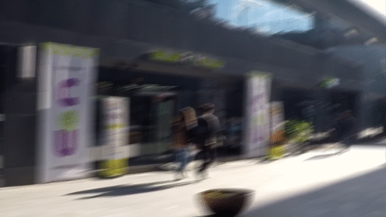

# DeblurGAN for Tensorflow

This repository provides a script and recipe to train the DeblurGAN model. The code is based on [DeblurGAN's tensorflow implementation](https://github.com/dongheehand/DeblurGAN-tf),
modifications are made to run on NPU

## Table Of Contents

* [Model overview](#model-overview)
  * [Model Architecture](#model-architecture)
  * [Default configuration](#default-configuration)
* [Data augmentation](#data-augmentation)
* [Setup](#setup)
  * [Requirements](#requirements)
* [Quick start guide](#quick-start-guide)
* [Advanced](#advanced)
  * [Command line arguments](#command-line-arguments)
  * [Training process](#training-process)
* [Performance](#performance)
  * [Results](#results)
    * [Training accuracy results](#training-accuracy-results)
    * [Training performance results](#training-performance-results)

## Model overview

Tensorflow implementation of the paper DeblurGAN: Blind Motion Deblurring Using Conditional Adversarial Networks.
`Orest Kupyn, Volodymyr Budzan, Mykola Mykhailych, Dmytro Mishkin, Jiri Matas. "DeblurGAN: Blind Motion Deblurring Using Conditional Adversarial Networks". <https://arxiv.org/abs/1711.07064>.`
reference implementation:  <https://github.com/dongheehand/DeblurGAN-tf>

### Model architecture

The DeblurGAN network takes blurry image as an input and procude the corresponding sharp estimate, as in the example:
 


The model we use is Conditional Wasserstein GAN with Gradient Penalty + Perceptual loss based on VGG-19 activations. Such architecture also gives good results on other image-to-image translation problems (super resolution, colorization, inpainting, dehazing etc.)

<p align="center">
  
</p>

### Default configuration

The following sections introduce the default configurations and hyperparameters for DeblurGAN model. We use the same training parameters as in the paper.
For detailed hpyerparameters, please refer to corresponding script `main.py`.

- batch_size 1
- patch_size 256 * 256
- learning_rate 1e-4
- max_epoch 300

The following are the command line options about the training scrip:
Parameters for training (Training/Evaluation):
    --train_Sharp_path             Path for sharp train images.
    --train_Blur_path              Path for blur train images.
    --model_path                   Checkpoint save path.
    --model_save_freq              Checkpoint save frequency.
    --learning_rate                Learning_rate.
    --mode                         Train or inference mode.

#### Optimizer

This model uses Momentum optimizer from Tensorflow with the following hyperparameters:

- Adam : 0.9, 0.99


#### Dataset

The first model to which we refer as DeblurGANWILD was trained on a random crops of size 256x256 from 1000 [GoPro training dataset](https://drive.google.com/file/d/1H0PIXvJH4c40pk7ou6nAwoxuR4Qh_Sa2/view) images downscaled by a factor of two.

You can use follwoingg scripts to preprocess the datasets:
`python GOPRO_preprocess.py --GOPRO_path ./GOPRO/data/path --output_path ./data/output/path`
The processed images will be saved in the ./data folder.

## Setup
The following section lists the requirements to start training the DeblurGAN model.
### Requirements

- Python 3.6.5
- Tensorflow 1.10.1
- Pillow 5.0.0
- numpy 1.14.5
- Pretrained VGG19 file : [vgg19.npy](https://mega.nz/#!xZ8glS6J!MAnE91ND_WyfZ_8mvkuSa2YcA7q-1ehfSm-Q1fxOvvs) (for training!)

## Quick Start Guide

### 1. Clone the respository

```shell
git clone xxx
cd  00-access
```

### 2. Train using GOPRO dataset
1) Download pretrained VGG19 file
[vgg19.npy](https://mega.nz/#!xZ8glS6J!MAnE91ND_WyfZ_8mvkuSa2YcA7q-1ehfSm-Q1fxOvvs)

2) Download GOPRO dataset
[GOPRO dataset](https://github.com/SeungjunNah/DeepDeblur_release)

3) Preprocessing GOPRO dataset.
```
python GOPRO_preprocess.py --GOPRO_path ./GOPRO/data/path --output_path ./data/output/path
```

4) Train using GOPRO dataset.
```
python main.py --train_Sharp_path ./GOPRO/path/sharp --train_Blur_path ./GOPRO/path/blur
```
### 3. Train using your own dataset
1) Download pretrained VGG19 file
[vgg19.npy](https://mega.nz/#!xZ8glS6J!MAnE91ND_WyfZ_8mvkuSa2YcA7q-1ehfSm-Q1fxOvvs)

2) Preprocess your dataset. Blur image and sharp image pair should have same index when they are sorted by name respectively.

3) Train using GOPRO dataset.
```
python main.py --train_Sharp_path ./yourData/path/sharp --train_Blur_path ./yourData/path/blur
```

## 4. Deblur your own images
1) Download pre-trained model.
[pre_trained_model](https://jbox.sjtu.edu.cn/l/Ou6oBk)

2) Unzip the pre-trained model file
```
tar -cvf DeblurGAN_model.tar
```
3) Deblur your own images
```
python main.py --mode test_only --pre_trained_model ./path/to/model --test_Blur_path ./path/to/own/images
```
4) If you have an out of memory(OOM) error, please use chop_forward option
```
python main.py --mode test_only --pre_trained_model ./path/to/model --test_Blur_path ./path/to/own/images --in_memory True --chop_forward True
```

## Advanced
### Commmand-line options

For a complete list of options, please refer to `main.py`

### Training process

All the logs of the training will be stored in the directory `log`.

## Performance

### Result

Our result were obtained by running the applicable training script. To achieve the same results, follow the steps in the Quick Start Guide.


#### Evaluation results
The model is evaluated on GOPRO dataset.

#### Training performance
