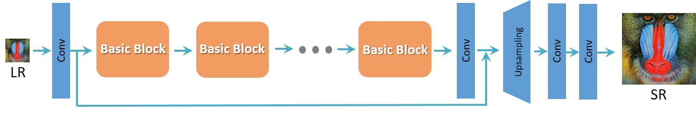

# ESRGAN for Tensorflow

This repository provides a script and recipe to train the ESRGAN model. The code is based on [ESRGAN's tensorflow implementation](https://github.com/hiram64/ESRGAN-tensorflow.git),
modifications are made to run on NPU

## Table Of Contents

* [Model overview](#model-overview)
  * [Model Architecture](#model-architecture)
  * [Default configuration](#default-configuration)
* [Data augmentation](#data-augmentation)
* [Setup](#setup)
  * [Requirements](#requirements)
* [Quick start guide](#quick-start-guide)
* [Advanced](#advanced)
  * [Command line arguments](#command-line-arguments)
  * [Training process](#training-process)
* [Performance](#performance)
  * [Results](#results)
    * [Training accuracy results](#training-accuracy-results)
    * [Training performance results](#training-performance-results)


## Model overview

ESRGAN model from
`Liang-Chieh Chen et al. "ESRGAN: Enhanced Super-Resolution Generative Adversarial Networks". <https://arxiv.org/abs/1809.00219>.`
reference implementation:  <https://github.com/hiram64/ESRGAN-tensorflow.git>
### Model architecture

## ESRGAN
The [author](https://xinntao.github.io/) improve the [SRGAN](https://arxiv.org/abs/1609.04802) from three aspects:
1. adopt a deeper model using Residual-in-Residual Dense Block (RRDB) without batch normalization layers.
2. employ [Relativistic average GAN](https://ajolicoeur.wordpress.com/relativisticgan/) instead of the vanilla GAN.
3. improve the perceptual loss by using the features before activation.

In contrast to SRGAN, which claimed that **deeper models are increasingly difficult to train**, the deeper ESRGAN model shows its superior performance with easy training.

<p align="center">
  
</p>
<p align="center">
  
</p>


### Default configuration

The following sections introduce the default configurations and hyperparameters for ESRGAN model. We use the same training parameters as in the paper.
For detailed hpyerparameters, please refer to corresponding script `train.py`.

- batch_size 16
- HR_image_size 192
- LR_image_size 48
- epsilon 1e-12
- gan_loss_coeff 0.005
- content_loss_coeff 0.01
- num_repeat_RRDB 23
- residual_scaling 0.2
#### Optimizer

This model uses Momentum optimizer from Tensorflow with the following hyperparameters:

- Adam : 0.9, 0.99
- pretrain_learning_rate : 2e-4
- pretrain_lr_decay_step : 250000
- learning_rate : 1e-4
- weight_initialize_scale : 0.1
- epsilon : 1e-12

#### Data augmentation

This model uses the following data augmentation:

- For training:
  - RandomRotation90, prob=0.5
  - RandomHorizontalFlip, prob=0.5

## Setup
The following section lists the requirements to start training the DeblurGAN model.
### Requirements

- tensorflow==1.15
- python==3.6.8
- opencv-python==4.1.0
- scikit-learn==0.20.3
- numpy==1.16.2

## Quick Start Guide

### 1. Clone the respository

```shell
git clone xxx
```

### 2. Download and preprocess the dataset

You can use any datasets as you wish. Here, we only use [DIV2K dataset](https://data.vision.ee.ethz.ch/cvl/DIV2K/) as an example to illustrate the data generation.

You can use our preprocessed dataset : [preprocessed dataset](https://e-share.obs-website.cn-north-1.myhuaweicloud.com?token=rlHpiH2fa8IfzVQVbABQ6PlBBBCQKou6mgmfGCUClMW0IQ491tmVQCFWF0PMDt72yvobVWdGJEVVQZ2Bm7G0FMZtYPuynJgLFznrOC6APcpWFgGdWXLCN6LGu5Oohf9TShJfBUO32Mzm4r1clihfowl16rHIVfVFsG3whS/lo/gAYrDF1OqVstDRry1LGZLRbtQs2U38wNd9x324LaeWOYOQKdd2KpNRrAFoinjCAPuxwwouSnLHb9cdoo3BnT5S4P4oIYfbr4nmfjW+SNH79VkdSdZR1qiCBB5GlVs7XiyI/KC9wMaPWcn26FZ/3rqvfjhosvDdsKdjnJQri6dsJsZ0zpYlxC4UBW0f72PcYIutlVECxkfL9vuWwKvZrwTvBHQzzdhl6EKpotzON30L8p20R2tUZKHMz1/FJWU7v7CPXnTioDyp3YjWt1Wbmxr0V9Qo7MJRKcWFlnAcs4QXcBZQRoQcjgkDfGuMgwMFnvEEOG7s/EM8UQ0tvEXADyT2LeTrbspssffZfQ4L9sMSmpDPWY2TuKOVvW1aTfTB4eS+C9I7+fvjDNbVpsfcbM+mNgXjAvmAWWY1OcRGLxoNgbK7bWiBB3ZogwOsLspicwo=)

`password : 123456`

Or you can process the dataset yourself:
1. download the DIV2K datasets.
2. modify the data path in the `extract_subimages.py` script
3. set the appropriate sub-image size (`crop_size`, `HR_image_size`, `LR_image_size`) in `train.py`.
4. go to the lib dict and set the appropriate dataset path in `extract_subimages.py`
5. run the script to create sub images
```shell
python extract_subimages.py
```

For other datasets, you can you can execute the same script, just replace the corresponding path and sub_image size


### 3. Train
All the scripts to tick off the training are located under `train.py`.  As there are two types of ESRGAN, one for better perceptual loss and the other for better PSNR performance. You are free to choose either of them by chooosing different types of gan loss.
It is best to use the pre-downloaded VGG19 model to avoid network problems during training. The VGG19 model path is id defined in `VGG19_weights`.

- For RRDB_PSNR, you can set the `pretrain_generator` to `True` int the `train.py` script and use larger HR_LR paired images (192 * 192 fo HR and 48 * 48 fo LR)

- For RRDB_ESRGAN, you can set the `perceptual_loss` to `VGG19` and set the `gan_loss_type` to `RaGAN` in the `train.py` script. Besides, you should generate smaller paired images for training (128 * 128 fo HR and 32 * 32 fo LR)


For instance, to train the model without pretrained model :
```shell
python train.py --pretrain_generator=True
```

### 4. Inference && Test
First download the [pre-trained model](https://e-share.obs-website.cn-north-1.myhuaweicloud.com?token=rlHpiH2fa8IfzVQVbABQ6PlBBBCQKou6mgmfGCUClMW0IQ491tmVQCFWF0PMDt72yvobVWdGJEVVQZ2Bm7G0FMZtYPuynJgLFznrOC6APcpWFgGdWXLCN6LGu5Oohf9TShJfBUO32Mzm4r1clihfowl16rHIVfVFsG3whS/lo/gAYrDF1OqVstDRry1LGZLRbtQs2U38wNd9x324LaeWOYOQKdd2KpNRrAFoinjCAPsIEM/Mw5m26iEa5upMPcyuJ9f3hPIKkx31wdYx4BPGECm4CEG6Qr3pXaXx4jDrLd3STQB4w2E9SAx6L4xiuicIWab9rGTJPadc7dhe/8g0tBjzdgzoeIlX0rkC1TqR6CjLGEwdFsFRZOxcxnrLi6K+IuKFoiPvGXZLGfMsAU65lHhQ26VoqvPdYVoQ+az7ErRgEqs7RBCr/YfAXQ3+oM3FQomG9dCQJ8nv+ZgOC1F/TkAqjwSvkNX5pmBHqwwqdxc8efxFYrArh0N+K2ENnQx3Z6MP3ExXu7EQkXRMTYHjLT88YULqGCHRw6C3tQFUJe/CmpbSh285GnW+nlEaJR9wC5xAaC87rQder0TPv0K+1A==)

`password : 123456`

- inference
```
python inference.py --data_dir --inference_result_dir --checkpoint_dir --inference_checkpoint
```
- test the model with benchmark dataset(e.g. Set14):
```
python evaluation.py --HR_data_dir \path\to\HR --inference_result \path\to\inference
```

### 5. Model Conversion
You can use the ckpt2pb script to get the frozen pb model:
```
python ckpt2pb.py --checkpoint_dir --inference_checkpoint
```

## Advanced
### Commmand-line options


```
  --num_iter                        The number of iterations
  --pretrain_generator              Whether to pretrain generator
  --VGG19_weights                   VGG19 weights url for perceptual loss
  --data_augmentation               whether to augment data
  --perceptual_los                  the part of loss function. "VGG19" or "pixel-wise"
  --gan_loss_type                   the type of GAN loss functions. "RaGAN or GAN"
  --num_iter                        the number of iterations
  --pre_train_checkpoint_dir        pre-train checkpoint directory
  --checkpoint_dir                  checkpoint directory
  --tf_initial_checkpoint           path to checkpoint of pretrained resnet_v1_101, default None
  --log_name                        the name of training log file, default training.log
```
for a complete list of options, please refer to `train.py`

### Training process

All the logs of the training will be stored in the directory `logdir`.

## Performance

### Result

Our result were obtained by running the applicable training script. To achieve the same results, follow the steps in the Quick Start Guide.


#### Evaluation results
The model is evaluated on Set5 and Set14 val set.


#### Training performance
