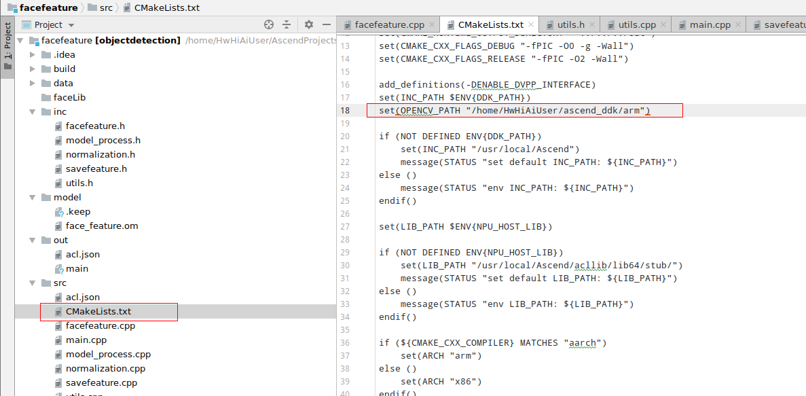
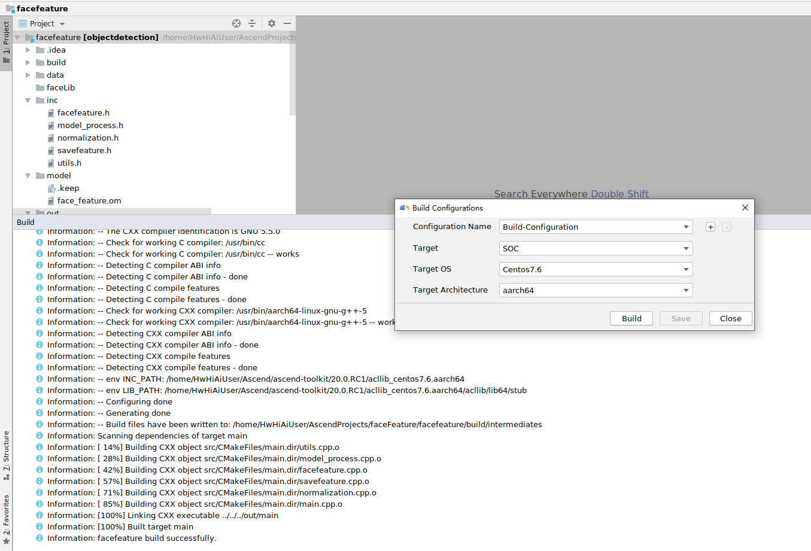
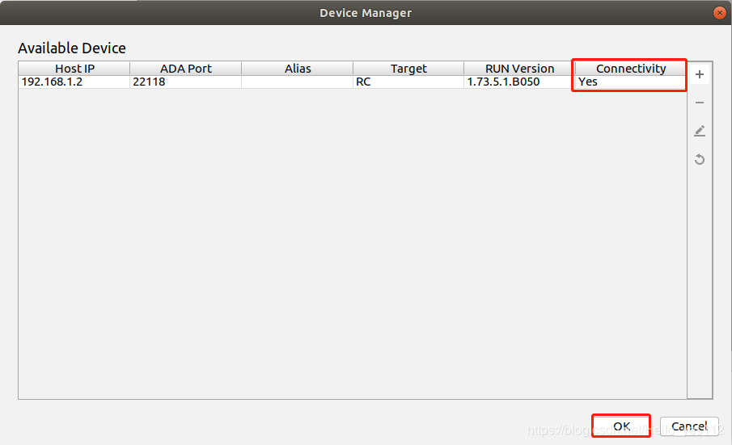

中文|[English](README_EN.md)

**该案例仅仅用于学习，打通流程，不对效果负责，不支持商用。**


# 人脸特征提取（C++）


## 简介

###### 	本Application支持运行在Atlas 200 DK上，实现了文件读入图片，提取特征保存到bin文件中，只支持112*112的jpg图片。

​	 模型来源:自研

 	模型转换得到的离线模型对输入数据的要求：NHWC 1, 112, 112, 3 

​	 推理耗时：平均每次耗时 5ms

​	 模型地址：https://gitee.com/guowen001/ascend_-demo_-open_-source/tree/master/faceFeature/facefeature/model

######  


## 环境配置   

**注：服务器上已安装交叉编译工具可跳过此步骤。**   

- 安装编译工具  
  **sudo apt-get install -y g++\-aarch64-linux-gnu g++\-5-aarch64-linux-gnu** 
  
- 安装opencv
  
    1. 开发板设置联网（root用户密码：Mind@123）。  
       **su root**  
       **vi /etc/netplan/01-netcfg.yaml**   
       填写以下配置。  
         
    
       填写后执行以下命令使配置生效，并将开发板网口接上可正常联网的网线。  
       **netplan apply**      
    
    2. 开发板换源（更换ubuntu18.04-arm华为源）。   
       执行以下换源操作。  
       **wget -O /etc/apt/sources.list https://repo.huaweicloud.com/repository/conf/Ubuntu-Ports-bionic.list**   
       更新源。  
       **apt-get update** 
    
    3. 安装相关依赖（需要在root用户下安装）。   
       **apt-get install build-essential libgtk2.0-dev libavcodec-dev libavformat-dev libjpeg-dev libtiff5-dev git cmake libswscale-dev python3-setuptools python3-dev python3-pip pkg-config -y**  
       **pip3 install --upgrade pip**  
       **pip3 install Cython**  
       **pip3 install numpy**
    
    4. 安装opencv。  
       下载opencv。  
       **git clone -b 4.3.0 https://gitee.com/mirrors/opencv.git**  
       **git clone -b 4.3.0 https://gitee.com/mirrors/opencv_contrib.git**  
       **cd opencv**  
       **mkdir build**  
       **cd build**  
    
       安装opencv。  
    
       ```
       cmake -D BUILD_SHARED_LIBS=ON  -D BUILD_opencv_python3=YES -D BUILD_TESTS=OFF -D CMAKE_BUILD_TYPE=RELEASE -D  CMAKE_INSTALL_PREFIX=/home/HwHiAiUser/ascend_ddk/arm -D WITH_LIBV4L=ON -D OPENCV_EXTRA_MODULES=../../opencv_contrib/modules -D PYTHON3_LIBRARIES=/usr/lib/python3.6/config-3.6m-aarch64-linux-gnu/libpython3.6m.so  -D PYTHON3_NUMPY_INCLUDE_DIRS=/usr/local/lib/python3.6/dist-packages/numpy/core/include -D OPENCV_SKIP_PYTHON_LOADER=ON ..
       ```
    
       **make -j8**  
       **make install**  
    
    5. 使python3-opencv生效。   
       **su root**  
    
       **cp  /home/HwHiAiUser/ascend_ddk/arm/lib/python3.6/dist-packages/cv2.cpython-36m-aarch64-linux-gnu.so /usr/lib/python3/dist-packages** 
    
       **exit**
    
    6. 修改环境变量。
       程序编译时会链接LD_LIBRARY_PATH环境变量地址中的库文件，所以要将ffmpeg和opencv安装的库文件地址加到该环境变量中。  
       **vi ~/.bashrc**  
       在最后添加  
       **export LD_LIBRARY_PATH=/home/HwHiAiUser/Ascend/acllib/lib64:/home/HwHiAiUser/ascend_ddk/arm/lib**
          
       执行以下命令使环境变量生效。  
       **source ~/.bashrc**
    
    7. 将开发板上安装的ffmpeg和opencv库导入开发环境中，以提供编译使用。  
       **以下操作在host侧执行，不在开发板上。**    
       使用普通用户执行   
       **mkdir $HOME/ascend_ddk**  
       **scp -r HwHiAiUser@192.168.1.2:/home/HwHiAiUser/ascend_ddk/arm $HOME/ascend_ddk**  
       切换至root用户  
       **su root**  
       **cd /usr/lib/aarch64-linux-gnu**  
       **scp -r HwHiAiUser@192.168.1.2:/lib/aarch64-linux-gnu/\* ./**  
       **scp -r HwHiAiUser@192.168.1.2:/usr/lib/aarch64-linux-gnu/\* ./**

## 编译<a name="zh-cn_topic_0219108795_section3723145213347"></a>

1.打开对应的工程。

以Mind Studio安装用户在命令行进入安装包解压后的“MindStudio-ubuntu/bin”目录，如：$HOME/MindStudio-ubuntu/bin。执行如下命令启动Mind Studio。

**./MindStudio.sh**

启动成功后，打开facefeture工程。

2.修改CMakeLists.txt，将CMakeLists.txt中的 OPENCV_PATH 修改为Mind Studio所在Ubuntu服务器的opencv 动态库的路径。如下图所示



3.开始编译，打开Mind Studio工具，在工具栏中点击**Build \> Edit Build Configuration**。  
选择Target OS 为Centos7.6，如[图 配置编译](#zh-cn_topic_0203223265_fig17414647130)所示。

之后点击**Build \> Build \> Build Configuration**，如[图 编译操作及生成文件](#zh-cn_topic_0203223265_fig1741464713019)所示，会在目录下生成build和out文件夹。

**图 3**  编译操作及生成文件<a name="zh-cn_topic_0203223265_fig1741464713019"></a>  


> **须知：**   
>首次编译工程时，**Build \> Build**为灰色不可点击状态。需要点击**Build \> Edit Build Configuration**，配置编译参数后再进行编译。 

2. ##### 1.Mindstudio配置开发板RC连接。

   **注：此时默认开发板已经连接到开发环境了**
    在Mind Studio工具的工具栏中找到**Tools**按钮，单机**Device Manager**。
   点击Device Manager界面右上方的 **“+”** 按钮，填写**Host IP**为开发者板ip（USB连接默认为192.168.1.2），点击OK。

   

   看到Device Manager界面**Connetctivity**为**Yes**即为连接成功，点击**OK**即可在MindStudio中看到推理结果。

   

   

   

   ##### 2.MindStudio连接不上Atlas200DK的情况

   通过scp命令拷贝编译好的文件到设备端 ，比如拷贝到/home/HwHiAiUser/xxx目录下

   ​		scp -r facefeature HWHiAiUser@192.168.1.2:/home/HwHiAiUser/xxx

   

   特征提取：

   登录到设备端，进去前面拷贝编译文件的目录，进入/count目录，执行 ./offline_inference_testcase.sh   ，会执行1000次推理，最后输出平均每次推理耗时时间，推理完成 会提取后的512个特征保存在 facefeature/faceLib/person.bin，图片名字作为索引。

   ​	

   ​	

   

