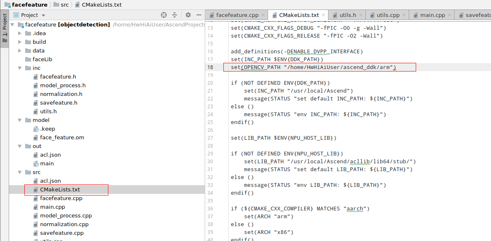
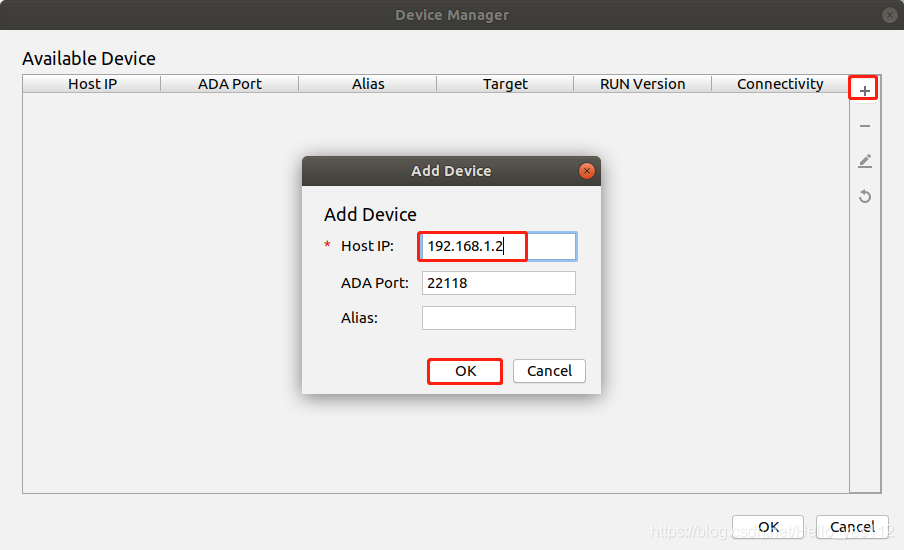

中文|[English](README_EN.md)

**该案例仅仅用于学习，打通流程，不对效果负责，不支持商用。**

# 人脸特征提取（C++）

###### **本Application支**持运行在Atlas 200 DK上，实现了文件读入图片，提取特征保存到bin文件中，支持112*112的jpg图片。 

## 环境配置   

**注：服务器上已安装交叉编译工具可跳过此步骤。**   

- 安装编译工具  
  **sudo apt-get install -y g++\-aarch64-linux-gnu g++\-5-aarch64-linux-gnu** 
  
- 安装opencv
  
  请参考 https://gitee.com/ascend/samples/tree/master/common/install_opencv/for_atlas200dk

## 编译

1.打开对应的工程。

以Mind Studio安装用户在命令行进入安装包解压后的“MindStudio-ubuntu/bin”目录，如：$HOME/MindStudio-ubuntu/bin。执行如下命令启动Mind Studio。

**./MindStudio.sh**

启动成功后，打开facefeture工程。

2.修改CMakeLists.txt，将CMakeLists.txt中的 OPENCV_PATH 修改为Mind Studio所在Ubuntu服务器的opencv 动态库的路径。如下图所示

3.开始编译，打开Mind Studio工具，在工具栏中点击**Build \> Edit Build Configuration**。  
选择Target OS 为Centos7.6，如[图 配置编译](#zh-cn_topic_0203223265_fig17414647130)所示。

之后点击**Build \> Build \> Build Configuration**，如[图 编译操作及生成文件](#zh-cn_topic_0203223265_fig1741464713019)所示，会在目录下生成build和out文件夹。

**图 3**  编译操作及生成文件  

> **须知：**   
>首次编译工程时，**Build \> Build**为灰色不可点击状态。需要点击**Build \> Edit Build Configuration**，配置编译参数后再进行编译。 

2. ##### 1.Mindstudio配置开发板RC连接。

   **注：此时默认开发板已经连接到开发环境了**
    在Mind Studio工具的工具栏中找到**Tools**按钮，单机**Device Manager**。
   点击Device Manager界面右上方的 **“+”** 按钮，填写**Host IP**为开发者板ip（USB连接默认为192.168.1.2），点击OK。

   

   看到Device Manager界面**Connetctivity**为**Yes**即为连接成功，点击**OK**即可在MindStudio中看到推理结果。

   

   

   

   ##### 2.MindStudio连接不上Atlas200DK的情况

   通过scp命令拷贝编译好的文件到设备端 ，比如拷贝到/home/HwHiAiUser/xxx目录下

   ​		scp -r facefeature HWHiAiUser@192.168.1.2:/home/HwHiAiUser/xxx

   

   特征提取：

   登录到设备端，进去前面拷贝编译文件的目录，进入/count/out目录，执行 ./main  xxx   ( xxx可以是单张图片的路径，

   ​		也可以是图片文件夹的路径) 提取后的512个特征保存在 facefeature/faceLib/person.bin，图片名字作为索引。

   ​	

   ​	

   

   

