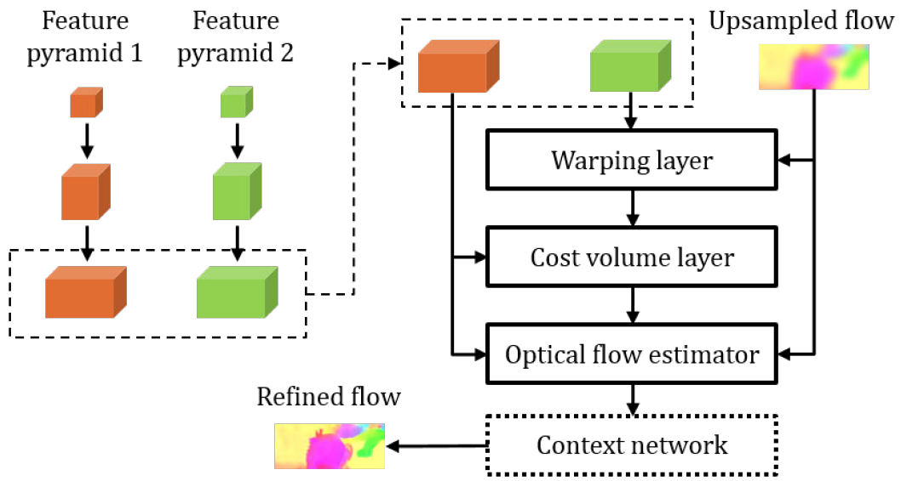
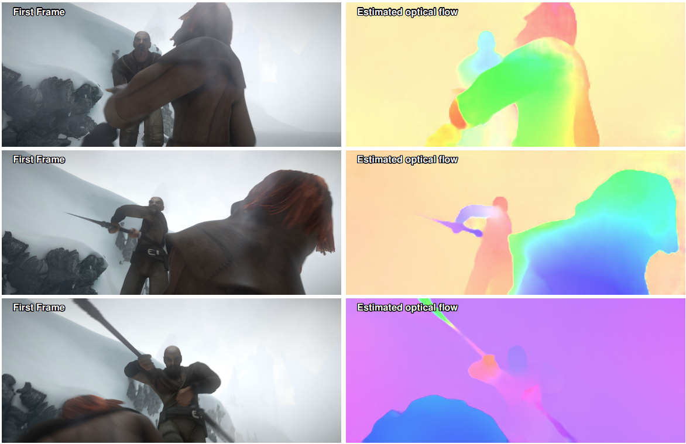

# PWCNet
## 模型简介
根据“PWC-Net: CNNs for Optical Flow Using Pyramid, Warping, and Cost Volume”，PWCNet通过在网络设计中添加领域知识来改进FlowNet2。光流估计背后的基本思想是尽管从一帧到下一帧时像素的位置会发生变化，但像素的亮度仍是基本恒定的。我们可以在第一帧中的像素周围抓取一个小patch，并在第二帧中找到另一个小patch，该patch将最大化两个patch的某种相关性（如归一化互相关）。在整个第一帧上滑动patch并在第二帧中寻找对应最相关的patch，便得到了ost volume。这种技术相当鲁棒（具有颜色不变性），但计算成本很高。

为了减轻生成cost volume的开销，第一种优化方法是使用金字塔。使用较低分辨率的图像，可以在相对第二帧图像更小的第一帧图像上滑动一个更小的patch进行搜索，然后使用该信息指导金字塔的下一层进行更有针对性的搜索。可以在图像域或特征域中执行多尺度的运动估计（特征域上即指使用由卷积生成的按比例缩小的特征图）。实际上，PWCNet使用以较低分辨率估算的运动流的的上采样版本来扭曲第一帧，这样模型在金字塔的较高分辨率级别中只需要搜索较小的运动量（缩小搜索范围）。




## 结果
迁移 [PWCNet](https://github.com/philferriere/tfoptflow) 到Ascend 910平台，使用的环境是 [ModelArts](https://www.huaweicloud.com/product/modelarts.html)

使用 [FlyingChairs](https://lmb.informatik.uni-freiburg.de/resources/datasets/FlyingChairs.en.html#flyingchairs) 数据集和 [FlyThings3d](https://lmb.informatik.uni-freiburg.de/resources/datasets/SceneFlowDatasets.en.html) 两个数据集进行预训练的模型，之后在ModelArts Ascend 910 TensorFlow平台上在 [MPI Sintel](http://sintel.is.tue.mpg.de/downloads) 数据集上训练，分别在MPI Sintel training clean set和MPI Sintel test set上测试结果如下：

<table>
    <tr>
        <td></td>
        <td >training clean set</td>
        <td colspan="6">training details</td>
    </tr>   
    <tr>
        <td></td>
        <td>Avg. EPE &#8595;</td>
        <td>Enviroment</td>
        <td>device </td>
        <td>batch size </td>
        <td>iterations </td>
        <td>lr schedule</td>
        <td>loss function</td>
    </tr>
    <tr>
        <td>pretrained model</td>
        <td>2.60</td>
        <td>TensorFlow, GPU</td>
        <td>2</td>
        <td>16</td>
        <td>600000</td>
        <td>multi-steps</td>
        <td>loss_multiscale(600K)</td>
    </tr>
    <tr>
        <td>Report in paper</td>
        <td>1.70</td>
        <td>Caffe, GPU</td>
        <td>Unknown</td>
        <td>4</td>
        <td>Unknown</td>
        <td>multi-steps</td>
        <td>loss_robust</td>
    </tr>
    <tr>
        <td>Reproduce on GPU</td>
        <td>1.76</td>
        <td>TensorFlow, GPU</td>
        <td>1</td>
        <td>4</td>
        <td>200000</td>
        <td>multi-steps</td>
        <td>loss_robust(200K)</td>
    </tr>
    <tr>
        <td>Reproduce on Ascend 910</td>
        <td>1.76</td>
        <td>ModelArts, Ascend 910</td>
        <td>1</td>
        <td>4</td>
        <td>200000</td>
        <td>multi-steps</td>
        <td>loss_robust(200K)</td>
    </tr>
    <tr>
        <td>Reproduce on Ascend 910 V2</td>
        <td>1.25</td>
        <td>ModelArts, Ascend 910</td>
        <td>1</td>
        <td>4</td>
        <td>200000+60000</td>
        <td>multi-steps</td>
        <td>loss_robust(200K)+loss_multiscale(60K)</td>
    </tr>
</table>


## Requirements
- Tensorflow 1.15.0
- Ascend 910
- cv2
- numpy
- os
- shutil
- tqdm
- scikit-learn
- scipy

---
## 数据准备
预训练模型在
```
obs://pwcnet-final/pretrained/pwcnet.ckpt-595000.index
obs://pwcnet-final/pretrained/pwcnet.ckpt-595000.meta
obs://pwcnet-final/pretrained/pwcnet.ckpt-595000.data-00000-of-00001
obs://pwcnet-final/pretrained/checkpoint
```  

在MPI Sintel clean training set上，在ModelArts TensorFlow Ascend 910环境下训练好的模型在   
```
obs://pwcnet-final/log/pwcnet-lg-6-2-multisteps-mpisintelclean-finetuned/pwcnet.ckpt-176000.index
obs://pwcnet-final/log/pwcnet-lg-6-2-multisteps-mpisintelclean-finetuned/pwcnet.ckpt-176000.meta
obs://pwcnet-final/log/pwcnet-lg-6-2-multisteps-mpisintelclean-finetuned/pwcnet.ckpt-176000.data-00000-of-00001
obs://pwcnet-final/log/pwcnet-lg-6-2-multisteps-mpisintelclean-finetuned/checkpoint
```

在GPU上复现的模型在
```
obs://pwcnet-final/log/gpu-finetuned/pwcnet.ckpt-176000.data-00000-of-00001
obs://pwcnet-final/log/gpu-finetuned/pwcnet.ckpt-176000.meta
obs://pwcnet-final/log/gpu-finetuned/checkpoint
obs://pwcnet-final/log/gpu-finetuned/pwcnet.ckpt-176000.index
```
注意：数据集直接下载后解压，不需要对数据做预处理，
OBS已设置为公共读，不需要手动从OBS中下载数据集和checkpoint文件，代码中会从OBS中拷贝到本地。


## 训练
### 参数说明
```
--iterations 训练的iteration个数
--display 训练过程中打印loss的迭代间隔数
--save_path 保存checkpoint的文件夹路径
--batch_size 训练的batch_size大小
--dataset 数据集文件夹路径，数据集将自动从公共读的OBS下载到本地该文件夹下
```

### 运行命令``
python pwcnet_finetune_lg-6-2-multisteps-mpisintelclean.py
       --iterations 200000
       --display 1000 
       --save_path ./pwcnet-lg-6-2-multisteps-mpisintelclean-finetuned/
       --batch_size 4 
       --dataset /cache/ 
```
## 测试 
### 参数说明
```
--dataset 数据集文件夹路径，数据集将自动从公共读的OBS下载到本地该文件夹下
--ckpt 需要测试的checkpoint的路径
--obs 可选项，如果为True，代码中会自动从公共读的OBS中下载训练好的checkpoint到本地pwcnet-lg-6-2-multisteps-mpisintelclean-finetuned文件夹下，如果需要测试本地的checkpoint，需要把该参数设置为False
```

### 运行命令
#### 测试OBS中训练好的模型
```
python pwcnet_eval_lg-6-2-multisteps-chairsthingsmix_mpisintelclean.py
       --dataset /cache/
       --ckpt ./pwcnet-lg-6-2-multisteps-mpisintelclean-finetuned/pwcnet.ckpt-176000
       --obs True
```
#### 测试本地模型
```
python pwcnet_eval_lg-6-2-multisteps-chairsthingsmix_mpisintelclean.py
       --dataset /cache/
       --ckpt <local checkpoint path>
       --obs False
```
