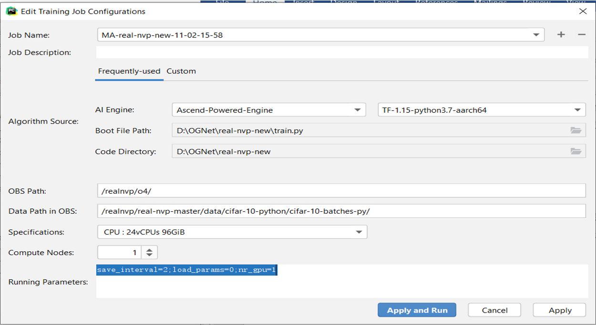
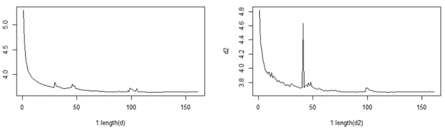

# RealNVP

## 概述

迁移[RealNVP](https://github.com/taesungp/real-nvp) 到Ascend910平台，迁移过程详见《模型众筹项目RealNVP设计与开发交付文档》描述，该文档仅给出概述。

文档地址：[Click here](https://realnvp.obs.cn-north-4.myhuaweicloud.com:443/submit/3-%20%E6%A8%A1%E5%9E%8B%E4%BC%97%E7%AD%B9%E9%A1%B9%E7%9B%AERealNVP%E8%AE%BE%E8%AE%A1%E4%B8%8E%E5%BC%80%E5%8F%91%E4%BA%A4%E4%BB%98%E6%96%87%E6%A1%A3.pdf?AccessKeyId=7N2JK6JLDLW3DE3ESNWV&Expires=1642692486&Signature=KAO32Q4UzKU22dINcG1M9MvLTtk%3D)

## Requirements

absl-py==0.10.0

astor==0.8.1

astunparse==1.6.3

bleach==1.5.0

cachetools==4.1.1

certifi==2020.6.20

chardet==3.0.4

cloudpickle==1.6.0

cycler==0.10.0

decorator==4.4.2

dm-tree==0.1.5

enum34==1.1.10

gast==0.2.2

google-auth==1.22.1

google-auth-oauthlib==0.4.1

google-pasta==0.2.0

grpcio==1.32.0

h5py==2.10.0

html5lib==0.9999999

idna==2.10

importlib-metadata==2.0.0

Keras-Applications==1.0.8

Keras-Preprocessing==1.1.2

kiwisolver==1.2.0

Markdown==3.3.1

matplotlib==3.3.2

mock==4.0.2

numpy==1.18.5

oauthlib==3.1.0

opt-einsum==3.3.0

Pillow==8.0.0

protobuf==3.13.0

pyasn1==0.4.8

pyasn1-modules==0.2.8

pyparsing==2.4.7

python-dateutil==2.8.1

requests==2.24.0

requests-oauthlib==1.3.0

rsa==4.6

scipy==1.4.1


six==1.15.0

tensorboard==1.13.1

tensorboard-plugin-wit==1.7.0

tensorflow==1.13.1

tensorflow-estimator==1.13.0

tensorflow-probability==0.11.1

tensorflow-tensorboard==0.4.0

termcolor==1.1.0

urllib3==1.25.10

Werkzeug==1.0.1

wrapt==1.12.1

zipp==3.3.0

## 代码路径解释

```
realnvp
└─ 
  ├─README.md
  ├─cifar10_data 解析论文要求的数据集
  ├─img2bin 用于推理
  ├─loss-check 用于推理精度验证
  ├─model realnvp模型
  ├─nn 各layer的具体实现，请参考文档2.1.2迁移过程部分的说明
  ├─plotting 作图
  ├─read_ckpt 读取checkpoint文件
  ├─read_from_ckpt 读取checkpoint文件
  ├─requirements.txt 
  ├─train 训练脚本
  ├─train-inference 解析推理的脚本
  ├─util 工具包
  	
```

------

## 准备数据和模型

checkpoint文件，model.py文件请从obs下载，链接如下：[Click here](https://e-share.obs-website.cn-north-1.myhuaweicloud.com?token=F/zCEh+aioGZ4XmzZhDIJhtHV5RJgCzLCr+QvkByMfwPbtgQohXfQkkLMzj7KP9MoM6LteMi2pzmRFKNelOpzMw8NtdkZRwQ2feB+FAkrYRZ9VM2jQezTL/ix7IBLr0tjhEhkgnB5ddZHb1D2oFj2w1EAgmeEDpxhWvJMbycPmdhpofECGFN7x2Gu8kd5pNA86gXUtjLeOUHbxRk1RXq8dwCsswD1moAnOv8Ndp+f82UKZEfXfAsLIbOKGvCsThDEEAHshIZh9kr6QDG73p/x4WZccSwJw5jfkJiOrazDwj6dfXOvRm8AOT1meU0q1Qqb2JEdZAficsDO3I41aA47hUTliN7lVkAd0lutrm3BbdxXyQtFERGdpNtGNZXVZw8Es57AQ7aqriTd4hJjCfSn5KEhK/fI2AmVScyBDwmyg7B5hTR3rGTVqssapyo0Kc8QeWUoTSrKvjm7KptBJ+4DlZROOs0dG3J5+ltQlIhQjNvVGN1OABIf4l28B7XewEjUPNW7hts+9yGzDBxFzm+XE68CLs6D1EDHYnMJ7ZkcSs=)

测试和验证数据集链接（cifar-10）：[Click here](http://www.cs.toronto.edu/~kriz/cifar-10-python.tar.gz)

## 参数

--num_gpus  		#运行时请将该参数设置为1，该参数仅用于适配华为npu。

--data_url 			#Location for the dataset')

--train_url 			#Location for parameter checkpoints and samples')

--data_set 			#可指定数据集

--save_interval 	#Every how many epochs to write checkpoint/samples?

--load_params  	#Restore training from previous model checkpoint? 1 = Yes, 0 = No

以下参数用于优化：

--learning_rate	#Base learning rate

--lr_decay			#Learning rate decay, applied every step of the optimization

--batch_size		#Batch size during training per GPU

--init_batch_size	#How much data to use for data-dependent initialization.

--dropout_p		#Dropout strength (i.e. 1 - keep_prob). 0 = No dropout, higher = more dropout.

--max_epochs	#How many epochs to run in total?

--nr_gpu				#How many GPUs to distribute the training across?

以下参数用于评估：

--sample_batch_size	#How many images to process in paralell during sampling?

以下参数用于随机化：

--seed					#Random seed to use

## 推荐参数设置

运行train.py，配置如下：

save_interval=2;load_params=0;nr_gpu=1



除此之外，还要设置以下参数：

```
--data_url：数据集所在的文件夹位置
```

## 精度数据

通过执行train.py --save_interval=2 --load_params=0 --nr_gpu=1命令的log数据，得到训练的精度数据：

| Network | Network Type | Framework  | Accuracy | Training Time | Precision | Dataset  |
| ------- | ------------ | ---------- | -------- | ------------- | --------- | -------- |
| RealNVP | Flow         | TensorFlow | 3.5      | 1000min       | 3.65      | Cifar-10 |

其中，精度是在逐渐收敛的。以下我们展示不同训练次数下的精度数据与用时。

| Time(min) | Train bpd | Test bpd |
| --------- | --------- | -------- |
| 837       | 5.2927    | 4.8197   |
| 7166      | 3.8992    | 3.8813   |
| 13617     | 3.7905    | 3.7945   |
| 20102     | 3.7751    | 3.7758   |
| 26636     | 3.7323    | 4.6336   |
| 33238     | 3.7156    | 3.7161   |
| 39927     | 3.6822    | 3.6853   |
| 46684     | 3.6712    | 3.6898   |
| 53514     | 3.6567    | 3.6678   |
| 60465     | 3.6553    | 3.6676   |
| 67530     | 3.7023    | 3.7052   |
| 74647     | 3.6539    | 3.6674   |
| 81780     | 3.6491    | 3.6646   |
| 88998     | 3.6531    | 3.6658   |
| 96256     | 3.6544    | 3.6703   |
| 103556    | 3.6522    | 3.6662   |
| 110952    | 3.6547    | 3.6705   |

进一步的，可以得到以下loss曲线。



由于昇腾环境下的限制，该模型预期训练轮次有5000轮。因此，我们有理由相信精度是可达标的。目前的环境下精度的数据维持在3.65左右。

## msame推理

待完成


## 交付件
| **序号** | **交付件**                                         |
| -------- | -------------------------------------------------- |
| 1        | 模型网络文件                                       |
| 2        | 模型训练脚本                                       |
| 3        | 模型推理脚本                                       |
| 4        | 能够复现目标精度的模型训练超参                     |
| 5        | 能够复现目标精度的模型checkpoint                   |
| 6        | readme                                             |
| 7        | 训练、测试数据集链接                               |
| 8        | .om模型文件                                        |
| 9        | 自验报告                                           |
| 10       | 开发设计文档（包括模型分析、实现方案、精度目标等） |

