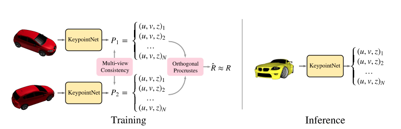
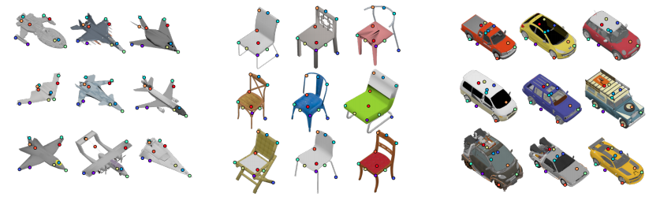

# Keypointnet for Tensorflow

This repository provides a script and recipe to train the Keypointnet model. The code is based on [Keypointnet's tensorflow implementation](https://github.com/tensorflow/models/tree/v1.13.0/research/keypointnet), modifications are made to run on NPU.

## Table Of Contents

* [Model overview](#model-overview)
  * [Model Architecture](#model-architecture)
  * [Default configuration](#default-configuration)
* [Quick start guide](#quick-start-guide)
  * [Dataset](#dataset)
  * [Train model](#train-model)
* [Performance](#performance)

## Model overview
This is an tensorflow implementation of the keypoint network proposed in "Discovery of Latent 3D Keypoints via End-to-end Geometric Reasoning [ [pdf](https://arxiv.org/pdf/1807.03146.pdf) ]". Given a single 2D image of a known class, this network can predict a set of 3D keypoints that are consistent across viewing angles of the same object and across object instances. These keypoints and their detectors are discovered and learned automatically without keypoint location supervision.


### Model architecture
During training, two views of the same object are given as input to the KeypointNet. The known rigid transformation (R, t) between the two views is provided as a supervisory signal. We optimize an ordered list of 3D keypoints that are consistent in both views and enable recovery of the transformation.

<p align="center">
   
</p>

During inference, KeypointNet extracts 3D keypoints from an individual input image. The output image is as follows.

<p align="center">
  
</p>


### Default configuration
The following sections introduce the default configurations and hyperparameters for Keypointnet model. For detailed hpyerparameters, please refer to corresponding script `main.py`.

- batch_size 16
- patch_size 128 * 128
- learning_rate 2e-4
- steps 700000

The following are the command line options about the training scrip:

    --data_url                     Path to the dataset.
    --model_dir                    Path to save model ckpt.


## Quick Start Guide

### Clone the respository

```shell
git clone xxx
```

### Dataset:
  ShapeNet's rendering for 
  [Cars](https://storage.googleapis.com/discovery-3dkeypoints-data/cars_with_keypoints.zip),
  [Planes](https://storage.googleapis.com/discovery-3dkeypoints-data/planes_with_keypoints.zip),
  [Chairs](https://storage.googleapis.com/discovery-3dkeypoints-data/chairs_with_keypoints.zip).

  Each set contains:
1. tfrecords
2. train.txt, a list of tfrecords used for training.
2. dev.txt, a list of tfrecords used for validation.
3. test.txt, a list of tfrecords used for testing.
4. projection.txt, storing the global 4x4 camera projection matrix.
5. job.txt, storing ShapeNet's object IDs in each tfrecord.

### Train model
1) Download the dataset mentioned above and unzip it into a folder.


2) Train the model with the following commend:
```
python main.py --data_url ./path/to/dataset/ --model_dir ./path/to/model/
```


## Performance
We trained and evaluated the model in the ShapeNet's rendering for chairs. The mean angular distance error of the pretrained model is 13.61° which is 14.57° in the paper(smaller is better).

