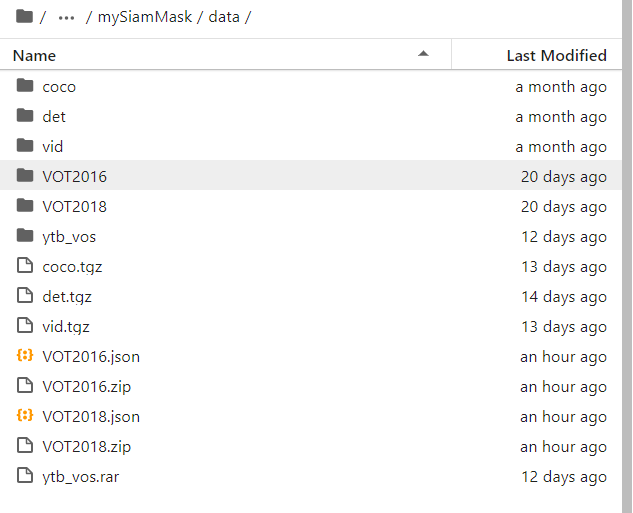
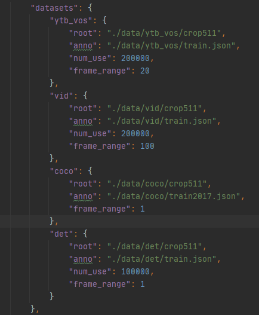

# SiamMask

#### Introduction
这是SiamMask模型的TensorFlow版本实现，相关论文为"Fast Online Object Tracking and Segmentation: A Unifying Approach
",[论文地址](https://arxiv.org/abs/1812.05050), [官方代码](https://github.com/foolwood/SiamMask) 。该版本的代码适配于Ascend910, 当前复现精度 EAO值0.243
#### Results
- OBS地址： [ckpt地址](https://e-share.obs-website.cn-north-1.myhuaweicloud.com?token=hCBKrEZG4sAIrJfXQrXfGsSoRN+g0YNZ9iH1jnDDfzcjjof2ynnXfJ4VYPm/eYo2//6r7VsH19NSgmSA9MrPF0ksNEr7EuSmWmpbDCUVSrk4RKEBOjF9ZJvuMxj+143L6oK3tUDGvIA+fVnrC28m+V2kIEWlvAGH7YKXQ/s4cCMagzvT3OpVDWM2AD7vRsQFlwidqaJTXTkFmCuaCaws1oSiBj/lqk1TyuGv+CdrSW35DH2nDK8NGvF3IRJjr+Je2d+2e2ChbKRaMiTQ79eugezLzlXTb90Sz4bQ1jh9SgQXOE1bx3Ml+nazT7hXK+Icj0cwZ82l+2eVPlTlH5mGymaV8KTmSmq6gTfqmBJkDPTFSu399hZi6JT1cSUmwBMV1O5E3PcAVKpt4HtV3ABn6M5SUWR2suIl/fGUJLb4AEhE0aDgm6kHucYn4MlybmHpoMVuk+iB7tKLKtdaF4adviunZQtmbW3XhWMrYZAtcJkhMNt0NqQQgP/kQtYuNXFRbWI7tGpLLSonLE68jCy4W8+aFFtzWjMF8hhAnr90Dnw=) ,提取密码siamma ； (如果obs失效，请使用百度网盘地址)
- 百度网盘：链接：https://pan.baidu.com/s/1M35mcoZvysxRoZdLTqnWrQ     提取码：qbvi 

|                           <sub>Tracker</sub>                           |      <sub>VOT2016</br>EAO /  A / R</sub>  |
|:----------------------------------------------------------------------:|:--------------------------------------------:|
| 论文SiamMask    | <sub>**0.433**/**0.639**/**0.214**</sub> | 
| GPU复现SiamMask(前100Kstep) | <sub>**0.281**/**0.639**/**0.522**</sub> | 
| NPU复现SiamMask(前40Kstep) | <sub>**0.243**/**0.630**/**0.597**</sub> | 
#### 代码及路径解释
```
.
└── SiamMask_tf_zx
    ├── config 存放配置文件
    │   ├── config.json
    ├── data 用于制作训练集，验证集，测试集的标签（参考官方代码）
    │   └── coco
    │       ├── crop511
    │       ├── train2017.json
    │       ├── ...
    │   ├── det
    │       ├── crop511
    │       ├── train.json
    │       ├── ...
    │   ├── vid
    │       ├── crop511
    │       ├── train.json
    │       ├── ...
    │   ├── ytb_vos
    │       ├── crop511
    │       ├── train.json
    │       ├── ...
    │   ├── VOT2016
    │   ├── VOT2016.json
    │   ├── VOT2018
    │   ├── VOT2018.json
    ├── preprocessing  数据预处理和数据生成器
    │   ├── generator.py
    │   ├── siam_mask_dataset.py
    ├── model 网络层与损失函数
    │   ├── resnet
    │       ├── resnet_utils.py
    │       ├── resnet_v1.py
    │   ├── custom.py
    │   ├── lossy.py
    ├── tools 测试
    │   ├── eval.py
    │   ├── test.py
    ├── utils 公共方法（参考官方代码）
    │   ├── pysot
    │   ├── pyvotkit
    │   ├── ...
    ├── README.md
    ├── requirements.txt
    ├── requirements_all.txt
    ├── train.py 训练代码
    └── train_testcase.sh
```

#### Installation
在Apulis docker环境下，执行
```
pip3.7 install -r requirements.txt
```
如果运行中找不到包，请参考requirement_all.txt内的对应版本进行下载


#### Training Data 
根据官方代码制作数据集
- Download the [Youtube-VOS](https://youtube-vos.org/dataset/download/), 
[COCO](http://cocodataset.org/#download), 
[ImageNet-DET](http://image-net.org/challenges/LSVRC/2015/), 
and [ImageNet-VID](http://image-net.org/challenges/LSVRC/2015/).
- Preprocess each datasets according the [readme](data/coco/readme.md) files.

- 百度网盘：链接：https://pan.baidu.com/s/1M35mcoZvysxRoZdLTqnWrQ     提取码：qbvi 
也可以直接删除./data目录，再根据下方的[OBS链接](https://e-share.obs-website.cn-north-1.myhuaweicloud.com?token=hCBKrEZG4sAIrJfXQrXfGsSoRN+g0YNZ9iH1jnDDfzcjjof2ynnXfJ4VYPm/eYo2//6r7VsH19NSgmSA9MrPF0ksNEr7EuSmWmpbDCUVSrk4RKEBOjF9ZJvuMxj+143L6oK3tUDGvIA+fVnrC28m+V2kIEWlvAGH7YKXQ/s4cCMagzvT3OpVDWM2AD7vRsQFlwidqaJTXTkFmCuaCaws1jQzaLzWzP0hMpNCcRvOMfJbQTjwxMBKPBmvVdaOj+/0+m1lMJladvzQKBRkh2hyP0osRrYeKY/UdXdwpo+32rm3ixwEJs0vg08Q1seNgNlmbebWB4zVCZu+F+2MgPJab5xTWCZTfMjn+E1qzMsJ4WHm1z4tKgKA4bB/6/pf/f5cNsp2I4ejA/qRZiwUOVxn8Gn0K/HuQ4cMlWdSfj23I+AE2+h6pH1dhZtKwXGCGlFzVbCrKBI1bp6+rCoGFW5flGd7+o/9U6gOLTXXT84PmyVCw/E0xq+ZgdbbvNlYunqdW1ljwm2gYNQT1XmDTvnWiMzvVr7XWzMPnP90tIjXFI4=)下载数据集,提取密码siamma, 并将下载好数据集各自解压到 ./data/目录下，以下是数据解压后的一个示例。
```
wget https://siammask-zx.obs.cn-north-4.myhuaweicloud.com/data/VOT2018.zip  --no-check-certificate
unzip VOT2018.zip
wget https://siammask-zx.obs.cn-north-4.myhuaweicloud.com/data/det.tgz  --no-check-certificate
tar -zxvf det.tgz
wget https://siammask-zx.obs.cn-north-4.myhuaweicloud.com/data/VOT2016.zip  --no-check-certificate
unzip VOT2016.zip
wget https://siammask-zx.obs.cn-north-4.myhuaweicloud.com/data/ytb_vos.zip  --no-check-certificate
unzip ytb_vos.zip
wget https://siammask-zx.obs.cn-north-4.myhuaweicloud.com/data/vid.tgz  --no-check-certificate
tar -zxvf vid.tgz
wget https://siammask-zx.obs.cn-north-4.myhuaweicloud.com/data/coco.tgz  --no-check-certificate
tar -zxvf coco.tgz
wget https://siammask-zx.obs.cn-north-4.myhuaweicloud.com/data/VOT2018.json  --no-check-certificate
wget https://siammask-zx.obs.cn-north-4.myhuaweicloud.com/data/VOT2016.json  --no-check-certificate


```



#### Train
- 在./config 目录下有名为 config.json,请先确认train_datasets下的datasets的路径是否正确


- 执行 （910训练时间7day+）
```
需要修改配置文件，具体见issue：https://gitee.com/ascend/modelzoo/issues/I29LVC?from=project-issue

默认参数执行
python3.7 train.py 2>&1 | tee train_log.log

断点续训
python3.7 train.py --model_checkpoint_path 模型地址 2>&1 | tee train_log.log

其它参数见主要参数注释
```
主要参数注释：
```
config 配置文件地址
batch_size 
epochs 训练轮次，需要和TRAIN_MAX_STEPS一起修改
TRAIN_MAX_STEPS 训练最大步数
log log和ckpt保存地址
SAVE_MAX 模型最大保存数量
model_checkpoint_path 恢复模型地址
platform 训练平台
optimizer 优化器
```


#### Evaluate
执行下述代码,注意循环的ckpt顺序范围
```
bash make.sh
bash test.sh

等待时间较长，需要测试多个ckpt，每个ckpt需要一个小时
```

#### convert ckpt to pb
修改ckptpath为模型地址，执行下述代码
```
python3.7  to_pb.py
```
