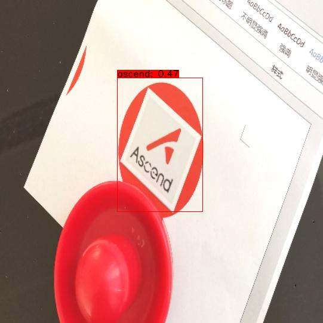

## 模型功能

 对图像中的ascend_logo进行识别分类。

## 原始模型

参考实现 ：

https://github.com/YunYang1994/tensorflow-yolov3

原始pb模型权重下载地址 :

https://modelzoo-train-atc.obs.cn-north-4.myhuaweicloud.com/003_Atc_Models/AE/ATC%20Model/YOLOV3_ascend_logo_following/yolov3_ascend_logo.pb

对应的cfg文件下载地址 ：

https://modelzoo-train-atc.obs.cn-north-4.myhuaweicloud.com/003_Atc_Models/AE/ATC%20Model/YOLOV3_ascend_logo_following/insert_op.cfg

## om模型

om模型下载地址：

https://modelzoo-train-atc.obs.cn-north-4.myhuaweicloud.com/003_Atc_Models/AE/ATC%20Model/YOLOV3_ascend_logo_following/yolov3_ascend_logo.om

使用ATC模型转换工具进行模型转换时可以参考如下指令:

```
atc --input_shape="input/input_data:1,416,416,3" --input_format=NHWC --output="yolov3_ascend_logo" --soc_version=Ascend310 --insert_op_conf=insert_op.cfg --framework=3 --model="yolov3_ascend_logo.pb" 

```

## 使用msame工具推理

参考 https://gitee.com/ascend/tools/tree/master/msame, 获取msame推理工具及使用方法。

获取到msame可执行文件之后，将待检测om文件放在model文件夹，然后进行性能测试。

## 性能测试

使用msame推理工具，参考如下命令，发起推理性能测试： 

```
./msame --model ./model/yolov3_ascend_logo.om  --output ./ --outfmt TXT --loop 100
```

```
Inference average time: 12.098610 ms
Inference average time without first time: 12.097303 ms
[INFO] unload model success, model Id is 1
[INFO] Execute sample success.
Test Finish!
```

Batch: 1, shape: 416* 416 *3 ，带AIPP，平均推理性能12.10ms

## 精度测试

待完善

推理效果

 

