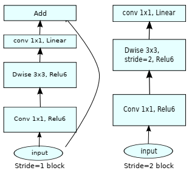
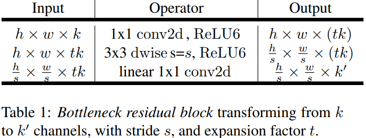
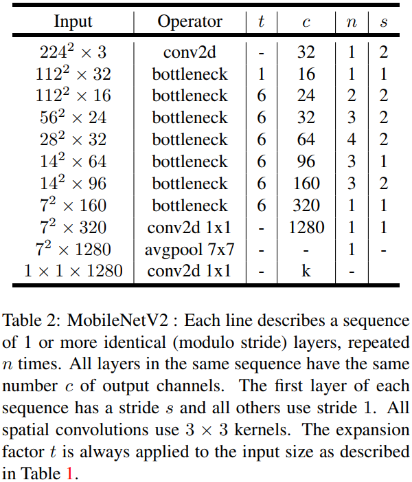

# MobileNetV2 for MindSpore

This repository provides a script and recipe to train the mobilenet-v2 model to achieve state-of-the-art accuracy.

## Table Of Contents

- [Model overview](#model-overview)
  - [Model architecture](#model-architecture)
  - [Default configuration](#default-configuration)
    - [Optimizer](#optimizer)
- [Data augmentation](#data-augmentation)
- [Setup](#setup)
  - [Requirements](#requirements)
- [Quick Start Guide](#quick-start-guide)
- [Performance](#performance)
  - [Results](#results)

## Model overview

MobileNetV2 is a mobile architecture. It is mainly constructed based on depthwise separable convolutions, linear bottlenecks, inverted residuals.

### Model architecture



​



Images are from the paper: *MobileNetV2: Inverted Residuals and Linear Bottlenecks*.

Images show the architecture of MobileNetV2 block and the whole network.

### Default configuration

The following sections introduce the default configurations and hyperparameters for MobileNetV2 model.

#### Optimizer

This model uses Momentum optimizer from MindSpore with the following hyperparameters:

- Momentum : 0.9
- Learning rate (LR) : 0.4
- Batch size : 256
- warmup epoch : 4.0
- Weight decay :  0.00004. We do not apply weight decay on all bias and Batch Norm trainable parameters (beta/gamma)
- Label smoothing = 0.1
- We train for:
  - 150 epochs for a standard training process using ImageNet
  - 300 epochs for best possible accuracy.

#### Data augmentation

This model uses the following data augmentation:

- For training:
  - RandomResizeCrop, scale=(0.08, 1.0), ratio=(0.75, 1.333)
  - RandomHorizontalFlip, prob=0.5
  - Color jitter, brightness=0.4, contrast=0.4, saturation=0.4
  - Normalize, mean=(0.485, 0.456, 0.406), std=(0.229, 0.224, 0.225)
- For inference:
  - Resize to (256, 256)
  - CenterCrop to (224, 224)
  - Normalize, mean=(0.485, 0.456, 0.406), std=(0.229, 0.224, 0.225)

## Setup

### Requirements

- mindspore
- recommonmark
- sphinx
- sphinx_rtd_theme

## Quick Start Guide

### 1. Clone the respository

```shell
git clone xxx
cd model_zoo_mobilenetv2
```

### 2. Download and preprocess the dataset

1. Download the imagenet dataset.
2. Extract the training data.
3. The train and val images are under the train/ and val/ directories, respectively. All images within one folder have the same label.

### 3. Train

```shell
# $PROJECT_ROOT is the project path
# $SINGLE_NODE_WORLD_SIZE is the number of devices
# $VISIBLE_DEVICES is the running device
# $ENV_SH is your own 1node environment shell script
# $SERVER_ID is your device ip
# $RUNNING_SCRIPT is the running script for distributing
# $SCRIPT_ARGS is the running script args
# $SCRIPT_ARGS is the running script args
# remember to add $PROJECT_ROOT to PYTHON_PATH in the $ENV_SH
python $PROJECT_ROOT/mindvision/common/distributed/launch.py --nproc_per_node=$SINGLE_NODE_WORLD_SIZE --visible_devices=$VISIBLE_DEVICES --env_sh=$ENV_SH --server_id=$SERVER_ID $RUNNING_SCRIPT $SCRIPT_ARGS
```

For example:
```shell
mkdir run_test
cd run_test
python /path/to/launch.py --nproc_per_node=8 --visible_devices=0,1,2,3,4,5,6,7 --env_sh=/path/to/env_sh.sh --server_id=xx.xxx.xxx.xxx /path/to/train.py --per_batch_size=256 --data_dir=/path/to/imagenet/train/ --is_distributed=1 --lr_scheduler=cosine_annealing --weight_decay=0.00004 --lr=0.4 --T_max=150 --max_epoch=150 --warmup_epochs=5 --label_smooth=1
```

### 4. Test

```shell
mkdir run_test
cd run_test
python /path/to/launch.py --nproc_per_node=8 --visible_devices=0,1,2,3,4,5,6,7 --server_id=xx.xxx.xxx.xxx -- env_sh=/path/to/env_sh.sh /path/to/test.py -- eval_data_dir=/path/to/imagenet/val --per_batch_size=256 -- pretrained=/path/to/ckp"
```

## Performance

### Result

Our result were obtained by running the applicable training script. To achieve the same results, follow the steps in the Quick Start Guide.

#### Training accuracy results

| **epochs** |   Top1/Top5   |
| :--------: | :-----------: |
|    150     | 71.32%/90.25% |
|    300     | 72.15%/90.80% |

#### Training performance results

| **GPUs** | train performance |
| :------: | :---------------: |
|    8     |   8618.21 img/s   |
